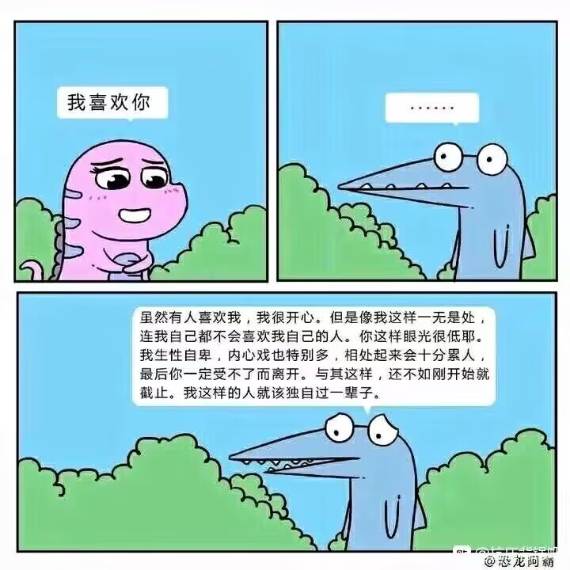

> 虽然很想在年前完成这篇博客，最后还是拖到了现在。但是今年啊，那些经历，那些情感可真是令人难忘呢。

看着前两年流水账般的总结，今年总该写一点什么了吧。可是这些记忆啊，这些感受，写下来怎么就这么困难呢。总之，我还是一点一点地写吧。

## 社交孤岛

> 我应该主动社交，和更多人交流，这样才可以生存下去

我和大多数人的关系只能说是认识，几乎不主动结识新的人，甚至遇到麻烦事了，我都不知道该找谁来帮忙。好在，我尽可能的把自己打造的全能一点，避免可以预见的麻烦事，这样我的生活不需要别人的参与也能过得去。

这种想法就算在网络上也一样，我就像网络上一个爬虫一样，浏览着数据，没有互动、评论。

今年有所改善，我摸出来了去年注册的 ~~twitter~~ (现在是马一龙的 X) ，没事就在上面发脑子里奇怪的想法，我喜欢这里，这里能刷到有趣的赛博游民，而不是墙内的 NPC 和魔怔人，这让我回想起刚开始玩 mc 服务器是交网友的快乐。

学校里，我应该会被其他人看作一个 nerd，每天捣鼓着摸不着头脑的东西，这些在我看来很有趣的东西啊，可能在别人那里就是没有什么作用吧。@stellaris 一直喊我整个 rust 部门，半推就下也算是开了一个，只不过也难逃中道崩殂的命运，不论是从行业前景还是 rust 本身的难度，都不是那么吸引人吧，亏我当初还想借此组建一个 sys 学习的小组，最后还是只有我自己啊。

我有时还挺羡慕他们的，可以稀疏平常地谈论着谁喜欢谁、今天去哪里吃饭。我就像一个机器人，每次需要别人输入精确的指令才能工作。

## 短暂的感情

6月到8月，一段仅仅两个多月的感情，我想过会结束，但没想过会这么快，我还想到过各种理由，但没想到这种理由。

第一次约会、第一次拥抱，这些都是美好的回忆，这段感情里，可能还是没有花足够的心思吧。

恋爱这种东西还是离我太遥远了，不过分手这种事情又发生了一次，还是令人十分沮丧的。

我不再敢对异性流露感情了，也许我悸动的内心早就在中学时第一次懵懂、错误的告白中死去了吧。

现在，我既害怕，也渴望着下一段感情，可下一次，肯定没这么好运了。

## 实习工作

6月份找工作还是很顺利的，只面试了一家就找到了现在的工作，实习的工作内容也比较硬核，有非常多值得深思熟虑的设计，我也学到了很多。

比较难受的是，我现在这家公司对 clean code 有着非常的执着，rust clippy 几乎开启了所有限制，一开始我觉得非常有意思，而现在我觉得这是很反人类的，比如我们应该随手写出一个 `xx.unwrap()` 去提取出总是有效的值，而为了避免违反 [unwrap_used](https://rust-lang.github.io/rust-clippy/master/index.html#/unwrap_used) 和 [expect_used](https://rust-lang.github.io/rust-clippy/master/index.html#/expect_used)，我们会写出 `xx.unwrap_or_else(|_| unreachable!("xxx"))` 这种诡异的结构; 再比如 doc 的限制，所有的命名函数、结构都需要有 doc，有的时候是在不知道怎么为一个生成的 `new` 函数编写 doc，就会加上　`Create XXX` 这种没有意义的 doc。

然后就是 code review 上，我们现在人手很少，而且大家都在 remote，pr 的 review 是轮询式的，一个 pr 想要合进去会变得非常慢，而且经常会有大量的冲突需要处理，我现在对 pr conflict 处理已经非常得心应手了。

想让别人帮你 review pr，这件事或许比自己写 pr 还要难一些。如果整个项目组的开发的氛围十分积极，每个人都在心底里觉得其他人的 pr 在做很有意义的事情，当这个 pr 合进去了会让整个项目变得更好这样的话，review 的进度应该会更快吧。所以，我不觉得是人手比较少的问题，很多时候我也不知道我 review 的 pr 合进去了能有多大的改变。这个项目在我看来正在朝着不可预知的方向发展。

另外就是和人打交道这一方面，我并不擅长，经历了大半年的磨合，我变得柔和了一些，我不再发表一些锋芒毕露的看法、和别人 battle 观点了，我学会了有什么新想法我先做一点，等这些改变足够让我去做大手脚的时候，我再去花大量的时间去做，如果发现没有必要，就算了。这样可以避免一开始花大量时间做没有意义的设计考虑和讨论了。

最后就是对 remote 工作的一些看法，起初我是感到兴奋的，我不需要花时间和中介和房东打交道、和学校 battle 过早出校实习、被一线城市高昂的物价宰割，享受着大家都在说的 WLB。事实上是，我花了非常多的时间在工作上，只为完成我承诺的进度。今天心情不好，我不能把工作放到明天等心情好时，反而堆积在那的任务会让心情更加糟糕。【Update: 所有的工作都是这样的😢，需要自己慢慢调节，remote 的坏处大概就是感觉自己好像不在上班，歇一会就会觉得自己是不是对不起老板，和同事交流也没有线下高效。】

> This is especially hard when working alone and working at home because there is no delineation of work time. If I can work whenever I want I can also feel guilty about not working whenever I want.
>
> —— [https://www.scattered-thoughts.net/writing/emotional-management/](https://www.scattered-thoughts.net/writing/emotional-management/)

忙完手头上的事情后，就试着找下一份工作吧。

## 亲人的离去

> 时止则止，时行则行
>
> ——《周易·下经·艮》

“艮”是我爷爷的名，它在八卦中表示山。我刚开始读书时是个留守儿童，爷爷陪伴了我整个小学的生活。打我记事起，爷爷就已经是个头发花白的老头子了。

这一天来的还是太早了啊，我很懊悔没能再长大一点，至少能让他看见我有出息的样子。

<blockquote class="twitter-tweet">
为什么没能见到最后一面 为什么不能再慢一点
&mdash; 泡泡 (@igxnon) <a href="https://twitter.com/igxnon/status/1731995045568610587?ref_src=twsrc%5Etfw">December 5, 2023</a></blockquote> 

他葬在曾经耕耘过的那片田地，和二十多年前的奶奶一样，并排在一起。

挚爱的离去，在人间孤独的二十多年里，爷爷也如同山一般坚强。

## 写博客的焦虑

今年的博客更新的非常少，我看了看我之前所写下的内容，又看了看其他人的博客，我的积累还是太少了。我想写下对别人有帮助的文章，而不是突然有个想法，写下来草草几笔结束。我准备将一些细碎的思考和经验放到周报或者推特上，博客正文里只留下有价值的文章。

当我正准备写下点有价值的文字的时候，我想不出可以写下什么，或者说，我在该方面的积累还没有达到可以写下一片博客分享的程度。例如，从8月份开始筹划的《乐理——音色》，推迟到现在也没有发出来，我除了在理论上分析频率，泛音列，钢弦振动以外，我写不出来其他关于音色的内容。而这些除了科普并没有什么实质作用，说到底我自己也不怎么会调音色，我对音色的理解也很浅薄，能写下什么有价值的东西呢？编程领域也类似。

另一点则是博客的深度，我一贯比较抵触晦涩难懂的文字，有些是故作玄虚，而有些则是内容的本身就有比较大的理解难度，需要花费很长时间学习，我喜欢将其简化成十分浅显的语言来描述，但这也会丢失一些内容上的深度。这个深度，不论是我原本想表达出来的程度，还是我从别处学来的程度，都会随着使用另一套简单的模型来表示而丢失。我希望我学来的知识不能只是表面的一层，我不能仅仅只从第二手转述中学习，我需要挖掘出这份的知识的起源，还有其发展，最后我才有资格写下一篇关于它的文章，来向大家展现这份知识的全部面貌。

【Update：[没有人关心你在博客上写了什么](https://www.alexmolas.com/2023/07/15/nobody-cares-about-your-blog.html)，所以有啥东西想写就写，觉得写的不好就删了，博客的休克是再也不更新了，死亡则是无法访问了】

## CS 的学习

今年 cs 的公开课学习算是在慢慢开始了，上半年接触第一个公开课 mit6.824，做到了 lab3 log compaction 然后就去工作了（等有时间了再把 lab4 补上）。半年的工作适应下，年底开始逐渐学 15445 了。

其次则是 plt 的学习，虽说我对其十分感兴趣，但这理论相当抽象，学起来也不成章法，目前还仅仅停留在入门阶段，下一阶段准备把 plfa 看完，然后再接着继续看 hott。

这一年我把大量的时间放到了 side project 上，`douban-rs` 的架构设计，`raknet-rs` 一个网络协议的实现。总体的代码量并不多，更多时间花在了重构和思考上。这一年里，我几乎都在写 rust，自然也对 rust 得心应手了起来，现在和 rustc battle 时也显得游刃有余。这一年我在代码层面上的提升是非常大的。我可以自信地说我能写出来高质量的代码。

---

那么，就到这里了，这篇博客也大致从不同的段落中拼接出我这一年的经历。接下来的一年里，也是差不多是大学最重要的一年里，也将会给自己带来一些新的感受吧。