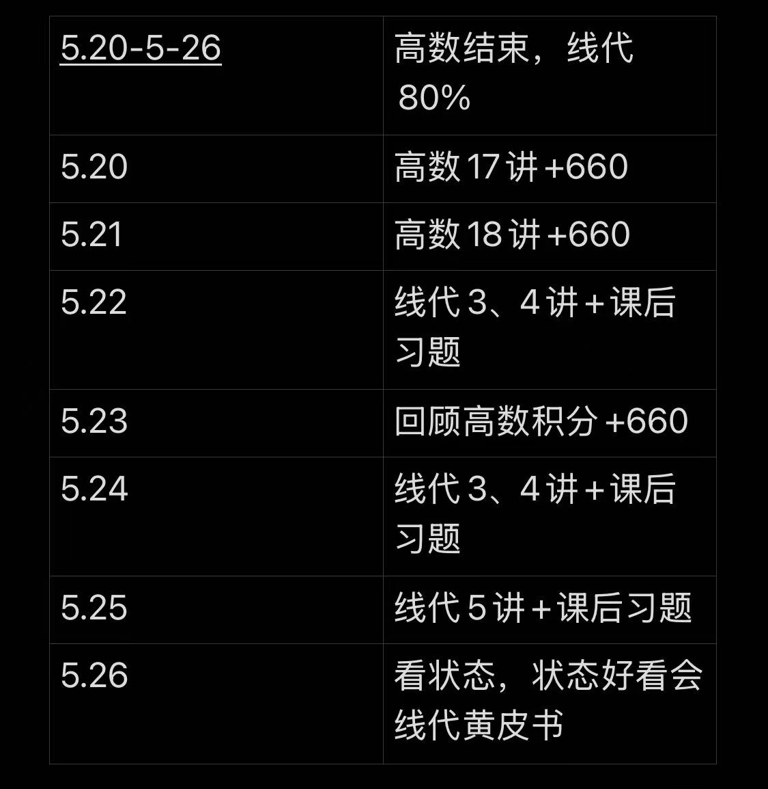
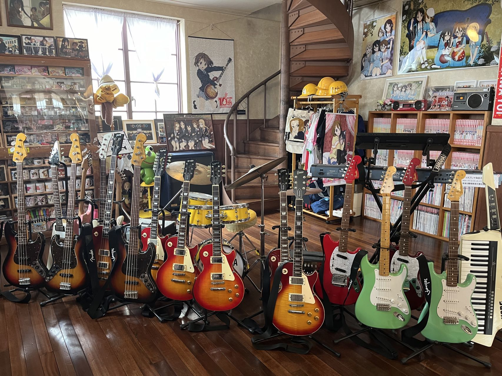
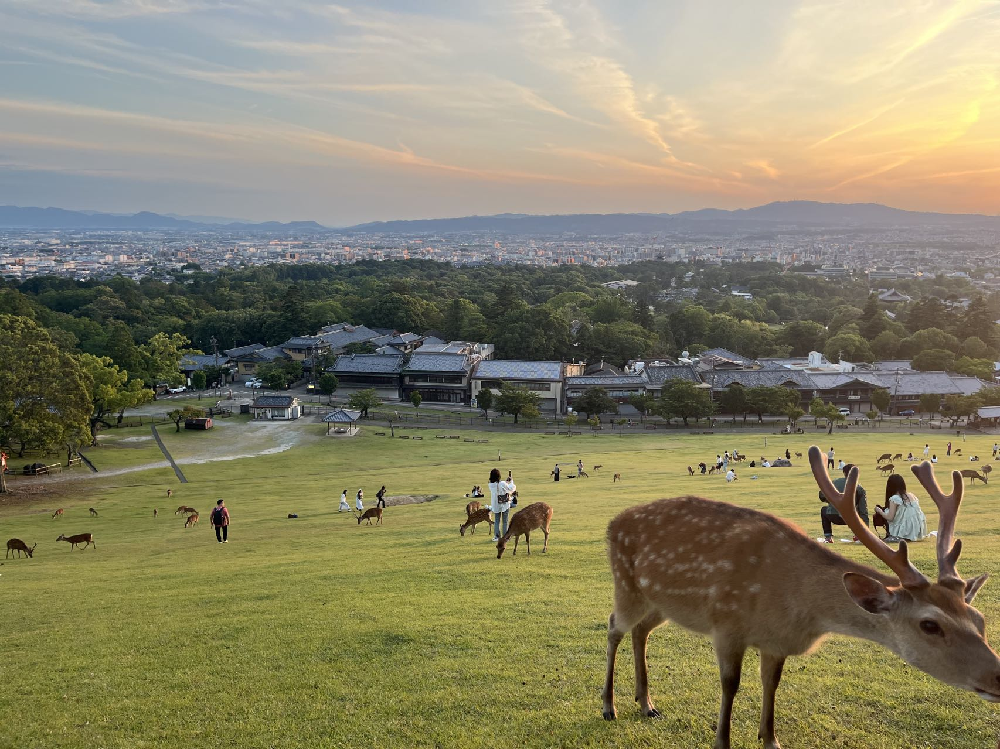
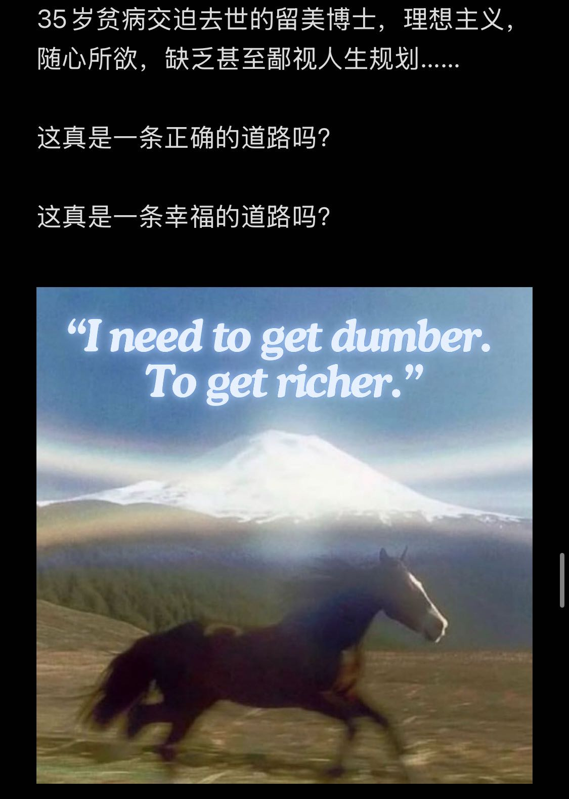
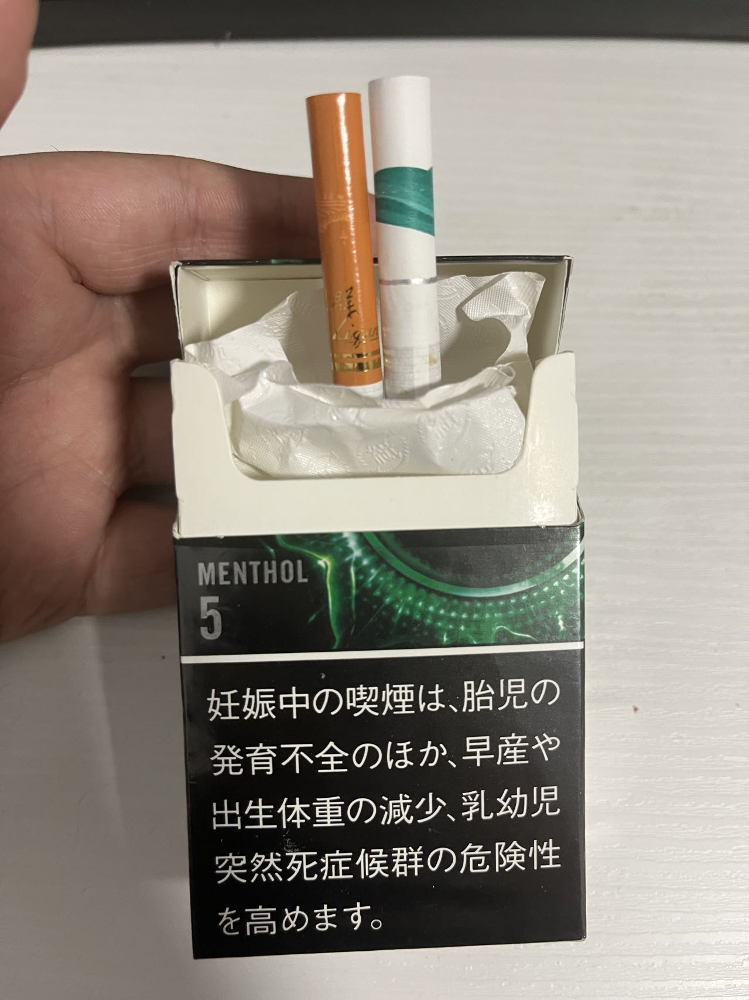
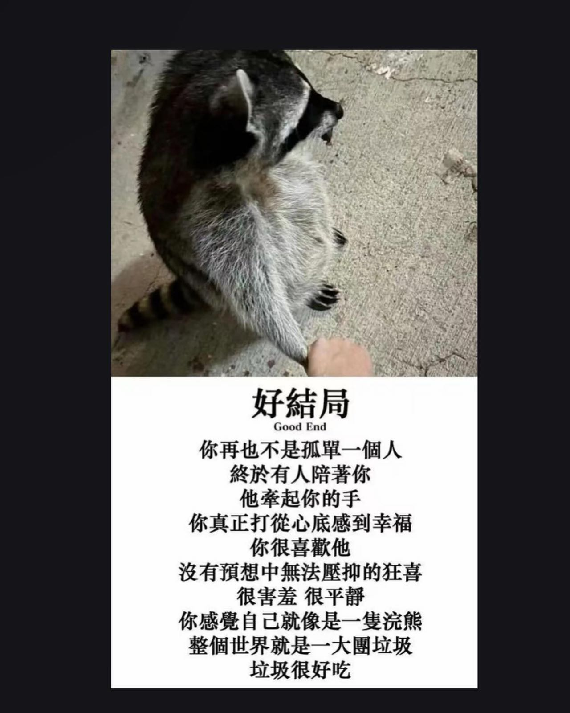

几篇年度总结，便是我整个大学生活，回过头看去，黯淡中透过一丝光

 

<link rel="stylesheet" href="https://cdn.jsdelivr.net/npm/aplayer/dist/APlayer.min.css">

## 黯淡

“泡泡干啥都淡淡的，淡淡的喜欢，淡淡的开心，淡淡的忧伤”

每天都把“一切没有意义”挂在嘴边，凭着不可靠的记忆，很容易忘掉精彩的瞬间

不知从何开始，变得不爱打游戏，不爱社交，不爱说话，不爱表达，在屏幕后面窥视，在大量文章中跳转，在维基兔子洞里穿梭，收集一些一万年也用不上的概念，自以为掌握了 CS 的精髓，但却改变不了一望到头的职业生涯

甚至不会去表达爱，去争取爱，当爱离去的时候，只会窝在被子里哭，哭的时候还不能发出声音，床底下的室友还在打游戏

“据说每一只蝉都要在地下闷17年，鸣叫两个月，然后死掉，和高考完的那个暑假一模一样”

上了个大学，就像过了半辈子，大多数人都是麻木的上课，写作业，准备考试，最后在一场秋招和考研中匆匆落幕，这绝不是大学该有的样子

而工作呢，除了面试通过时开心一会，接下来就是噩梦的开始，风风火火，一地鸡毛，每当如此，这种无意义感觉就会加深

我染上了“意义”的毒瘾，没有意义，精神就会涣散，身体就会麻木，只有不断地把时间消磨干净，寻求那一丝丝的意义，打成粉末，吸入鼻孔，就能产生强烈的幻觉。每吸食一次，就会想要更多，更刺激，就会大肆挥霍时间，浪费在自以为崇高的事情上，往往落一场空，陷入更深的低谷

“原来人并不会像玻璃一样“bulingbuling”脆脆地碎掉，

它更类似于锈蚀、腐烂、低温烫伤，

温和地、毫无痛楚地，越来越麻木，越来越迟钝”

**将一堆杂乱的思绪加工成一段没有语病的话已经成为奢求**

我会这样死去吗？

不，我还能像这样写博客抱怨这一切，我还能和网友自嘲，我还能幻想一觉醒来，发现全世界所有计算机都爆炸了，所有的历史包袱全都消失，我是个[自杀者](https://book.douban.com/review/8112594/)，我还没自杀是因为我还有一些[幽默感](https://book.douban.com/review/14449507/)吊着

## 像烈火燃烧般炽热

3 月份，我停掉了周报，辞掉了工作，准备考研，我并不是想靠提升学历来提升竞争力，我只是对当下的环境感到深深的无力，也许存在一条远离这一切的道路，只要我咬咬牙，坚持一会

我制定了很多计划，每天需要复习什么，要专注多少个小时，每周需要做到哪些，看着代办事项一点点被划掉，我感觉我从来都没有这么高效过，不过我不想梭哈导致最后变成无业游民，空闲时间拿来刷算法题了

周报也许并没有停掉，而是变成了备考计划

复习考研的那一段日子里，时间过得很慢，时间总是随着琐事增多而变快，但这是我长大以来第一次觉得一天居然可以有这么长，长到我可以看完几十页书，背几百个单词，写几十道习题，晚上还能回去继续看文学经典

我感觉这样坚持下去我大概率能考上，继续升学读博，做出非凡的研究成果，然后再顺利毕业，最后卷教职，在知名大学里面为学术界添砖加瓦，倾听着一群意气风发的年轻人的梦想，指引着他们前行的方向；工作没有加班，够用的薪水和一定社会声望，同事都是高学历知识分子，相处融洽

想着不能总这样窝在图书馆里，要释放一些压力，六月份的时候去了一趟日本旅行，在关西那边溜了一圈，比较开心的是去了轻音少女的现实原型地点那里圣地巡礼还有奈良那边摸了鹿

~~站在路中间要饭，被摸秃了的鹿：~~

若草山坡上躺到日落：

梦醒了，现在到了九月份，考研只剩下三个月了，今天写了十道数学题，一共错了十一道，其中一道是为了证明答案是错的翻看之前的解答过程，发现之前的就是错的。每天就写那微积分，怎么也算不出来答案，好不容易有思路，匆匆忙忙算错了。还有那怎么也背不下来的政治知识点和一合书就忘的 408 考点

梦只是碎了第一步，没关系，只要我工作后攒够一笔钱申请海外的学校...

[磕盐现状：「给各位天命人的劝退信」](https://jyywiki.cn/Letter.md)

**我的精神力量可能不足以支撑到我走到终点**，更何况，那个终点可能并不是我想象的样子

好了，全碎了

最后结局是我夹着尾巴逃跑了，匆匆忙忙准备秋招，找了个班上

现在想一想，还是挺对不起之前的老板的，明明他那么劝说我不去趟这摊浑水，我还是去做了，果不其然失败了，也没准备回之前的公司继续上班

但想一想某位前辈考研两次失败的经历，他经历了多大的精神压力？我无法估计出，还好我是半途退出

但我还是报名了考试，我会最终坐在考场上面临这一切

12.23，考试的阵仗很严肃，考生们都很紧张，12.24，一切都结束了

## 像枫叶坠地般凄美

到了十月，确定了去处后，我开始摆烂，开始做我想做的事情，回到从前那样无所事事，花大量的时间探寻内心的平衡，等待意义的浮现

不过，我等到了一个人，我们看到彼此的第一眼先是迟疑了一会，但很明确对方是谁

她送给了我一只很可爱的企鹅，我还不清楚为什么的时候，就从她发给我的消息里又找到了熟悉的感觉：虽然不是表白，但会让人浮想联翩

先是一阵害怕，害怕到不能呼吸，命运为何只捉弄苦命人，为什么要让我一次次体会这样的感觉

我就是要这样反抗遗憾的过去，我很快说服自己，接受了这一切，要更勇敢一点，更果断一点，更疯狂一点

结局会是如何呢，我不知道，但愿不要太过痛苦，给我留下一口气，按经验来说，时间自会抹平

## 尼古丁

起因是从日本给推友带的香烟，还剩下一包，图书馆里自闭了一天，深夜焦虑，拆开包装，一股浓烈的香精味，点燃一根，吸入第一口

奇怪的是，和记忆力偷偷顺的老爸的香烟不一样，它并不呛喉咙，然后是一阵眩晕和愉悦

接下来就是一支接着一支，一包接着一包，直到我决定了去处，理智叫停了，欲望还在

我这辈子都忘不掉这种感觉了，这种廉价的愉悦

看到别人点烟，闻道烟味，包括写下这段文字，我都想继续点上一根

不想变成妈妈讨厌的样子

第一包的第一只烟 & 最后一包的最后一只烟（期望）：

## 神明寄宿的地方

阴郁的时候，我就想在书里翻到什么慰藉心灵，我在思考网络是不是给我带来太多负面影响，多到完全抵消了我从网络上获取到的资源，所以今年，我看了很多书：

- 《悉达多》
- 《在轮下》
- 《荒原狼》

> 所有的孩子一出世就代表着脱离宇宙，代表着从上帝那里游离出来，代表着走上痛苦的新生之路，若想回到宇宙，停止痛苦的个性化生活，进而修身成神，就一定要敞开胸怀，扩大灵魂，从而让灵魂可以容纳下整个宇宙

- 《献给阿尔吉侬的花束》

> 学习是件很奇怪的事，走得越远，越知道自己连知识存在何处都不清楚。不久之前，我还愚蠢地以为我可以学会一切事情，掌握世上所有知识。如今，我只希望我能知道知识的存在，了解其中的沧海一粟。

- 《德米安：徬徨少年时》

> 爱无须祈求，爱也无须索取。爱是内心坚定的力量。有了这种力量，人就无须去吸引爱，爱会前来。

- 《西线无战事》

> 人只要屈服，就能躲避打击，忍受恐惧——一旦去思考，就立即活不下去了

- 《旅行之木》

> “顺着自己与生俱来的洪流活下去”，每个人刚开始的时候都是这么过日子的。只是大家都在还很年轻的时候就早早地抛弃了这股洪流，想方设法要上岸。

- 《不能承受的生命之轻》

> 最沉重的负担同时也是最激越的生命实现的形象。负担越沉重，我们的生命就越贴近地面，生命就越写实也越真实。相反的，完全没有负担会让人的存在变得比空气还轻，会让人的存在飞起，远离地面，远离人世的存在，变得只是似真非真，一切动作都变得自由自在，却又无足轻重。

「好的作品寄宿着神明」

随着不同主人公故事的落幕，内心平静了许多

我也该起身为故事的落幕做准备了

## 垃圾很好吃

11 月，我离开学校，准备去实习，攒够一笔钱毕业的时候旅游用

入职第一天晚上，panic attack，我不想生命浪费在这一坨历史包袱上

入职第三天，线上事故，全组人 oncall 从下午四点处理到凌晨两点，我在旁边看到了半夜零点后回去了

入职第一周，组内做了次分享，理清楚了大家的名字和性格，一群很友善的同事，开心

入职第三周，大致摸清楚组内情况和气氛，还不错，“鸡头也是头”，开始慢悠悠地学习、干活

... 

在这个大环境里，这份工作不算很好，能留给自己的时间不多，还要担心老板会不会哪天把自己干掉，也不算太坏，各种待遇是非常丰厚的

希望能挤出更多的时间，变得更有效率，有动力的时候能推进完成一些工作，没有动力的时候能歇一会缓口气

---

“泡泡离开前可以一起看夜景么”

“下周日带你去喝茶，给你读小王子”

“要想我，把我放心上”

“来，看着我” **kiss*

我好像做了一场甜蜜的梦，梦里我不再苦苦追寻着什么，追求意义的本身就毫无意义

## 2024 Happy Ending

世界会变得更好吗？

「我们每个人都是时代的因和果。」
