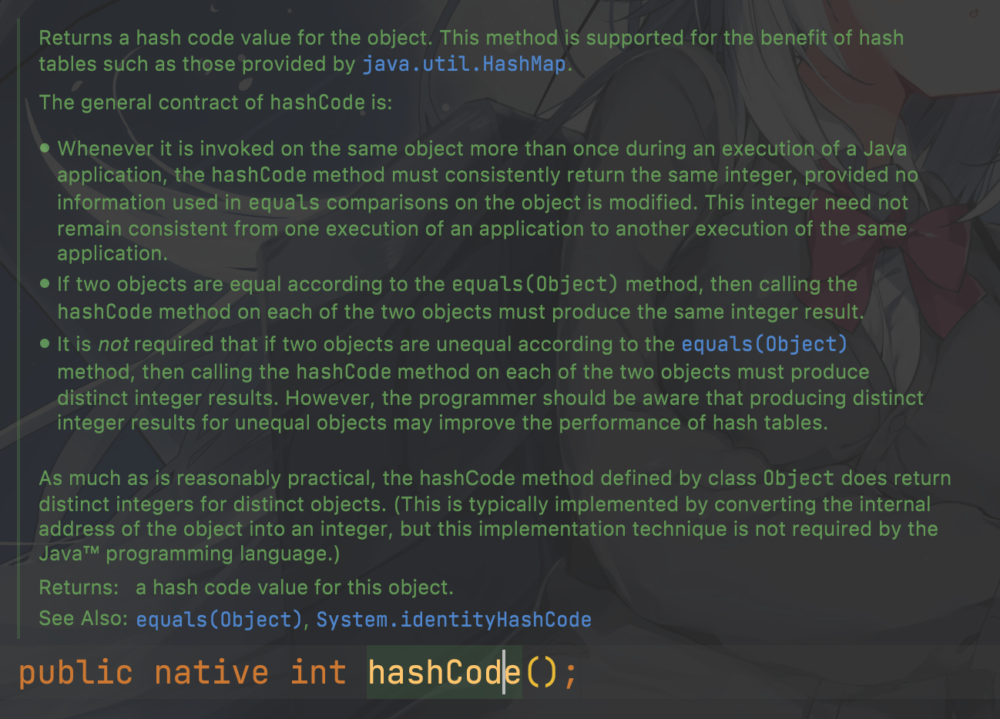
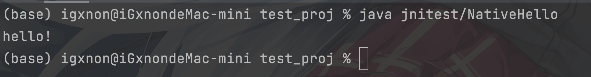

# JNI

众所周知，Java 的 native 方法不是用 Java 实现的，比如 hashCode



**JNI(Java Native Interface) 直译 Java 本地接口**

Java 是运行在 JVM 上的，而 JVM 又将操作系统的绝大数控制权给封闭起来不让开发者用(

所以开发者想用的话就得使用 JNI，用其他系统级编程语言实现这个接口

# CGo

CGo 是 Golang 和 C/C++ 进行交互所推出的特性
CGo 作用

- 白嫖 C/C++ 几十年的软件资源
- 和其他语言进行交互
- 增加性能？？

# CGo + JNI = ?

使用 javah 命令会生成一个 .h 文件，里面定义了 native 方法的接口

开发者只需要实现 .h，然后把它做成 **动态链接库** 给 java 程序动态加载

使用 CGo 来实现 .h，用 `go build -buildmode=c-shared` 编译成 动态链接库

计划通！

# Code

```java
package jnitest;

public class NativeHello {

    public native void SayHello(); // 定义一个 native 方法

    static {
        // 这里可以把 hi.so 的路径放进环境变量里，然后 loadLibrary()
        System.load("/Users/igxnon/工作目录/GolandProject/test_proj/hi.so");
    }

    public static void main(String[] args) {
        new NativeHello().SayHello();
    }

}
```

javah 后就会生成一个这么个东西

```c
/* DO NOT EDIT THIS FILE - it is machine generated */
#include <jni.h>
/* Header for class jnitest_NativeHello */

#ifndef _Included_jnitest_NativeHello
#define _Included_jnitest_NativeHello
#ifdef __cplusplus  // 这里兼容 cpp
extern "C" {
#endif
/*
 * Class:     jnitest_NativeHello
 * Method:    SayHello
 * Signature: ()V
 */
JNIEXPORT void JNICALL Java_jnitest_NativeHello_SayHello // 需要的就是这个 `Java_jnitest_NativeHello_SayHello(JNIEnv *, jobject)`
  (JNIEnv *, jobject);

#ifdef __cplusplus
}
#endif
#endif

```

```go
package main

/*
// cgo 配置，定义了头文件的检索目录，实际上就是定义 jni.h 在哪
#cgo CFLAGS: -I./include

// 导入 javah 生成的头文件
#include "jnitest_NativeHello.h"
 */
import "C" // 启用 CGo

import "fmt"

// 得有个 main 函数，不然 go 不让编译
func main() {

}

// 下面会生成一个 C Java_jnitest_NativeHello_SayHello 函数
//export Java_jnitest_NativeHello_SayHello
func Java_jnitest_NativeHello_SayHello(env *C.JNIEnv, obj C.jobject)  {
	fmt.Println("hello!")
}
```

go build 后 生成两个文件

- hi.h 供 C/C++ include 使用
- hi.so 动态链接库，里面装了具体实现内容

java load 动态链接库时不会加载这个，所以写 go 时，不要直接用这里的一些别名 typedef，需要的话在 .go 文件里自行定义

hi.h 如下：

```c
/* Code generated by cmd/cgo; DO NOT EDIT. */

/* package test_proj */


#line 1 "cgo-builtin-export-prolog"

#include <stddef.h> /* for ptrdiff_t below */

#ifndef GO_CGO_EXPORT_PROLOGUE_H
#define GO_CGO_EXPORT_PROLOGUE_H

#ifndef GO_CGO_GOSTRING_TYPEDEF
typedef struct { const char *p; ptrdiff_t n; } _GoString_;
#endif

#endif

/* Start of preamble from import "C" comments.  */


#line 3 "hello.go"


#include "jnitest_NativeHello.h"

#line 1 "cgo-generated-wrapper"


/* End of preamble from import "C" comments.  */


/* Start of boilerplate cgo prologue.  */
#line 1 "cgo-gcc-export-header-prolog"

#ifndef GO_CGO_PROLOGUE_H
#define GO_CGO_PROLOGUE_H

typedef signed char GoInt8;
typedef unsigned char GoUint8;
typedef short GoInt16;
typedef unsigned short GoUint16;
typedef int GoInt32;
typedef unsigned int GoUint32;
typedef long long GoInt64;
typedef unsigned long long GoUint64;
typedef GoInt64 GoInt;
typedef GoUint64 GoUint;
typedef __SIZE_TYPE__ GoUintptr;
typedef float GoFloat32;
typedef double GoFloat64;
typedef float _Complex GoComplex64;
typedef double _Complex GoComplex128;

/*
  static assertion to make sure the file is being used on architecture
  at least with matching size of GoInt.
*/
typedef char _check_for_64_bit_pointer_matching_GoInt[sizeof(void*)==64/8 ? 1:-1];

#ifndef GO_CGO_GOSTRING_TYPEDEF
typedef _GoString_ GoString;
#endif
typedef void *GoMap;
typedef void *GoChan;
typedef struct { void *t; void *v; } GoInterface;
typedef struct { void *data; GoInt len; GoInt cap; } GoSlice;

#endif

/* End of boilerplate cgo prologue.  */

#ifdef __cplusplus
extern "C" {
#endif

extern void Java_jnitest_NativeHello_SayHello(JNIEnv* env, jobject obj);

#ifdef __cplusplus
}
#endif
```

最后把生成的 hi.so 给 java 加载就行了

(放 static 语法块里能保证类装载时就加载，防止用的时候找不到)

```java
static {
    System.load("/Users/igxnon/工作目录/GolandProject/test_proj/hi.so");
}
```

# Result



# Furthermore

好玩

native 如它名称一样，本地|原生，使用了 native 的程序大多数移植性不强

为了适配不同的操作系统，可能需要实现多种 native 方法

CGo 这个特性很多语法都奇奇怪怪的，比如必须在 import "C" 上面写注释才会被认做 C 源码，中间有空行都不行，还有名字叫 "C"但里面啥也不是的假包

想念 Java 中的注解....
