# 基础求导

## 标量

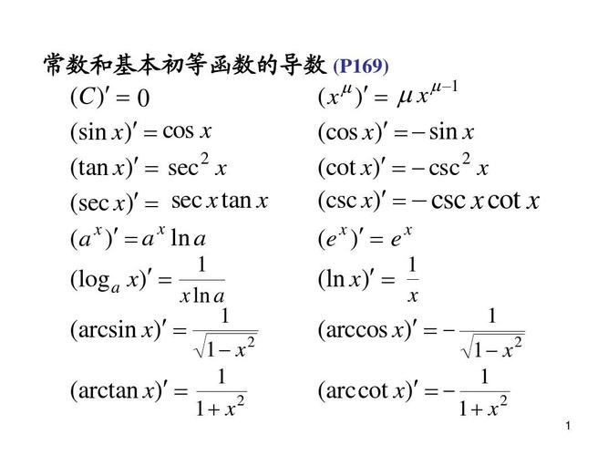

## 向量

### 形状变化

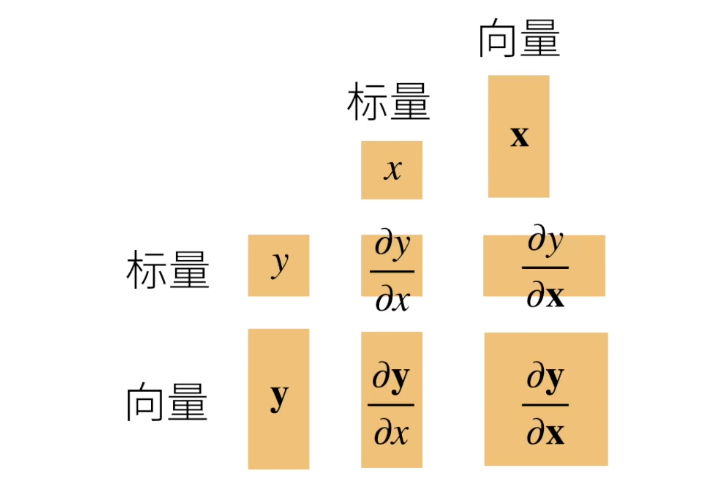

### 例子

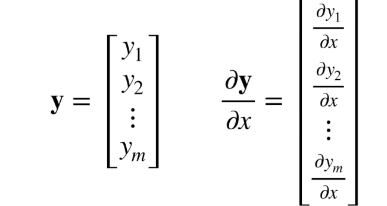

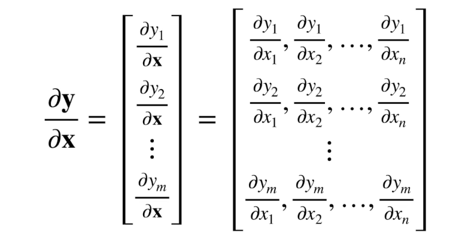

### 求导法则


+ 常见函数关系

y 是标量

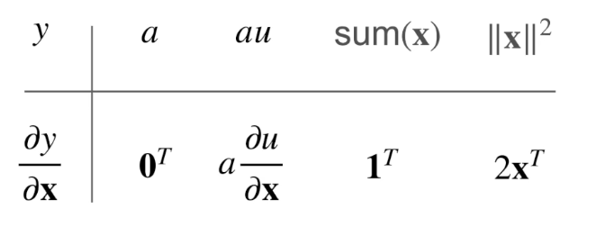

y 是向量

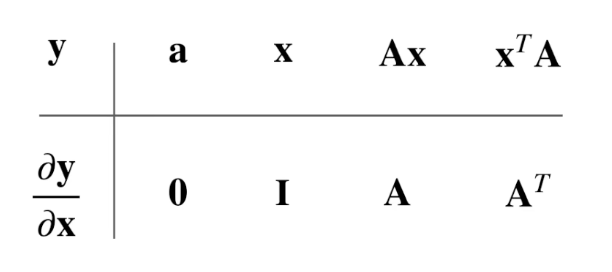

其中 a/A 相对 x 是常数
 
I 是对角矩阵

推导

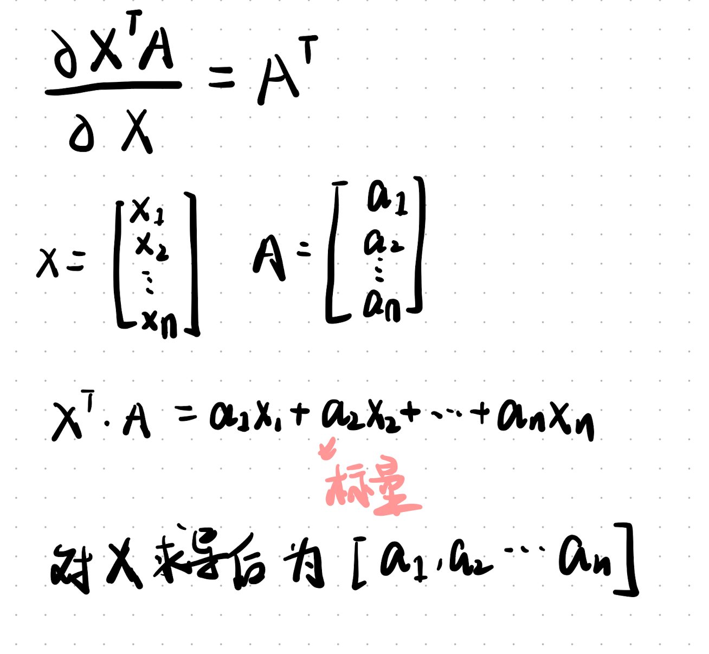

+ 常见求导法则

y 是标量

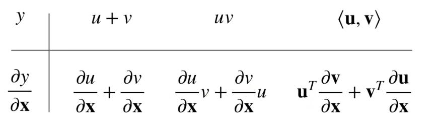

y 是向量

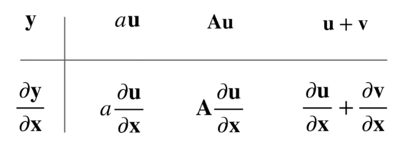

其中 u v 是列向量 (计算机上一般不考虑向量的行列，维度相同就能内积)

u/v 的转置是行向量，v/u 对 x 导数是一个矩阵，相乘后等于一个行向量；相加后就是行向量

## 继续拓展...

可以拓展到 n 维张量

# 链式求导

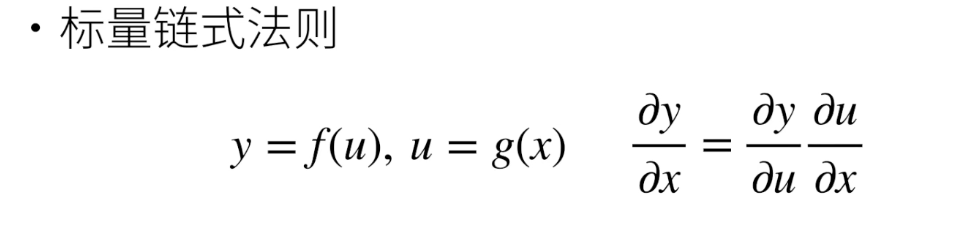

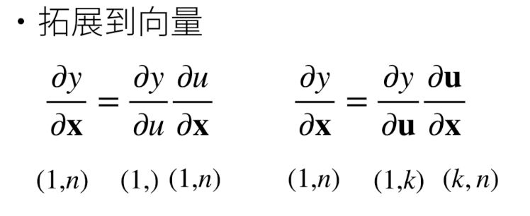

(1,) 表示一个标量 等同 (1,1)

## 例子

线性回归的求导

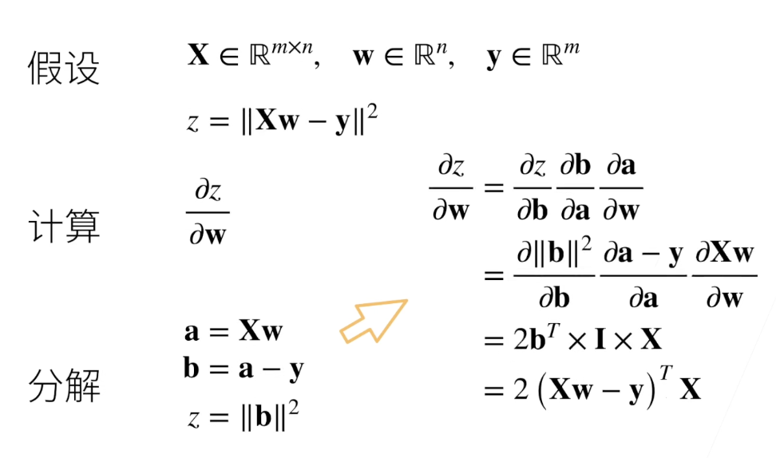

z 是 b 的 L2 范数 是一个常数, z 对 b 导数形状是 b 的转置

# 自动求导

自动求导指在 计算一个函数对某个给定变量上的导数，如 y = x^2，可以求的 x 等于 1 时 y 的梯度是 2

## 计算图

+ 储存计算过程的图
+ 无环图
+ pytorch 中，计算图是隐式构造的，即无需定义这个计算过程

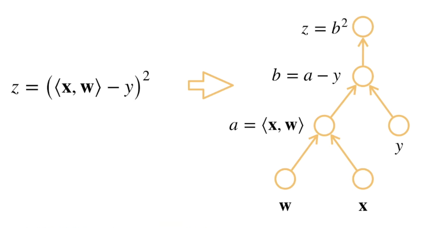

## 模式

+ 正向累积: 从 x 到 y
+ 反向累积/传递: 从 y 到 x

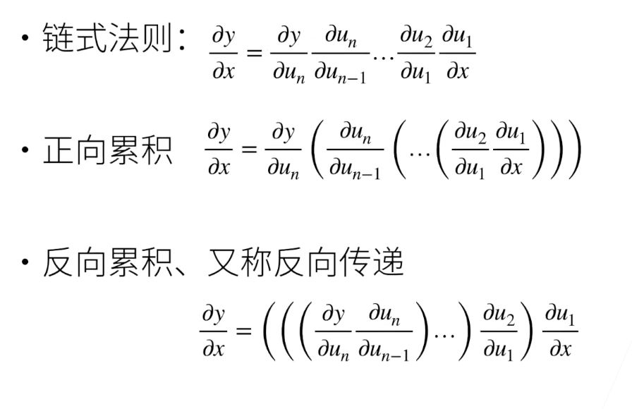

反向传递可以储存中间的梯度，这样就不需要中间变量对x的所有梯度了

正向和反向开始的计算复杂度均为 O(n), 但反向可以储存中间梯度，后续计算复杂度小于 O(n)

正向累积内存复杂度是 0(1)，不需要储存中间梯度


```python
import torch

x = torch.arange(4.0, requires_grad=True)
x
```

```
    tensor([0., 1., 2., 3.], requires_grad=True)
```

```python
y = x * 2
y
```

```
    tensor([0., 2., 4., 6.], grad_fn=<MulBackward0>)
```

```python
y.backward(torch.ones(4))  # 等价于 y.sum().backward()
x.grad
```

```
    tensor([2., 2., 2., 2.])
```

+ 上面的 y 不能直接 backward()
+ 一般来说，很少对一个向量反向累积，(pytorch里不允许直接对向量backward()) 维度会越积越高

```python
def myFunc(a):
    while a.norm() < 100:
        a = a * 2
    if a.sum() > 0:
        return a
    else:
        return -1 * a
    
a = torch.randn(size=(), requires_grad=True)
f = myFunc(a)
f.backward()

a.grad == f / a  
```

```
    tensor(True)
```

+ myFunc 中可以看出 f = k * a (k 就是梯度，随着 a 的数值而变化)，那么 f / a = k = a.grad
