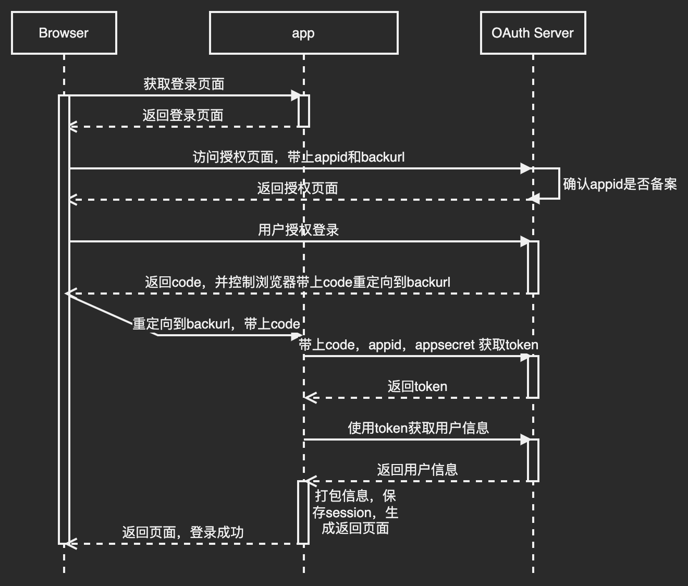
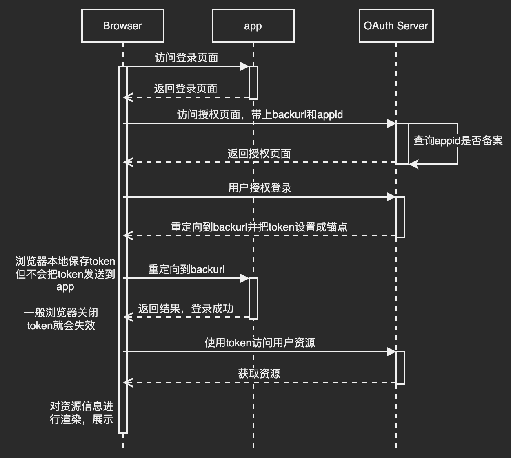
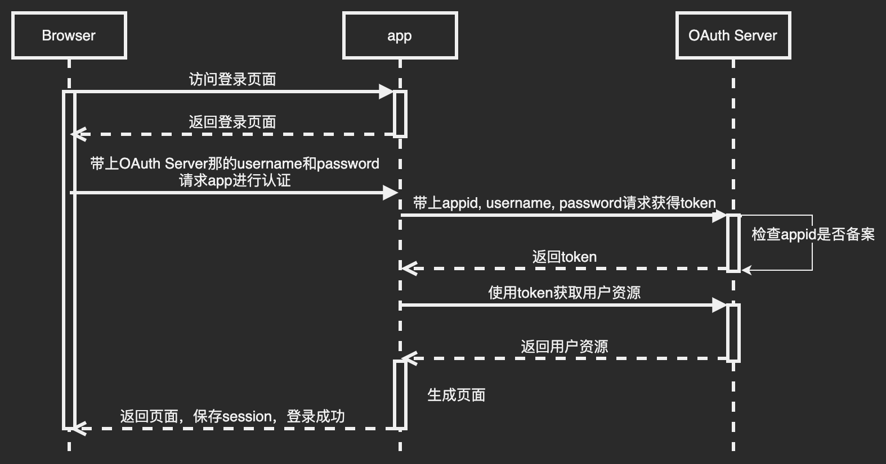
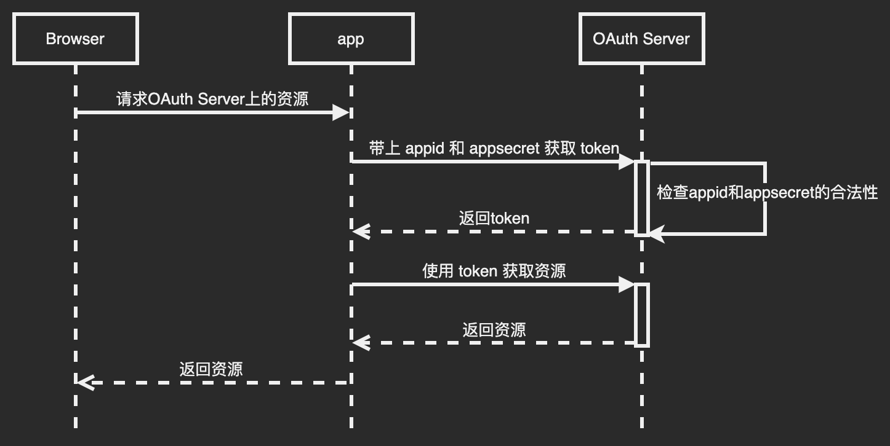
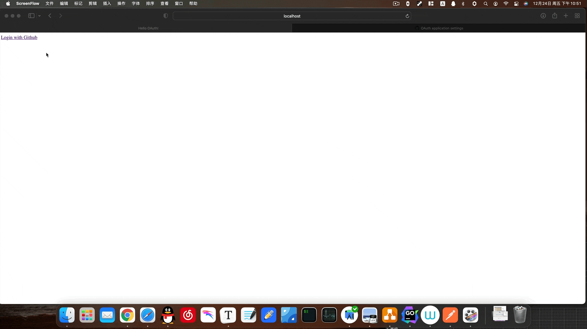

# 前言

---

OAuth2.0 的标准是 [RFC6749](https://tools.ietf.org/html/rfc6749)

常见的使用微信登录，使用 Github 登录等操作使用的就是 OAuth 标准

# 图解

---

## 授权码式(最常见)

适用于前后端分离的 web 应用

appsecret 和 token 均保存在后端，因为放在浏览器内保存会有危险(这就是为什么不直接返回 token 而是返回 code)

## 隐藏式

适用于没有后端的 web 应用
这种授权方式很不安全，通常适用于对安全性要求低的场景，授权时间很短

## 密码式

很不安全，只有十分相信这个 app 的情况下再去登录

## 凭证式

这不是针对用户授权登录的，而是针对服务端的，获得的 token 能请求到的是第三方服务资源，而不是用户的资源，所以可能存在多个用户共享一个 token

# 使用 Github OAuth Server 的一个 Demo

---

这里是前后端不分离的
源代码: [https://gitee.com/iGxnon/oauth-github-test](https://gitee.com/iGxnon/oauth-github-test)

效果

