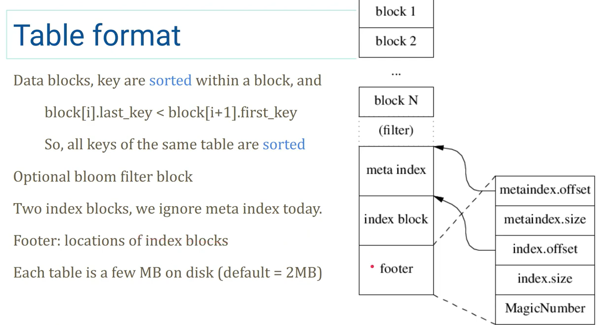
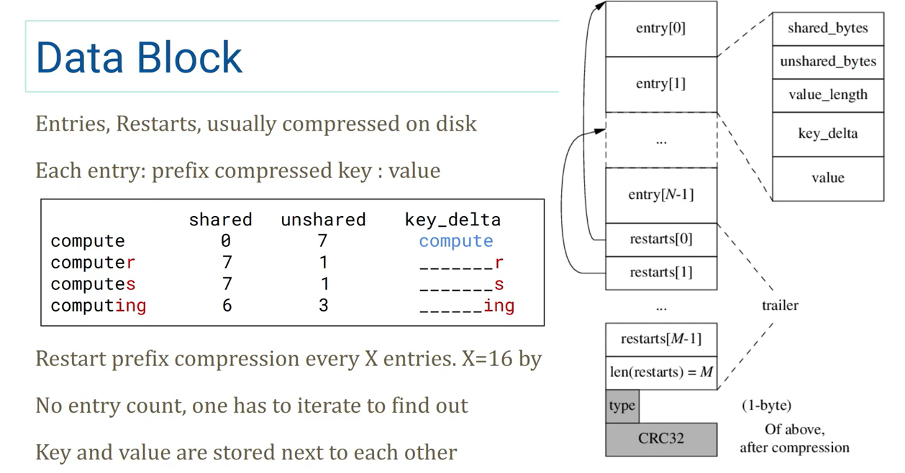
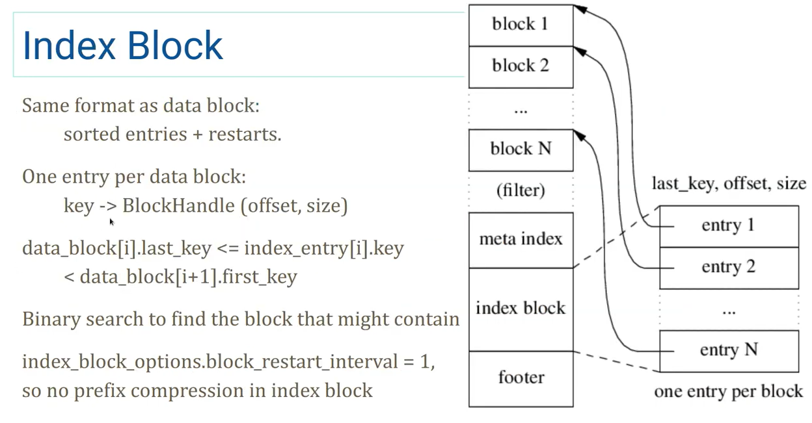

## Overview

- PPT 来自 https://www.youtube.com/watch?v=Dpf8_qRLPkI

### Table format



- 倒着读，顺序写
- 包含一个 `filter`，默认是 `BloomFilter`
- `footer` 使用的是变长数，即支持理论上无限大的存储器（然而事实上不会超过 `uint64` 能表示的范围）

### Data block(Block)



- 倒着读，算出 entries 的长度

- type 和 CRC32 只在硬盘里，entries 和 restarts 在磁盘上存储时会压缩（no mmap）
- restarts 是有序的，所以可以当作这个 Data Block 的一层索引
- entry 的 key 有前缀压缩，restart 会重置前缀压缩的起始点，默认X=16个重置一次
  - X 取一页可以放下的 entries 应该是最好的，这样往前读 restart 可以命中同一个 page，不会增加磁盘IO

### Index block



- 为全部 Data Block 建立的一层索引
- 结构和 Data Block 完全一样，只不过 value 是 `BlockHandle(offset, size)`，指向一个 Data Block
- 也有 restarts（图中没画出），同样这个 restarts 也可以作为这个 Index Block 的一层索引
  - 检索流程 Index block restarts -> Index block -> Data block restarts -> Data block

- Index Block 的 last_key 是它所指向的 Data Block 到下一个 Data Block 之间的 key，这样可以压缩 Index Block 的 last_key
  - 如果 `DataBlock[3].last_key = "abcdefghi"`, `DataBlock[4].first_key= "c"`
  - 那么 `IndexBlock[3].last_key` 可以是 `"b"`，如果大于 `"b"`，那就说明不在这个 `DataBlock` 里，这样就可以不用存 `"abcdefghi"`，只用存 `"b"` 了

---

到这基本上就已经知道 reader 是如何实现的了，接下来是具体的实现的代码解析，可以从中学到一些工程设计。

## Implementation

### Reader

Dump File 的实现会把所有的 Reader 整合在一起，跟着执行路径读应该能看完大部分的 Reader 实现

解析后的格式：

```txt
// XXXXXX.log
--- offset 0; sequence 257
  put 'Key0' 'Test data value: 0'
--- offset 44; sequence 258
  put 'Key1' 'Test data value: 1'
...

// XXXXXX.ldb:
'Key0' @ 1 : val => 'Test data value: 0'
'Key1' @ 2 : val => 'Test data value: 1'
'Key10' @ 11 : val => 'Test data value: 10'
'Key100' @ 101 : val => 'Test data value: 100'
'Key101' @ 102 : val => 'Test data value: 101'
'Key102' @ 103 : val => 'Test data value: 102'
...

// MANIFEST-XXXXXX:
--- offset 0; VersionEdit {
  Comparator: leveldb.BytewiseComparator
}
--- offset 35; VersionEdit {
  LogNumber: 6
  PrevLogNumber: 0
  NextFile: 7
  LastSeq: 256
  AddFile: 0 5 2396 'Key0' @ 1 : 1 .. 'Key99' @ 100 : 1
}
```

实现：

```c++
// 文件类型
enum FileType {
  kLogFile,        // XXXXXX.log
  kDBLockFile,     // LOCK
  kTableFile,      // XXXXXX.sst/.ldb
  kDescriptorFile, // MANIFEST-XXXXXX
  kCurrentFile,    // CURRENT
  kTempFile,       // XXXXXX.dbtmp
  kInfoLogFile     // LOG/LOG.old
};

Status DumpFile(Env* env, const std::string& fname, WritableFile* dst) {
  FileType ftype;
  if (!GuessType(fname, &ftype)) {
    return Status::InvalidArgument(fname + ": unknown file type");
  }
  // 根据文件类型分别解析
  switch (ftype) {
    case kLogFile:
      return DumpLog(env, fname, dst);
    case kDescriptorFile:
      return DumpDescriptor(env, fname, dst);
    case kTableFile:
      return DumpTable(env, fname, dst);
    default:
      break;
  }
  return Status::InvalidArgument(fname + ": not a dump-able file type");
}
```

`DumpLog/DumpDescriptor`

```c++
Status DumpLog(Env* env, const std::string& fname, WritableFile* dst) {
  return PrintLogContents(env, fname, WriteBatchPrinter, dst);
}

// Called on every log record (each one of which is a WriteBatch)
// found in a kLogFile.
// 最终输出到文件的函数，一些字符串拼接操作
static void WriteBatchPrinter(uint64_t pos, Slice record, WritableFile* dst) {
  std::string r = "--- offset ";
  AppendNumberTo(&r, pos);
  r += "; ";
  if (record.size() < 12) {
    r += "log record length ";
    AppendNumberTo(&r, record.size());
    r += " is too small\n";
    dst->Append(r);
    return;
  }
  // 把读出来的 record 丢到 WriteBatch，相当于 WriteBatch 直接使用也会构造一个和 record 一样的结构
  // 然后迭代 WriteBatch，传入一个自定义的 Handle（把迭代的内容写到 dst 里），就可以解析了
  WriteBatch batch;
  // 设置 Writer buffer
  WriteBatchInternal::SetContents(&batch, record);
  r += "sequence ";
  AppendNumberTo(&r, WriteBatchInternal::Sequence(&batch));
  r.push_back('\n');
  dst->Append(r);
  // 自定义的 Handle，把迭代的内容写到 dst 里
  WriteBatchItemPrinter batch_item_printer;
  batch_item_printer.dst_ = dst;
  Status s = batch.Iterate(&batch_item_printer);
  if (!s.ok()) {
    dst->Append("  error: " + s.ToString() + "\n");
  }
}

// Print contents of a log file. (*func)() is called on every record.
Status PrintLogContents(Env* env, const std::string& fname,
                        void (*func)(uint64_t, Slice, WritableFile*),
                        WritableFile* dst) {
  SequentialFile* file;
  Status s = env->NewSequentialFile(fname, &file);
  if (!s.ok()) {
    return s;
  }
  // 遇到 Corruption 会贴到输出文件里
  CorruptionReporter reporter;
  reporter.dst_ = dst;
  // 主要使用 log::Reader 读，启用了 checksum，从 0 开始读
  log::Reader reader(file, &reporter, true, 0);
  Slice record;
  std::string scratch; // 这只当作一个 StringBuffer 用，ReadRecord 不应该每次调用都分配一次内存（可以用个全局变量啊？）
  while (reader.ReadRecord(&record, &scratch)) {
    (*func)(reader.LastRecordOffset(), record, dst);
  }
  delete file;
  return Status::OK();
}

// Called on every log record (each one of which is a WriteBatch)
// found in a kDescriptorFile.
static void VersionEditPrinter(uint64_t pos, Slice record, WritableFile* dst) {
  std::string r = "--- offset ";
  AppendNumberTo(&r, pos);
  r += "; ";
  VersionEdit edit;
  // 解析 VersionEdit，里面按序存了一些 metadata，没有什么特殊的
  Status s = edit.DecodeFrom(record);
  if (!s.ok()) {
    r += s.ToString();
    r.push_back('\n');
  } else {
    r += edit.DebugString();
  }
  dst->Append(r);
}

Status DumpDescriptor(Env* env, const std::string& fname, WritableFile* dst) {
  return PrintLogContents(env, fname, VersionEditPrinter, dst);
}
```

#### log::Reader

- block 大小固定 `kBlockSize = 32768`
- 每个 block 前面有 7 个字节的 header，4 个 crc32，2 个 length，1 个 type
- 三种 type
  - Zero：mmap 时会使用这个类型，读到会返回 BadRecord
  - Full：完整的一个记录
  - Fisrt/Middle/Last：分片记录

定义

```c++
class Reader {
 public:
  // Interface for reporting errors.
  // 遇到 Corruption 时的处理，读坏了提供一些信息
  class Reporter {
   public:
    virtual ~Reporter();

    // Some corruption was detected.  "bytes" is the approximate number
    // of bytes dropped due to the corruption.
    virtual void Corruption(size_t bytes, const Status& status) = 0;
  };

  // Create a reader that will return log records from "*file".
  // "*file" must remain live while this Reader is in use.
  //
  // If "reporter" is non-null, it is notified whenever some data is
  // dropped due to a detected corruption.  "*reporter" must remain
  // live while this Reader is in use.
  //
  // If "checksum" is true, verify checksums if available.
  //
  // The Reader will start reading at the first record located at physical
  // position >= initial_offset within the file.
  Reader(SequentialFile* file, Reporter* reporter, bool checksum,
         uint64_t initial_offset);

  // 只允许引用传递
  Reader(const Reader&) = delete;
  Reader& operator=(const Reader&) = delete;

  ~Reader();

  // Read the next record into *record.  Returns true if read
  // successfully, false if we hit end of the input.  May use
  // "*scratch" as temporary storage.  The contents filled in *record
  // will only be valid until the next mutating operation on this
  // reader or the next mutation to *scratch.
  // 主要的方法，读一个记录放到 record 里，第二个参数 scratch 用来拼接分片的记录（为什么不用成员变量？）
  bool ReadRecord(Slice* record, std::string* scratch);

  // Returns the physical offset of the last record returned by ReadRecord.
  //
  // Undefined before the first call to ReadRecord.
  // 上一次读的记录的物理 offset，如果是分片的记录，返回分片第一个记录的物理 offset
  uint64_t LastRecordOffset();

 private:
  // Extend record types with the following special values
  enum {
    kEof = kMaxRecordType + 1,
    // Returned whenever we find an invalid physical record.
    // Currently there are three situations in which this happens:
    // * The record has an invalid CRC (ReadPhysicalRecord reports a drop)
    // * The record is a 0-length record (No drop is reported)
    // * The record is below constructor's initial_offset (No drop is reported)
    kBadRecord = kMaxRecordType + 2
  };

  // Skips all blocks that are completely before "initial_offset_".
  //
  // Returns true on success. Handles reporting.
  bool SkipToInitialBlock();

  // Return type, or one of the preceding special values
  unsigned int ReadPhysicalRecord(Slice* result);

  // Reports dropped bytes to the reporter.
  // buffer_ must be updated to remove the dropped bytes prior to invocation.
  void ReportCorruption(uint64_t bytes, const char* reason);
  void ReportDrop(uint64_t bytes, const Status& reason);

  SequentialFile* const file_;
  Reporter* const reporter_;
  bool const checksum_;
  // store 大小是固定的 kBlockSize，所以不需要扩容，指针地址也不会改变
  char* const backing_store_;
  Slice buffer_;
  bool eof_;  // Last Read() indicated EOF by returning < kBlockSize

  // Offset of the last record returned by ReadRecord.
  uint64_t last_record_offset_;
  // Offset of the first location past the end of buffer_.
  uint64_t end_of_buffer_offset_;

  // Offset at which to start looking for the first record to return
  uint64_t const initial_offset_;

  // True if we are resynchronizing after a seek (initial_offset_ > 0). In
  // particular, a run of kMiddleType and kLastType records can be silently
  // skipped in this mode
  bool resyncing_;
};
```

实现

```c++
enum RecordType {
  // Zero is reserved for preallocated files
  kZeroType = 0,

  kFullType = 1,

  // For fragments
  kFirstType = 2,
  kMiddleType = 3,
  kLastType = 4
};

static const int kMaxRecordType = kLastType;

// int16 最大值，大小是固定的，并非 DataBlock 一样可以运行时改变
static const int kBlockSize = 32768;

// Header is checksum (4 bytes), length (2 bytes), type (1 byte).
static const int kHeaderSize = 4 + 2 + 1;

Reader::Reader(SequentialFile* file, Reporter* reporter, bool checksum,
               uint64_t initial_offset)
    : file_(file),
      reporter_(reporter),
      checksum_(checksum),
      backing_store_(new char[kBlockSize]),
      buffer_(),
      eof_(false),
      last_record_offset_(0),
      end_of_buffer_offset_(0),
      initial_offset_(initial_offset),
      resyncing_(initial_offset > 0) {}

Reader::~Reader() { delete[] backing_store_; }

// 跳到 initial_offset 所指向的 block
bool Reader::SkipToInitialBlock() {
  const size_t offset_in_block = initial_offset_ % kBlockSize;
  // 当前 offset 所在的 block 的首个字节位置
  uint64_t block_start_location = initial_offset_ - offset_in_block;

  // Don't search a block if we'd be in the trailer
  // trailer 会占用一个 block 最后 6 个字节
  if (offset_in_block > kBlockSize - 6) {
    // 如果当前 offset 在 trailer 里，就跳过这个 block
    block_start_location += kBlockSize;
  }
  // 记录一下当前读的点
  end_of_buffer_offset_ = block_start_location;

  // Skip to start of first block that can contain the initial record
  if (block_start_location > 0) {
    // seek file cursor
    Status skip_status = file_->Skip(block_start_location);
    if (!skip_status.ok()) {
      ReportDrop(block_start_location, skip_status);
      return false;
    }
  }

  return true;
}

bool Reader::ReadRecord(Slice* record, std::string* scratch) {
  // 确保第一次读之前先 seek 到 initial_offset_
  if (last_record_offset_ < initial_offset_) {
    if (!SkipToInitialBlock()) {
      return false;
    }
  }

  scratch->clear();
  record->clear();
  // 是不是正在解读分片记录
  bool in_fragmented_record = false;
  // Record offset of the logical record that we're reading
  // 0 is a dummy value to make compilers happy
  uint64_t prospective_record_offset = 0;

  Slice fragment;
  while (true) {
    const unsigned int record_type = ReadPhysicalRecord(&fragment);

    // ReadPhysicalRecord may have only had an empty trailer remaining in its
    // internal buffer. Calculate the offset of the next physical record now
    // that it has returned, properly accounting for its header size.
    // 当前读到的 block 的物理 offset
    uint64_t physical_record_offset =
        end_of_buffer_offset_ - buffer_.size() - kHeaderSize - fragment.size();

    if (resyncing_) {
      // 如果 seek 到的 initial_offset_ 是分片记录，并且是中间或者末尾的记录，那么跳过这些记录，从第一个完整的记录开始
      if (record_type == kMiddleType) {
        continue;
      } else if (record_type == kLastType) {
        resyncing_ = false;
        continue;
      } else {
        resyncing_ = false;
      }
    }

    switch (record_type) {
      case kFullType:
        if (in_fragmented_record) {
          // 分片的记录中间不该出现一个 fulltype 记录
          // Handle bug in earlier versions of log::Writer where
          // it could emit an empty kFirstType record at the tail end
          // of a block followed by a kFullType or kFirstType record
          // at the beginning of the next block.
          if (!scratch->empty()) {
            ReportCorruption(scratch->size(), "partial record without end(1)");
          }
        }
        prospective_record_offset = physical_record_offset;
        scratch->clear();
        *record = fragment;
        last_record_offset_ = prospective_record_offset;
        return true; // 读到了一个完整的

      case kFirstType:
        if (in_fragmented_record) {
          // 同上，分片还没结束不应该又出现一个分片开头
          // Handle bug in earlier versions of log::Writer where
          // it could emit an empty kFirstType record at the tail end
          // of a block followed by a kFullType or kFirstType record
          // at the beginning of the next block.
          if (!scratch->empty()) {
            ReportCorruption(scratch->size(), "partial record without end(2)");
          }
        }
        // prospective_record_offset 在读分片记录时会一直指向分片开始的 block 的开头的物理 offset，而不是上一次读取到的 block 的开头的物理 offset
        prospective_record_offset = physical_record_offset;
        scratch->assign(fragment.data(), fragment.size()); // 重置分片的 scratch
        in_fragmented_record = true; // 开始读分片记录了
        break;

      case kMiddleType:
        if (!in_fragmented_record) {
          // middle 记录需要在 first 之后
          ReportCorruption(fragment.size(),
                           "missing start of fragmented record(1)");
        } else {
          scratch->append(fragment.data(), fragment.size()); // 贴到 scratch 后面
        }
        break;

      case kLastType:
        if (!in_fragmented_record) {
          ReportCorruption(fragment.size(),
                           "missing start of fragmented record(2)");
        } else {
          scratch->append(fragment.data(), fragment.size());
          *record = Slice(*scratch);
          // 正确地读完一整块分片，记录一下 last_record_offset_ 为分片开头的 block 的物理 offset
          last_record_offset_ = prospective_record_offset;
          // 这里是不是忘了 in_fragmented_record = false ?
          return true; // 读到了一个完整的
        }
        break;

      case kEof:
        if (in_fragmented_record) {
          // This can be caused by the writer dying immediately after
          // writing a physical record but before completing the next; don't
          // treat it as a corruption, just ignore the entire logical record.
          // writer 写分片记录写一半挂了，reader 只能读出一半来，把之前填充的 scratch 清理掉
          scratch->clear();
        }
        return false;

      case kBadRecord:
        if (in_fragmented_record) {
          ReportCorruption(scratch->size(), "error in middle of record");
          in_fragmented_record = false;
          scratch->clear();
        }
        break;

      default: {
        // 读到了不认得的 block type
        char buf[40];
        std::snprintf(buf, sizeof(buf), "unknown record type %u", record_type);
        ReportCorruption(
            (fragment.size() + (in_fragmented_record ? scratch->size() : 0)),
            buf);
        in_fragmented_record = false;
        scratch->clear();
        break;
      }
    }
  }
  return false;
}

uint64_t Reader::LastRecordOffset() { return last_record_offset_; }

void Reader::ReportCorruption(uint64_t bytes, const char* reason) {
  ReportDrop(bytes, Status::Corruption(reason));
}

void Reader::ReportDrop(uint64_t bytes, const Status& reason) {
  if (reporter_ != nullptr &&
      end_of_buffer_offset_ - buffer_.size() - bytes >= initial_offset_) {
    reporter_->Corruption(static_cast<size_t>(bytes), reason);
  }
}

unsigned int Reader::ReadPhysicalRecord(Slice* result) {
  while (true) {
    if (buffer_.size() < kHeaderSize) { // 如果当前读到的 buffer 里没有数据（内容比 header size 还小）
      if (!eof_) {
        // Last read was a full read, so this is a trailer to skip
        buffer_.clear();
        // 读一个 block，buffer 重置为指向 backing_store_ 的一个切片
        Status status = file_->Read(kBlockSize, &buffer_, backing_store_);
        end_of_buffer_offset_ += buffer_.size(); // 一直往后读，不会跳过，所以只需要加大小就是 end offset
        if (!status.ok()) { // 读坏了！
          buffer_.clear();
          ReportDrop(kBlockSize, status);
          eof_ = true;
          return kEof;
        } else if (buffer_.size() < kBlockSize) { // 读完发现没读完整一个 Block，说明已经结束了
          eof_ = true;
        }
        // 我还能读！
        continue;
      } else {
        // Note that if buffer_ is non-empty, we have a truncated header at the
        // end of the file, which can be caused by the writer crashing in the
        // middle of writing the header. Instead of considering this an error,
        // just report EOF.
        // writer 写 header 写一半挂了，reader 读到最后一个 block 发现只有半个 header，就会走到
        // 这里。buffer 这时可能还有东西（半个 header），清理掉然后当作 EOF 处理
        buffer_.clear();
        return kEof;
      }
    }
    
    // buffer 里现在有一个 block 的数据了，开始解析
    // Parse the header
    // 前 4 个 Bytes 是 crc32
    // 第 5，6 两个字节表示长度，第6个字节是高位，长度不包括头部
    // 第 7 个字节是类型
    const char* header = buffer_.data();
    const uint32_t a = static_cast<uint32_t>(header[4]) & 0xff;
    const uint32_t b = static_cast<uint32_t>(header[5]) & 0xff;
    const unsigned int type = header[6];
    const uint32_t length = a | (b << 8);
    if (kHeaderSize + length > buffer_.size()) { // length 不对劲，算一下居然比 buffer 还长
      size_t drop_size = buffer_.size();
      buffer_.clear();
      if (!eof_) {
        ReportCorruption(drop_size, "bad record length");
        return kBadRecord;
      }
      // If the end of the file has been reached without reading |length| bytes
      // of payload, assume the writer died in the middle of writing the record.
      // Don't report a corruption.
      // writer 写一半挂了，那么 reader 确实会读出怪 length，当作 EOF
      return kEof;
    }

    if (type == kZeroType && length == 0) {
      // Skip zero length record without reporting any drops since
      // such records are produced by the mmap based writing code in
      // env_posix.cc that preallocates file regions.
      buffer_.clear();
      return kBadRecord;
    }

    // Check crc
    if (checksum_) {
      // 前 4 个 Bytes 是 crc32
      uint32_t expected_crc = crc32c::Unmask(DecodeFixed32(header));
      // 跳过前6个字节，包括第7个字节（类型）一起计算数据部分的 crc32
      uint32_t actual_crc = crc32c::Value(header + 6, 1 + length);
      if (actual_crc != expected_crc) {
        // Drop the rest of the buffer since "length" itself may have
        // been corrupted and if we trust it, we could find some
        // fragment of a real log record that just happens to look
        // like a valid log record.
        size_t drop_size = buffer_.size();
        buffer_.clear();
        ReportCorruption(drop_size, "checksum mismatch");
        return kBadRecord;
      }
    }
    
    // 跳过已经解析了内容
    buffer_.remove_prefix(kHeaderSize + length);

    // Skip physical record that started before initial_offset_
    // 读到 initial_offset_ 之前的东西了
    if (end_of_buffer_offset_ - buffer_.size() - kHeaderSize - length <
        initial_offset_) {
      result->clear();
      return kBadRecord;
    }

    // result 指向 block data 部分
    *result = Slice(header + kHeaderSize, length);
    return type;
  }
}
```

`DumpTable`

```c++
Status DumpTable(Env* env, const std::string& fname, WritableFile* dst) {
  uint64_t file_size;
  RandomAccessFile* file = nullptr; // 使用 RandomAccessFile 作为 backend
  Table* table = nullptr;
  Status s = env->GetFileSize(fname, &file_size);
  if (s.ok()) {
    s = env->NewRandomAccessFile(fname, &file);
  }
  if (s.ok()) {
    // We use the default comparator, which may or may not match the
    // comparator used in this database. However this should not cause
    // problems since we only use Table operations that do not require
    // any comparisons.  In particular, we do not call Seek or Prev.
    s = Table::Open(Options(), file, file_size, &table);
  }
  if (!s.ok()) {
    delete table;
    delete file;
    return s;
  }

  ReadOptions ro;
  ro.fill_cache = false; // 读取不会 cache
  Iterator* iter = table->NewIterator(ro);
  std::string r;
  // 迭代写入 dst
  for (iter->SeekToFirst(); iter->Valid(); iter->Next()) {
    r.clear();
    ParsedInternalKey key;
    if (!ParseInternalKey(iter->key(), &key)) {
      r = "badkey '";
      AppendEscapedStringTo(&r, iter->key());
      r += "' => '";
      AppendEscapedStringTo(&r, iter->value());
      r += "'\n";
      dst->Append(r);
    } else {
      r = "'";
      AppendEscapedStringTo(&r, key.user_key);
      r += "' @ ";
      AppendNumberTo(&r, key.sequence);
      r += " : ";
      // 删除也是一条记录
      if (key.type == kTypeDeletion) {
        r += "del";
      } else if (key.type == kTypeValue) {
        r += "val";
      } else {
        AppendNumberTo(&r, key.type);
      }
      r += " => '";
      AppendEscapedStringTo(&r, iter->value());
      r += "'\n";
      dst->Append(r);
    }
  }
  s = iter->status();
  if (!s.ok()) {
    dst->Append("iterator error: " + s.ToString() + "\n");
  }

  delete iter;
  delete table;
  delete file;
  return Status::OK();
}
```

#### Table::Open

定义

```c++
// A Table is a sorted map from strings to strings.  Tables are
// immutable and persistent.  A Table may be safely accessed from
// multiple threads without external synchronization.
class LEVELDB_EXPORT Table {
 public:
  // Attempt to open the table that is stored in bytes [0..file_size)
  // of "file", and read the metadata entries necessary to allow
  // retrieving data from the table.
  //
  // If successful, returns ok and sets "*table" to the newly opened
  // table.  The client should delete "*table" when no longer needed.
  // If there was an error while initializing the table, sets "*table"
  // to nullptr and returns a non-ok status.  Does not take ownership of
  // "*source", but the client must ensure that "source" remains live
  // for the duration of the returned table's lifetime.
  //
  // *file must remain live while this Table is in use.
  static Status Open(const Options& options, RandomAccessFile* file,
                     uint64_t file_size, Table** table);

  Table(const Table&) = delete;
  Table& operator=(const Table&) = delete;

  ~Table();

  // Returns a new iterator over the table contents.
  // The result of NewIterator() is initially invalid (caller must
  // call one of the Seek methods on the iterator before using it).
  Iterator* NewIterator(const ReadOptions&) const;

  // Given a key, return an approximate byte offset in the file where
  // the data for that key begins (or would begin if the key were
  // present in the file).  The returned value is in terms of file
  // bytes, and so includes effects like compression of the underlying data.
  // E.g., the approximate offset of the last key in the table will
  // be close to the file length.
  uint64_t ApproximateOffsetOf(const Slice& key) const;

 private:
  friend class TableCache;
  struct Rep;

  static Iterator* BlockReader(void*, const ReadOptions&, const Slice&);

  explicit Table(Rep* rep) : rep_(rep) {}

  // Calls (*handle_result)(arg, ...) with the entry found after a call
  // to Seek(key).  May not make such a call if filter policy says
  // that key is not present.
  Status InternalGet(const ReadOptions&, const Slice& key, void* arg,
                     void (*handle_result)(void* arg, const Slice& k,
                                           const Slice& v));

  void ReadMeta(const Footer& footer);
  void ReadFilter(const Slice& filter_handle_value);

  Rep* const rep_;
};
```


### Writer


