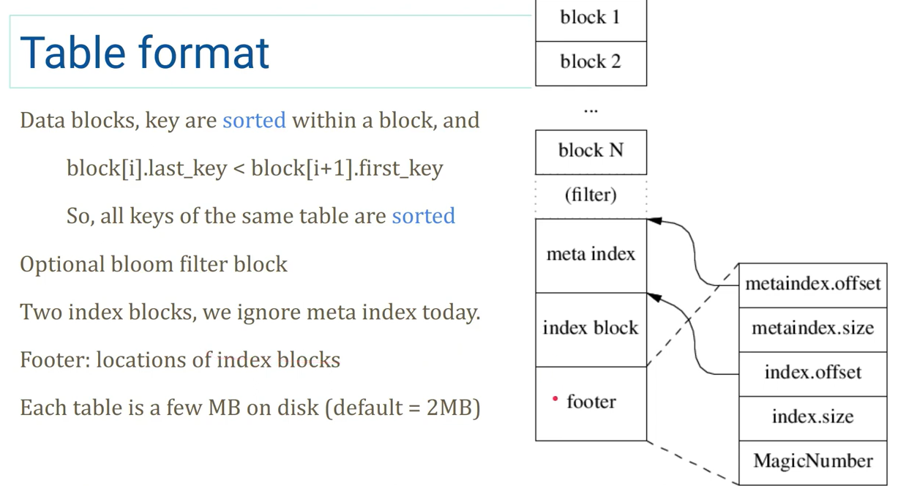
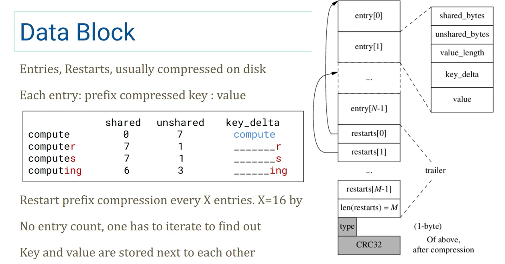
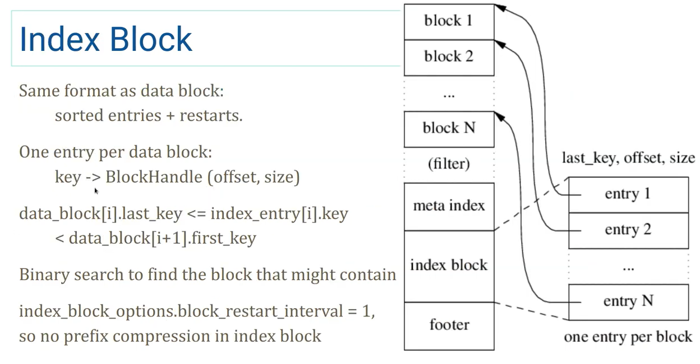
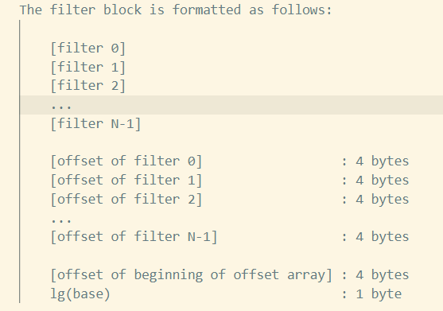

## Overview

- PPT 来自 [https://www.youtube.com/watch?v=Dpf8_qRLPkI](https://www.youtube.com/watch?v=Dpf8_qRLPkI)

### Table format



- 倒着读，顺序写
- 中间包含一个 `filter`，默认是 `BloomFilter`
- `footer` 中的 offset 和 size 使用的是变长数，即支持理论上无限大的存储器（然而事实上不会超过 `uint64` 能表示的范围）
  - 目前长度有上限，四个数总共不能超过 `2*BlockHandle::kMaxEncodedLength == 40B`，也就是每个数可以比 `uint64` 多两个 bytes
  - 使用变长大概是为了兼容考虑，如果哪天 40B 也不够用了拓展后依然能读旧的 table

- `footer` 有 padding，确保长度是 40B（除去 8B 的 magic number）

#### Data block(Block)



- 倒着读，算出 entries 的长度

- type 和 CRC32 只在硬盘里，entries 和 restarts 在磁盘上存储时会压缩（no mmap）
- restarts 是有序的，所以可以当作这个 Data Block 的一层索引
- entry 的 key 有前缀压缩，restart 会重置前缀压缩的起始点，默认X=16个重置一次
  - X 取一页可以放下的 entries 应该是最好的，这样往前读 restart 可以命中同一个 page，不会增加磁盘IO

#### Index block



- 为全部 Data Block 建立的一层索引
- 结构和 Data Block 完全一样，只不过 value 是 `BlockHandle(offset, size)`，指向一个 Data Block
- 也有 restarts（图中没画出），同样这个 restarts 也可以作为这个 Index Block 的一层索引
  - 检索流程 Index block restarts -> Index block -> Data block restarts -> Data block

- Index Block 的 key(last_key) 是它所指向的 Data Block 到下一个 Data Block 之间的 key，这样可以压缩 Index Block 的 last_key
  - 如果 `DataBlock[3].last_key = "abcdefghi"`, `DataBlock[4].first_key= "c"`
  - 那么 `IndexBlock[3].last_key` 可以是 `"b"`，如果大于 `"b"`，那就说明不在这个 `DataBlock` 里，这样就可以不用存 `"abcdefghi"`，只用存 `"b"` 了

#### Meta block

- 自定义的 Block 结构，目前内置的只有一个 meta block 可用：filter block
  - 默认是布隆过滤器

Filter block 结构：



- 每一个 `filter[i]` 表示从 `[i*base, (i+1)*base-1]` 的 key 使用 `FilterPolicy::CreateFilter()` 创建出来的 filter
  - `base` 目前是 `2KB`
- 下面的 offset 可以让 data block offset 快速 map 到对应的 filter 上
- 最后 5 个 bytes 的 trailer
  - 4B 指向 offset 的开始
  - 1B 表示 `log(base)`

#### Meta index block

- 类似 index block，key 是 meta block 的名称，value 也是 `BlockHandle(offset, size)`

### Log format

- 固定的 block 大小
  - 32KB
- 每个 block 里有多个 record
- 每个 record 前 7 个字节为 header，4 个 crc32，2 个 length，1 个 type
  - 后面是 char[length] 的数据
- 三种 type
  - Zero：mmap 时会使用这个类型，读到会返回 BadRecord
  - Full：完整的一个记录
  - Fisrt/Middle/Last：分片记录，它们会合并到一起当作一个 record 提供给外部

---

到这基本上就已经知道 reader 是如何实现的了，接下来是具体的实现的代码解析，可以从中学到一些工程设计。

## Implementation

### Reader

Dump File 的实现会把所有的 Reader 整合在一起，跟着执行路径读应该能看完大部分的 Reader 实现

解析后的格式：

```txt
// XXXXXX.log
--- offset 0; sequence 257
  put 'Key0' 'Test data value: 0'
--- offset 44; sequence 258
  put 'Key1' 'Test data value: 1'
...

// XXXXXX.ldb:
'Key0' @ 1 : val => 'Test data value: 0'
'Key1' @ 2 : val => 'Test data value: 1'
'Key10' @ 11 : val => 'Test data value: 10'
'Key100' @ 101 : val => 'Test data value: 100'
'Key101' @ 102 : val => 'Test data value: 101'
'Key102' @ 103 : val => 'Test data value: 102'
...

// MANIFEST-XXXXXX:
--- offset 0; VersionEdit {
  Comparator: leveldb.BytewiseComparator
}
--- offset 35; VersionEdit {
  LogNumber: 6
  PrevLogNumber: 0
  NextFile: 7
  LastSeq: 256
  AddFile: 0 5 2396 'Key0' @ 1 : 1 .. 'Key99' @ 100 : 1
}
```

实现：

```c++
// 文件类型
enum FileType {
  kLogFile,        // XXXXXX.log
  kDBLockFile,     // LOCK
  kTableFile,      // XXXXXX.sst/.ldb
  kDescriptorFile, // MANIFEST-XXXXXX
  kCurrentFile,    // CURRENT
  kTempFile,       // XXXXXX.dbtmp
  kInfoLogFile     // LOG/LOG.old
};

Status DumpFile(Env* env, const std::string& fname, WritableFile* dst) {
  FileType ftype;
  if (!GuessType(fname, &ftype)) {
    return Status::InvalidArgument(fname + ": unknown file type");
  }
  // 根据文件类型分别解析
  switch (ftype) {
    case kLogFile:
      return DumpLog(env, fname, dst);
    case kDescriptorFile:
      return DumpDescriptor(env, fname, dst);
    case kTableFile:
      return DumpTable(env, fname, dst);
    default:
      break;
  }
  return Status::InvalidArgument(fname + ": not a dump-able file type");
}
```

`DumpLog/DumpDescriptor`

```c++
Status DumpLog(Env* env, const std::string& fname, WritableFile* dst) {
  return PrintLogContents(env, fname, WriteBatchPrinter, dst);
}

// Called on every log record (each one of which is a WriteBatch)
// found in a kLogFile.
// 最终输出到文件的函数，一些字符串拼接操作
static void WriteBatchPrinter(uint64_t pos, Slice record, WritableFile* dst) {
  std::string r = "--- offset ";
  AppendNumberTo(&r, pos);
  r += "; ";
  if (record.size() < 12) {
    r += "log record length ";
    AppendNumberTo(&r, record.size());
    r += " is too small\n";
    dst->Append(r);
    return;
  }
  // 把读出来的 record 丢到 WriteBatch，相当于 WriteBatch 直接使用也会构造一个和 record 一样的结构
  // 然后迭代 WriteBatch，传入一个自定义的 Handle（把迭代的内容写到 dst 里），就可以解析了
  WriteBatch batch;
  // 设置 Writer buffer
  WriteBatchInternal::SetContents(&batch, record);
  r += "sequence ";
  AppendNumberTo(&r, WriteBatchInternal::Sequence(&batch));
  r.push_back('\n');
  dst->Append(r);
  // 自定义的 Handle，把迭代的内容写到 dst 里
  WriteBatchItemPrinter batch_item_printer;
  batch_item_printer.dst_ = dst;
  Status s = batch.Iterate(&batch_item_printer);
  if (!s.ok()) {
    dst->Append("  error: " + s.ToString() + "\n");
  }
}

// Print contents of a log file. (*func)() is called on every record.
Status PrintLogContents(Env* env, const std::string& fname,
                        void (*func)(uint64_t, Slice, WritableFile*),
                        WritableFile* dst) {
  SequentialFile* file;
  Status s = env->NewSequentialFile(fname, &file);
  if (!s.ok()) {
    return s;
  }
  // 遇到 Corruption 会贴到输出文件里
  CorruptionReporter reporter;
  reporter.dst_ = dst;
  // 主要使用 log::Reader 读，启用了 checksum，从 0 开始读
  log::Reader reader(file, &reporter, true, 0);
  Slice record;
  std::string scratch; // 这只当作一个 StringBuffer 用，ReadRecord 不应该每次调用都分配一次内存（可以用个全局变量啊？）
  while (reader.ReadRecord(&record, &scratch)) {
    (*func)(reader.LastRecordOffset(), record, dst);
  }
  delete file;
  return Status::OK();
}

// Called on every log record (each one of which is a WriteBatch)
// found in a kDescriptorFile.
static void VersionEditPrinter(uint64_t pos, Slice record, WritableFile* dst) {
  std::string r = "--- offset ";
  AppendNumberTo(&r, pos);
  r += "; ";
  VersionEdit edit;
  // 解析 VersionEdit，里面按序存了一些 metadata，没有什么特殊的
  Status s = edit.DecodeFrom(record);
  if (!s.ok()) {
    r += s.ToString();
    r.push_back('\n');
  } else {
    r += edit.DebugString();
  }
  dst->Append(r);
}

Status DumpDescriptor(Env* env, const std::string& fname, WritableFile* dst) {
  return PrintLogContents(env, fname, VersionEditPrinter, dst);
}
```

#### Log

定义

```c++
class Reader {
 public:
  // Interface for reporting errors.
  // 遇到 Corruption 时的处理，读坏了提供一些信息
  class Reporter {
   public:
    virtual ~Reporter();

    // Some corruption was detected.  "bytes" is the approximate number
    // of bytes dropped due to the corruption.
    virtual void Corruption(size_t bytes, const Status& status) = 0;
  };

  // Create a reader that will return log records from "*file".
  // "*file" must remain live while this Reader is in use.
  //
  // If "reporter" is non-null, it is notified whenever some data is
  // dropped due to a detected corruption.  "*reporter" must remain
  // live while this Reader is in use.
  //
  // If "checksum" is true, verify checksums if available.
  //
  // The Reader will start reading at the first record located at physical
  // position >= initial_offset within the file.
  Reader(SequentialFile* file, Reporter* reporter, bool checksum,
         uint64_t initial_offset);

  // 只允许引用传递
  Reader(const Reader&) = delete;
  Reader& operator=(const Reader&) = delete;

  ~Reader();

  // Read the next record into *record.  Returns true if read
  // successfully, false if we hit end of the input.  May use
  // "*scratch" as temporary storage.  The contents filled in *record
  // will only be valid until the next mutating operation on this
  // reader or the next mutation to *scratch.
  // 主要的方法，读一个记录放到 record 里，第二个参数 scratch 用来拼接分片的记录（为什么不用成员变量？）
  bool ReadRecord(Slice* record, std::string* scratch);

  // Returns the physical offset of the last record returned by ReadRecord.
  //
  // Undefined before the first call to ReadRecord.
  // 上一次读的记录的物理 offset，如果是分片的记录，返回分片第一个记录的物理 offset
  uint64_t LastRecordOffset();

 private:
  // Extend record types with the following special values
  enum {
    kEof = kMaxRecordType + 1,
    // Returned whenever we find an invalid physical record.
    // Currently there are three situations in which this happens:
    // * The record has an invalid CRC (ReadPhysicalRecord reports a drop)
    // * The record is a 0-length record (No drop is reported)
    // * The record is below constructor's initial_offset (No drop is reported)
    kBadRecord = kMaxRecordType + 2
  };

  // Skips all blocks that are completely before "initial_offset_".
  //
  // Returns true on success. Handles reporting.
  bool SkipToInitialBlock();

  // Return type, or one of the preceding special values
  unsigned int ReadPhysicalRecord(Slice* result);

  // Reports dropped bytes to the reporter.
  // buffer_ must be updated to remove the dropped bytes prior to invocation.
  void ReportCorruption(uint64_t bytes, const char* reason);
  void ReportDrop(uint64_t bytes, const Status& reason);

  SequentialFile* const file_;
  Reporter* const reporter_;
  bool const checksum_;
  // store 大小是固定的 kBlockSize，所以不需要扩容，指针地址也不会改变
  char* const backing_store_;
  Slice buffer_;
  bool eof_;  // Last Read() indicated EOF by returning < kBlockSize

  // Offset of the last record returned by ReadRecord.
  uint64_t last_record_offset_;
  // Offset of the first location past the end of buffer_.
  uint64_t end_of_buffer_offset_;

  // Offset at which to start looking for the first record to return
  uint64_t const initial_offset_;

  // True if we are resynchronizing after a seek (initial_offset_ > 0). In
  // particular, a run of kMiddleType and kLastType records can be silently
  // skipped in this mode
  bool resyncing_;
};
```

实现

```c++
enum RecordType {
  // Zero is reserved for preallocated files
  kZeroType = 0,

  kFullType = 1,

  // For fragments
  kFirstType = 2,
  kMiddleType = 3,
  kLastType = 4
};

static const int kMaxRecordType = kLastType;

// int16 最大值，大小是固定的，并非 DataBlock 一样可以运行时改变
static const int kBlockSize = 32768;

// Header is checksum (4 bytes), length (2 bytes), type (1 byte).
static const int kHeaderSize = 4 + 2 + 1;

Reader::Reader(SequentialFile* file, Reporter* reporter, bool checksum,
               uint64_t initial_offset)
    : file_(file),
      reporter_(reporter),
      checksum_(checksum),
      backing_store_(new char[kBlockSize]),
      buffer_(),
      eof_(false),
      last_record_offset_(0),
      end_of_buffer_offset_(0),
      initial_offset_(initial_offset),
      resyncing_(initial_offset > 0) {}

Reader::~Reader() { delete[] backing_store_; }

// 跳到 initial_offset 所指向的 block
bool Reader::SkipToInitialBlock() {
  const size_t offset_in_block = initial_offset_ % kBlockSize;
  // 当前 offset 所在的 block 的首个字节位置
  uint64_t block_start_location = initial_offset_ - offset_in_block;

  // Don't search a block if we'd be in the trailer
  // trailer 会占用一个 block 最后 6 个字节
  if (offset_in_block > kBlockSize - 6) {
    // 如果当前 offset 在 trailer 里，就跳过这个 block
    block_start_location += kBlockSize;
  }
  // 记录一下当前读的点
  end_of_buffer_offset_ = block_start_location;

  // Skip to start of first block that can contain the initial record
  if (block_start_location > 0) {
    // seek file cursor
    Status skip_status = file_->Skip(block_start_location);
    if (!skip_status.ok()) {
      ReportDrop(block_start_location, skip_status);
      return false;
    }
  }

  return true;
}

bool Reader::ReadRecord(Slice* record, std::string* scratch) {
  // 确保第一次读之前先 seek 到 initial_offset_
  if (last_record_offset_ < initial_offset_) {
    if (!SkipToInitialBlock()) {
      return false;
    }
  }

  scratch->clear();
  record->clear();
  // 是不是正在解读分片记录
  bool in_fragmented_record = false;
  // Record offset of the logical record that we're reading
  // 0 is a dummy value to make compilers happy
  uint64_t prospective_record_offset = 0;

  Slice fragment;
  while (true) {
    const unsigned int record_type = ReadPhysicalRecord(&fragment);

    // ReadPhysicalRecord may have only had an empty trailer remaining in its
    // internal buffer. Calculate the offset of the next physical record now
    // that it has returned, properly accounting for its header size.
    // 当前读到的 block 的物理 offset
    uint64_t physical_record_offset =
        end_of_buffer_offset_ - buffer_.size() - kHeaderSize - fragment.size();

    if (resyncing_) {
      // 如果 seek 到的 initial_offset_ 是分片记录，并且是中间或者末尾的记录，那么跳过这些记录，从第一个完整的记录开始
      if (record_type == kMiddleType) {
        continue;
      } else if (record_type == kLastType) {
        resyncing_ = false;
        continue;
      } else {
        resyncing_ = false;
      }
    }

    switch (record_type) {
      case kFullType:
        if (in_fragmented_record) {
          // 分片的记录中间不该出现一个 fulltype 记录
          // Handle bug in earlier versions of log::Writer where
          // it could emit an empty kFirstType record at the tail end
          // of a block followed by a kFullType or kFirstType record
          // at the beginning of the next block.
          if (!scratch->empty()) {
            ReportCorruption(scratch->size(), "partial record without end(1)");
          }
        }
        prospective_record_offset = physical_record_offset;
        scratch->clear();
        *record = fragment;
        last_record_offset_ = prospective_record_offset;
        return true; // 读到了一个完整的

      case kFirstType:
        if (in_fragmented_record) {
          // 同上，分片还没结束不应该又出现一个分片开头
          // Handle bug in earlier versions of log::Writer where
          // it could emit an empty kFirstType record at the tail end
          // of a block followed by a kFullType or kFirstType record
          // at the beginning of the next block.
          if (!scratch->empty()) {
            ReportCorruption(scratch->size(), "partial record without end(2)");
          }
        }
        // prospective_record_offset 在读分片记录时会一直指向分片开始的 block 的开头的物理 offset，而不是上一次读取到的 block 的开头的物理 offset
        prospective_record_offset = physical_record_offset;
        scratch->assign(fragment.data(), fragment.size()); // 重置分片的 scratch
        in_fragmented_record = true; // 开始读分片记录了
        break;

      case kMiddleType:
        if (!in_fragmented_record) {
          // middle 记录需要在 first 之后
          ReportCorruption(fragment.size(),
                           "missing start of fragmented record(1)");
        } else {
          scratch->append(fragment.data(), fragment.size()); // 贴到 scratch 后面
        }
        break;

      case kLastType:
        if (!in_fragmented_record) {
          ReportCorruption(fragment.size(),
                           "missing start of fragmented record(2)");
        } else {
          scratch->append(fragment.data(), fragment.size());
          *record = Slice(*scratch);
          // 正确地读完一整块分片，记录一下 last_record_offset_ 为分片开头的 block 的物理 offset
          last_record_offset_ = prospective_record_offset;
          // 这里是不是忘了 in_fragmented_record = false ?
          return true; // 读到了一个完整的
        }
        break;

      case kEof:
        if (in_fragmented_record) {
          // This can be caused by the writer dying immediately after
          // writing a physical record but before completing the next; don't
          // treat it as a corruption, just ignore the entire logical record.
          // writer 写分片记录写一半挂了，reader 只能读出一半来，把之前填充的 scratch 清理掉
          scratch->clear();
        }
        return false;

      case kBadRecord:
        if (in_fragmented_record) {
          ReportCorruption(scratch->size(), "error in middle of record");
          in_fragmented_record = false;
          scratch->clear();
        }
        break;

      default: {
        // 读到了不认得的 block type
        char buf[40];
        std::snprintf(buf, sizeof(buf), "unknown record type %u", record_type);
        ReportCorruption(
            (fragment.size() + (in_fragmented_record ? scratch->size() : 0)),
            buf);
        in_fragmented_record = false;
        scratch->clear();
        break;
      }
    }
  }
  return false;
}

uint64_t Reader::LastRecordOffset() { return last_record_offset_; }

void Reader::ReportCorruption(uint64_t bytes, const char* reason) {
  ReportDrop(bytes, Status::Corruption(reason));
}

void Reader::ReportDrop(uint64_t bytes, const Status& reason) {
  if (reporter_ != nullptr &&
      end_of_buffer_offset_ - buffer_.size() - bytes >= initial_offset_) {
    reporter_->Corruption(static_cast<size_t>(bytes), reason);
  }
}

unsigned int Reader::ReadPhysicalRecord(Slice* result) {
  while (true) {
    if (buffer_.size() < kHeaderSize) { // 如果当前读到的 buffer 里没有数据（内容比 header size 还小）
      if (!eof_) {
        // Last read was a full read, so this is a trailer to skip
        buffer_.clear();
        // 读一个 block，buffer 重置为指向 backing_store_ 的一个切片
        Status status = file_->Read(kBlockSize, &buffer_, backing_store_);
        end_of_buffer_offset_ += buffer_.size(); // 一直往后读，不会跳过，所以只需要加大小就是 end offset
        if (!status.ok()) { // 读坏了！
          buffer_.clear();
          ReportDrop(kBlockSize, status);
          eof_ = true;
          return kEof;
        } else if (buffer_.size() < kBlockSize) { // 读完发现没读完整一个 Block，说明已经结束了
          eof_ = true;
        }
        // 我还能读！
        continue;
      } else {
        // Note that if buffer_ is non-empty, we have a truncated header at the
        // end of the file, which can be caused by the writer crashing in the
        // middle of writing the header. Instead of considering this an error,
        // just report EOF.
        // writer 写 header 写一半挂了，reader 读到最后一个 block 发现只有半个 header，就会走到
        // 这里。buffer 这时可能还有东西（半个 header），清理掉然后当作 EOF 处理
        buffer_.clear();
        return kEof;
      }
    }
    
    // buffer 里现在有一个 record 的数据了，开始解析
    // Parse the header
    // 前 4 个 Bytes 是 crc32
    // 第 5，6 两个字节表示长度，第6个字节是高位，长度不包括头部
    // 第 7 个字节是类型
    const char* header = buffer_.data();
    const uint32_t a = static_cast<uint32_t>(header[4]) & 0xff;
    const uint32_t b = static_cast<uint32_t>(header[5]) & 0xff;
    const unsigned int type = header[6];
    const uint32_t length = a | (b << 8);
    if (kHeaderSize + length > buffer_.size()) { // length 不对劲，算一下居然比 buffer 还长
      size_t drop_size = buffer_.size();
      buffer_.clear();
      if (!eof_) {
        ReportCorruption(drop_size, "bad record length");
        return kBadRecord;
      }
      // If the end of the file has been reached without reading |length| bytes
      // of payload, assume the writer died in the middle of writing the record.
      // Don't report a corruption.
      // writer 写一半挂了，那么 reader 确实会读出怪 length，当作 EOF
      return kEof;
    }

    if (type == kZeroType && length == 0) {
      // Skip zero length record without reporting any drops since
      // such records are produced by the mmap based writing code in
      // env_posix.cc that preallocates file regions.
      buffer_.clear();
      return kBadRecord;
    }

    // Check crc
    if (checksum_) {
      // 前 4 个 Bytes 是 crc32
      uint32_t expected_crc = crc32c::Unmask(DecodeFixed32(header));
      // 跳过前6个字节，包括第7个字节（类型）一起计算数据部分的 crc32
      uint32_t actual_crc = crc32c::Value(header + 6, 1 + length);
      if (actual_crc != expected_crc) {
        // Drop the rest of the buffer since "length" itself may have
        // been corrupted and if we trust it, we could find some
        // fragment of a real log record that just happens to look
        // like a valid log record.
        size_t drop_size = buffer_.size();
        buffer_.clear();
        ReportCorruption(drop_size, "checksum mismatch");
        return kBadRecord;
      }
    }
    
    // 跳过已经解析了内容
    buffer_.remove_prefix(kHeaderSize + length);

    // Skip physical record that started before initial_offset_
    // 读到 initial_offset_ 之前的东西了
    if (end_of_buffer_offset_ - buffer_.size() - kHeaderSize - length <
        initial_offset_) {
      result->clear();
      return kBadRecord;
    }

    // result 指向 block data 部分
    *result = Slice(header + kHeaderSize, length);
    return type;
  }
}
```

`DumpTable`

```c++
Status DumpTable(Env* env, const std::string& fname, WritableFile* dst) {
  uint64_t file_size;
  RandomAccessFile* file = nullptr; // 使用 RandomAccessFile 作为 backend
  Table* table = nullptr;
  Status s = env->GetFileSize(fname, &file_size);
  if (s.ok()) {
    s = env->NewRandomAccessFile(fname, &file);
  }
  if (s.ok()) {
    // We use the default comparator, which may or may not match the
    // comparator used in this database. However this should not cause
    // problems since we only use Table operations that do not require
    // any comparisons.  In particular, we do not call Seek or Prev.
    s = Table::Open(Options(), file, file_size, &table);
  }
  if (!s.ok()) {
    delete table;
    delete file;
    return s;
  }

  ReadOptions ro;
  ro.fill_cache = false; // 读取不会 cache
  Iterator* iter = table->NewIterator(ro);
  std::string r;
  // 迭代写入 dst
  for (iter->SeekToFirst(); iter->Valid(); iter->Next()) {
    r.clear();
    ParsedInternalKey key;
    if (!ParseInternalKey(iter->key(), &key)) {
      r = "badkey '";
      AppendEscapedStringTo(&r, iter->key());
      r += "' => '";
      AppendEscapedStringTo(&r, iter->value());
      r += "'\n";
      dst->Append(r);
    } else {
      r = "'";
      AppendEscapedStringTo(&r, key.user_key);
      r += "' @ ";
      AppendNumberTo(&r, key.sequence);
      r += " : ";
      // 删除也是一条记录
      if (key.type == kTypeDeletion) {
        r += "del";
      } else if (key.type == kTypeValue) {
        r += "val";
      } else {
        AppendNumberTo(&r, key.type);
      }
      r += " => '";
      AppendEscapedStringTo(&r, iter->value());
      r += "'\n";
      dst->Append(r);
    }
  }
  s = iter->status();
  if (!s.ok()) {
    dst->Append("iterator error: " + s.ToString() + "\n");
  }

  delete iter;
  delete table;
  delete file;
  return Status::OK();
}
```

#### Format

- Table 中一些具体的组件
  - BlockHandle：用于指向一个 block
  - Footer：sstable 的 footer
  - BlockContents：block 磁盘数据表示

定义

```c++
class Block;
class RandomAccessFile;
struct ReadOptions;

// BlockHandle is a pointer to the extent of a file that stores a data
// block or a meta block.
class BlockHandle {
 public:
  // Maximum encoding length of a BlockHandle
  enum { kMaxEncodedLength = 10 + 10 };

  BlockHandle();

  // The offset of the block in the file.
  uint64_t offset() const { return offset_; }
  void set_offset(uint64_t offset) { offset_ = offset; }

  // The size of the stored block
  uint64_t size() const { return size_; }
  void set_size(uint64_t size) { size_ = size; }

  void EncodeTo(std::string* dst) const;
  Status DecodeFrom(Slice* input);

 private:
  // 由文件的偏移和长度确定一个 handle
  uint64_t offset_;
  uint64_t size_;
};

// Footer encapsulates the fixed information stored at the tail
// end of every table file.
class Footer {
 public:
  // Encoded length of a Footer.  Note that the serialization of a
  // Footer will always occupy exactly this many bytes.  It consists
  // of two block handles and a magic number.
  enum { kEncodedLength = 2 * BlockHandle::kMaxEncodedLength + 8 };

  Footer() = default;

  // The block handle for the metaindex block of the table
  const BlockHandle& metaindex_handle() const { return metaindex_handle_; }
  void set_metaindex_handle(const BlockHandle& h) { metaindex_handle_ = h; }

  // The block handle for the index block of the table
  const BlockHandle& index_handle() const { return index_handle_; }
  void set_index_handle(const BlockHandle& h) { index_handle_ = h; }

  void EncodeTo(std::string* dst) const;
  Status DecodeFrom(Slice* input);

 private:
  // footer 由两个 index 的 handle 构成（还有一个 magic number 外加一些 padding）
  BlockHandle metaindex_handle_;
  BlockHandle index_handle_;
};

// kTableMagicNumber was picked by running
//    echo http://code.google.com/p/leveldb/ | sha1sum
// and taking the leading 64 bits.
static const uint64_t kTableMagicNumber = 0xdb4775248b80fb57ull;

// 1-byte type + 32-bit crc
static const size_t kBlockTrailerSize = 5;

struct BlockContents {
  Slice data;           // Actual contents of data
  bool cachable;        // True if data can be cached
  bool heap_allocated;  // True if caller should delete[] data.data()
};

// Read the block identified by "handle" from "file".  On failure
// return non-OK.  On success fill *result and return OK.
Status ReadBlock(RandomAccessFile* file, const ReadOptions& options,
                 const BlockHandle& handle, BlockContents* result);
```

实现

```c++
void BlockHandle::EncodeTo(std::string* dst) const {
  // Sanity check that all fields have been set
  assert(offset_ != ~static_cast<uint64_t>(0));
  assert(size_ != ~static_cast<uint64_t>(0));
  // 变长编码，但又有 padding，不知道它们是怎么想的，大概是为了兼容吧，也许哪一天 u64 也装不下了呢？如果拓展的话使用固定长度编码的旧 table 就会读不出来
  PutVarint64(dst, offset_);
  PutVarint64(dst, size_);
}

Status BlockHandle::DecodeFrom(Slice* input) {
  // 变长编码
  if (GetVarint64(input, &offset_) && GetVarint64(input, &size_)) {
    return Status::OK();
  } else {
    return Status::Corruption("bad block handle");
  }
}

void Footer::EncodeTo(std::string* dst) const {
  const size_t original_size = dst->size();
  metaindex_handle_.EncodeTo(dst);
  index_handle_.EncodeTo(dst);
  dst->resize(2 * BlockHandle::kMaxEncodedLength);  // Padding
  // 小端编码 magic number，怪
  PutFixed32(dst, static_cast<uint32_t>(kTableMagicNumber & 0xffffffffu));
  PutFixed32(dst, static_cast<uint32_t>(kTableMagicNumber >> 32));
  // 会写进入 48 个 Bytes
  assert(dst->size() == original_size + kEncodedLength);
  (void)original_size;  // Disable unused variable warning.
}

Status Footer::DecodeFrom(Slice* input) {
  if (input->size() < kEncodedLength) {
    return Status::Corruption("not an sstable (footer too short)");
  }

  const char* magic_ptr = input->data() + kEncodedLength - 8;
  const uint32_t magic_lo = DecodeFixed32(magic_ptr);
  const uint32_t magic_hi = DecodeFixed32(magic_ptr + 4);
  const uint64_t magic = ((static_cast<uint64_t>(magic_hi) << 32) |
                          (static_cast<uint64_t>(magic_lo)));
  if (magic != kTableMagicNumber) {
    return Status::Corruption("not an sstable (bad magic number)");
  }

  Status result = metaindex_handle_.DecodeFrom(input);
  if (result.ok()) {
    result = index_handle_.DecodeFrom(input);
  }
  if (result.ok()) {
    // We skip over any leftover data (just padding for now) in "input"
    const char* end = magic_ptr + 8;
    *input = Slice(end, input->data() + input->size() - end);
  }
  return result;
}

Status ReadBlock(RandomAccessFile* file, const ReadOptions& options,
                 const BlockHandle& handle, BlockContents* result) {
  result->data = Slice();
  result->cachable = false;
  result->heap_allocated = false;

  // Read the block contents as well as the type/crc footer.
  // See table_builder.cc for the code that built this structure.
  size_t n = static_cast<size_t>(handle.size());
  // trailer 的大小不算在 handle 的 size 里...
  char* buf = new char[n + kBlockTrailerSize];
  Slice contents; // 可能是 buf 的一段切片，可能也不是（mmap 的 file 则不是）
  Status s = file->Read(handle.offset(), n + kBlockTrailerSize, &contents, buf);
  if (!s.ok()) {
    delete[] buf;
    return s;
  }
  if (contents.size() != n + kBlockTrailerSize) {
    delete[] buf;
    return Status::Corruption("truncated block read");
  }

  // Check the crc of the type and the block contents
  const char* data = contents.data();  // Pointer to where Read put the data
  if (options.verify_checksums) {
    const uint32_t crc = crc32c::Unmask(DecodeFixed32(data + n + 1));
    const uint32_t actual = crc32c::Value(data, n + 1);
    if (actual != crc) {
      delete[] buf;
      s = Status::Corruption("block checksum mismatch");
      return s;
    }
  }

  switch (data[n]) { // 最后一个是 data block 的 type
    case kNoCompression:
      if (data != buf) {
        // File implementation gave us pointer to some other data.
        // Use it directly under the assumption that it will be live
        // while the file is open.
        // 这里发现 data 没有指向 buf，说明 file->Read 是读到了一个 mmap file 了，没有拷贝到 buf 里
        delete[] buf; // 那么 buf 显然是没用了，删了
        result->data = Slice(data, n);
        result->heap_allocated = false; // 没有进一步分配堆内存
        // mmap file 操作系统有 page cache，所以不用再 cache 一次了
        result->cachable = false;  // Do not double-cache
      } else {
        // 这里则是正常的 file io，拷贝到了 buf 里
        result->data = Slice(buf, n);
        result->heap_allocated = true; // 进行了一次堆内存分配
        result->cachable = true; // 这里做 cache
      }

      // Ok
      break;
    case kSnappyCompression: {
      size_t ulength = 0;
      // 先估计一下解压后大概有多大
      if (!port::Snappy_GetUncompressedLength(data, n, &ulength)) {
        delete[] buf;
        return Status::Corruption("corrupted snappy compressed block length");
      }
      char* ubuf = new char[ulength];
      // 解压
      if (!port::Snappy_Uncompress(data, n, ubuf)) {
        delete[] buf;
        delete[] ubuf;
        return Status::Corruption("corrupted snappy compressed block contents");
      }
      delete[] buf;
      result->data = Slice(ubuf, ulength);
      result->heap_allocated = true; // 解压缩一定会分配堆内存
      result->cachable = true; // 为解压缩过后的数据做 cache
      break;
    }
    case kZstdCompression: {
      // 类似
      size_t ulength = 0;
      if (!port::Zstd_GetUncompressedLength(data, n, &ulength)) {
        delete[] buf;
        return Status::Corruption("corrupted zstd compressed block length");
      }
      char* ubuf = new char[ulength];
      if (!port::Zstd_Uncompress(data, n, ubuf)) {
        delete[] buf;
        delete[] ubuf;
        return Status::Corruption("corrupted zstd compressed block contents");
      }
      delete[] buf;
      result->data = Slice(ubuf, ulength);
      result->heap_allocated = true;
      result->cachable = true;
      break;
    }
    default:
      delete[] buf;
      return Status::Corruption("bad block type");
  }

  return Status::OK();
}
```

#### Table::Open

Table 定义

- 主要有 `Open` 和 `NewIterator` 两个常用的方法

```c++
// A Table is a sorted map from strings to strings.  Tables are
// immutable and persistent.  A Table may be safely accessed from
// multiple threads without external synchronization.
class LEVELDB_EXPORT Table {
 public:
  // Attempt to open the table that is stored in bytes [0..file_size)
  // of "file", and read the metadata entries necessary to allow
  // retrieving data from the table.
  //
  // If successful, returns ok and sets "*table" to the newly opened
  // table.  The client should delete "*table" when no longer needed.
  // If there was an error while initializing the table, sets "*table"
  // to nullptr and returns a non-ok status.  Does not take ownership of
  // "*source", but the client must ensure that "source" remains live
  // for the duration of the returned table's lifetime.
  //
  // *file must remain live while this Table is in use.
  static Status Open(const Options& options, RandomAccessFile* file,
                     uint64_t file_size, Table** table);

  Table(const Table&) = delete;
  Table& operator=(const Table&) = delete;

  ~Table();

  // Returns a new iterator over the table contents.
  // The result of NewIterator() is initially invalid (caller must
  // call one of the Seek methods on the iterator before using it).
  Iterator* NewIterator(const ReadOptions&) const;

  // Given a key, return an approximate byte offset in the file where
  // the data for that key begins (or would begin if the key were
  // present in the file).  The returned value is in terms of file
  // bytes, and so includes effects like compression of the underlying data.
  // E.g., the approximate offset of the last key in the table will
  // be close to the file length.
  uint64_t ApproximateOffsetOf(const Slice& key) const;

 private:
  friend class TableCache;
  struct Rep;

  static Iterator* BlockReader(void*, const ReadOptions&, const Slice&);

  explicit Table(Rep* rep) : rep_(rep) {}

  // Calls (*handle_result)(arg, ...) with the entry found after a call
  // to Seek(key).  May not make such a call if filter policy says
  // that key is not present.
  Status InternalGet(const ReadOptions&, const Slice& key, void* arg,
                     void (*handle_result)(void* arg, const Slice& k,
                                           const Slice& v));

  void ReadMeta(const Footer& footer);
  void ReadFilter(const Slice& filter_handle_value);

  Rep* const rep_;
};
```

`Table::Open` 实现

```c++
/// Table 的底层表示
struct Table::Rep {
  ~Rep() {
    delete filter;
    delete[] filter_data;
    delete index_block;
  }

  Options options;
  Status status;
  RandomAccessFile* file;
  uint64_t cache_id;
  
  // Filter meta block 相关，默认是布隆过滤器
  FilterBlockReader* filter;
  // Filter data，过滤器的存储
  const char* filter_data;

  // meta block 的 index
  BlockHandle metaindex_handle;  // Handle to metaindex_block: saved from footer
  // data block 的 index
  Block* index_block;
};

Status Table::Open(const Options& options, RandomAccessFile* file,
                   uint64_t size, Table** table) {
  *table = nullptr;
  if (size < Footer::kEncodedLength) {
    return Status::Corruption("file is too short to be an sstable");
  }

  // 倒着读，先读 footer
  char footer_space[Footer::kEncodedLength];
  Slice footer_input;
  Status s = file->Read(size - Footer::kEncodedLength, Footer::kEncodedLength,
                        &footer_input, footer_space);
  if (!s.ok()) return s;

  Footer footer;
  s = footer.DecodeFrom(&footer_input);
  if (!s.ok()) return s;

  // 然后读 data block 的 index
  // Read the index block
  BlockContents index_block_contents;
  ReadOptions opt;
  if (options.paranoid_checks) { // 积极的 checksum 可能会导致一整个 sstable 打不开
    opt.verify_checksums = true;
  }
  // 从 footer 里记载的 index block 的 handle 那里找到 index
  s = ReadBlock(file, opt, footer.index_handle(), &index_block_contents);

  if (s.ok()) {
    // We've successfully read the footer and the index block: we're
    // ready to serve requests.
    Block* index_block = new Block(index_block_contents);
    Rep* rep = new Table::Rep;
    rep->options = options;
    rep->file = file;
    rep->metaindex_handle = footer.metaindex_handle();
    rep->index_block = index_block;
    // 0 表示不开启 cache
    rep->cache_id = (options.block_cache ? options.block_cache->NewId() : 0);
    rep->filter_data = nullptr;
    rep->filter = nullptr;
    *table = new Table(rep);
    // 最后读 meta block
    (*table)->ReadMeta(footer);
  }

  return s;
}
```

`Table::ReadMeta` 实现

```c++
void Table::ReadMeta(const Footer& footer) {
  // 目前只有一个 filter meta block
  if (rep_->options.filter_policy == nullptr) {
    return;  // Do not need any metadata
  }

  // TODO(sanjay): Skip this if footer.metaindex_handle() size indicates
  // it is an empty block.
  ReadOptions opt;
  if (rep_->options.paranoid_checks) {
    opt.verify_checksums = true;
  }
  BlockContents contents;
  if (!ReadBlock(rep_->file, opt, footer.metaindex_handle(), &contents).ok()) {
    // Do not propagate errors since meta info is not needed for operation
    return;
  }
  // 创建内存中的 Block 数据表示
  Block* meta = new Block(contents);

  Iterator* iter = meta->NewIterator(BytewiseComparator());
  std::string key = "filter.";
  key.append(rep_->options.filter_policy->Name()); // 默认 leveldb.BuiltinBloomFilter2
  iter->Seek(key);
  if (iter->Valid() && iter->key() == Slice(key)) {
    ReadFilter(iter->value()); // 只会读 filter
  }
  delete iter;
  delete meta;
}

void Table::ReadFilter(const Slice& filter_handle_value) {
  Slice v = filter_handle_value;
  BlockHandle filter_handle;
  // meta handle 里存的也是一个 BlockHandle
  if (!filter_handle.DecodeFrom(&v).ok()) {
    return;
  }

  // We might want to unify with ReadBlock() if we start
  // requiring checksum verification in Table::Open.
  ReadOptions opt;
  if (rep_->options.paranoid_checks) {
    opt.verify_checksums = true;
  }
  BlockContents block;
  if (!ReadBlock(rep_->file, opt, filter_handle, &block).ok()) {
    return;
  }
  if (block.heap_allocated) {
    // 记录一下，Table 被 delete 了也能顺带着把对应分配的堆内存给回收了
    rep_->filter_data = block.data.data();  // Will need to delete later
  }
  // 创建 Filter
  rep_->filter = new FilterBlockReader(rep_->options.filter_policy, block.data);
}
```

#### FilterBlockReader

- 内存的 Filter 数据表示
  - 默认是有多个布隆过滤器组成

定义

```c++
class FilterPolicy;

class FilterBlockReader {
 public:
  // REQUIRES: "contents" and *policy must stay live while *this is live.
  FilterBlockReader(const FilterPolicy* policy, const Slice& contents);
  bool KeyMayMatch(uint64_t block_offset, const Slice& key);

 private:
  const FilterPolicy* policy_;
  const char* data_;    // Pointer to filter data (at block-start)
  const char* offset_;  // Pointer to beginning of offset array (at block-end)
  size_t num_;          // Number of entries in offset array
  size_t base_lg_;      // Encoding parameter (see kFilterBaseLg in .cc file)
};
```

实现

```c++

FilterBlockReader::FilterBlockReader(const FilterPolicy* policy,
                                     const Slice& contents)
    : policy_(policy), data_(nullptr), offset_(nullptr), num_(0), base_lg_(0) {
  size_t n = contents.size();
  // 长度小于 5 说明有问题
  if (n < 5) return;  // 1 byte for base_lg_ and 4 for start of offset array
  
  base_lg_ = contents[n - 1];
  uint32_t last_word = DecodeFixed32(contents.data() + n - 5);
  if (last_word > n - 5) return; // 第一个 offset 所在的位置不应该比读出来的 length 更长
  data_ = contents.data();
  offset_ = data_ + last_word;
  num_ = (n - 5 - last_word) / 4; // 每个 offset entry 都是 4B，这里一共有多少个 offset
}

bool FilterBlockReader::KeyMayMatch(uint64_t block_offset, const Slice& key) {
  uint64_t index = block_offset >> base_lg_; // 查看这个 block 应该落到哪个 filter 中
  if (index < num_) {
    // 每个 offset 存两个数，用于指示 data 中哪块是一个完整的 filter data
    uint32_t start = DecodeFixed32(offset_ + index * 4);
    uint32_t limit = DecodeFixed32(offset_ + index * 4 + 4);
    if (start <= limit && limit <= static_cast<size_t>(offset_ - data_)) { // limit 应该指向 offset 的前面
      Slice filter = Slice(data_ + start, limit - start);
      return policy_->KeyMayMatch(key, filter); // 跳到对应的 filter policy 中
    } else if (start == limit) {
      // Empty filters do not match any keys
      // 空的 filter data，说明没有创建任何 filter，也就是说没有 key
      return false;
    }
  }
  // 误报，当作过滤器失效
  return true;  // Errors are treated as potential matches
}
```

#### Table::NewIterator

`Table::NewIterator` 实现

```c++
Iterator* Table::NewIterator(const ReadOptions& options) const {
  // 两层的 iterator，先查 index，再查 block
  // block 的 iterator 是动态创建的，只有读到对应的 block 才会创建对应的 iterator
  return NewTwoLevelIterator(
      rep_->index_block->NewIterator(rep_->options.comparator),
      &Table::BlockReader, const_cast<Table*>(this), options);
}


// Convert an index iterator value (i.e., an encoded BlockHandle)
// into an iterator over the contents of the corresponding block.
// Index => Block
Iterator* Table::BlockReader(void* arg, const ReadOptions& options,
                             const Slice& index_value) {
  Table* table = reinterpret_cast<Table*>(arg);
  Cache* block_cache = table->rep_->options.block_cache;
  Block* block = nullptr;
  Cache::Handle* cache_handle = nullptr;

  BlockHandle handle;
  Slice input = index_value;
  Status s = handle.DecodeFrom(&input);
  // We intentionally allow extra stuff in index_value so that we
  // can add more features in the future.

  if (s.ok()) {
    BlockContents contents;
    if (block_cache != nullptr) {
      char cache_key_buffer[16];
      EncodeFixed64(cache_key_buffer, table->rep_->cache_id); // cache id 会作为 cache key 的开头
      EncodeFixed64(cache_key_buffer + 8, handle.offset()); // 其次是它的 offset，可以唯一确定一个 block
      Slice key(cache_key_buffer, sizeof(cache_key_buffer));
      cache_handle = block_cache->Lookup(key);
      if (cache_handle != nullptr) {
        // 命中了 cache
        block = reinterpret_cast<Block*>(block_cache->Value(cache_handle));
      } else {
        s = ReadBlock(table->rep_->file, options, handle, &contents);
        if (s.ok()) {
          block = new Block(contents);
          // fill_cache 在这里参与控制这次 read 会不会存入 cache
          if (contents.cachable && options.fill_cache) {
            cache_handle = block_cache->Insert(key, block, block->size(),
                                               &DeleteCachedBlock);
          }
        }
      }
    } else {
      s = ReadBlock(table->rep_->file, options, handle, &contents);
      if (s.ok()) {
        block = new Block(contents);
      }
    }
  }

  Iterator* iter;
  if (block != nullptr) {
    iter = block->NewIterator(table->rep_->options.comparator); // 关键的部分，跳到 Block 中的 iterator
    // 根据 block 的 backend 来确定如何回收 block
    if (cache_handle == nullptr) {
      iter->RegisterCleanup(&DeleteBlock, block, nullptr);
    } else {
      iter->RegisterCleanup(&ReleaseBlock, block_cache, cache_handle);
    }
  } else {
    // 为了保证接口的整洁...
    iter = NewErrorIterator(s);
  }
  return iter;
}

// 传给 Iterator 的回调，没有从 cache 里读的情况下会清理 block
static void DeleteBlock(void* arg, void* ignored) {
  delete reinterpret_cast<Block*>(arg);
}

// 传给 Iterator 的回调，从 cache 里读的话把 cache handle release 掉，生命周期归还 cache 管理
static void ReleaseBlock(void* arg, void* h) {
  Cache* cache = reinterpret_cast<Cache*>(arg);
  Cache::Handle* handle = reinterpret_cast<Cache::Handle*>(h);
  cache->Release(handle);
}

// 传给 Cache 的回调，淘汰时会清理 block
static void DeleteCachedBlock(const Slice& key, void* value) {
  Block* block = reinterpret_cast<Block*>(value);
  delete block;
}
```

#### Block

- 内存中的 block 数据表示

定义

```c++
class Block {
 public:
  // Initialize the block with the specified contents.
  // 是由磁盘中的 BlockContents 表示转换而来的
  explicit Block(const BlockContents& contents);

  Block(const Block&) = delete;
  Block& operator=(const Block&) = delete;

  ~Block();

  size_t size() const { return size_; }
  Iterator* NewIterator(const Comparator* comparator);  // 主要使用的方法

 private:
  class Iter;

  uint32_t NumRestarts() const;

  const char* data_;
  size_t size_;
  uint32_t restart_offset_;  // Offset in data_ of restart array
  bool owned_;               // Block owns data_[]，对应 BlockContents heap_allocated
};
```

实现

```c++
inline uint32_t Block::NumRestarts() const {
  assert(size_ >= sizeof(uint32_t));
  // 注意到这里的 block contents 去掉了最后的 crc32 和 type 了，所以随后 4B 是 num_restarts
  // 用于算出 restarts 从哪开始
  return DecodeFixed32(data_ + size_ - sizeof(uint32_t));
}

Block::Block(const BlockContents& contents)
    : data_(contents.data.data()),
      size_(contents.data.size()),
      owned_(contents.heap_allocated) {
  if (size_ < sizeof(uint32_t)) {
    size_ = 0;  // Error marker
  } else {
    size_t max_restarts_allowed = (size_ - sizeof(uint32_t)) / sizeof(uint32_t);
    if (NumRestarts() > max_restarts_allowed) {
      // The size is too small for NumRestarts()
      size_ = 0;
    } else {
      restart_offset_ = size_ - (1 + NumRestarts()) * sizeof(uint32_t);
    }
  }
}

Block::~Block() {
  if (owned_) { // 内存管理
    delete[] data_;
  }
}

// Helper routine: decode the next block entry starting at "p",
// storing the number of shared key bytes, non_shared key bytes,
// and the length of the value in "*shared", "*non_shared", and
// "*value_length", respectively.  Will not dereference past "limit".
//
// If any errors are detected, returns nullptr.  Otherwise, returns a
// pointer to the key delta (just past the three decoded values).
static inline const char* DecodeEntry(const char* p, const char* limit,
                                      uint32_t* shared, uint32_t* non_shared,
                                      uint32_t* value_length) {
  if (limit - p < 3) return nullptr;
  *shared = reinterpret_cast<const uint8_t*>(p)[0];
  *non_shared = reinterpret_cast<const uint8_t*>(p)[1];
  *value_length = reinterpret_cast<const uint8_t*>(p)[2];
  if ((*shared | *non_shared | *value_length) < 128) {
    // Fast path: all three values are encoded in one byte each
    p += 3;
  } else {
    if ((p = GetVarint32Ptr(p, limit, shared)) == nullptr) return nullptr;
    if ((p = GetVarint32Ptr(p, limit, non_shared)) == nullptr) return nullptr;
    if ((p = GetVarint32Ptr(p, limit, value_length)) == nullptr) return nullptr;
  }

  if (static_cast<uint32_t>(limit - p) < (*non_shared + *value_length)) {
    return nullptr;
  }
  return p;
}

class Block::Iter : public Iterator {
 private:
  const Comparator* const comparator_;
  const char* const data_;       // underlying block contents
  uint32_t const restarts_;      // Offset of restart array (list of fixed32)
  uint32_t const num_restarts_;  // Number of uint32_t entries in restart array

  // current_ is offset in data_ of current entry.  >= restarts_ if !Valid
  uint32_t current_;
  uint32_t restart_index_;  // Index of restart block in which current_ falls
  std::string key_;
  Slice value_;
  Status status_;

  inline int Compare(const Slice& a, const Slice& b) const {
    return comparator_->Compare(a, b);
  }

  // Return the offset in data_ just past the end of the current entry.
  inline uint32_t NextEntryOffset() const {
    return (value_.data() + value_.size()) - data_;
  }

  uint32_t GetRestartPoint(uint32_t index) {
    assert(index < num_restarts_);
    return DecodeFixed32(data_ + restarts_ + index * sizeof(uint32_t));
  }

  void SeekToRestartPoint(uint32_t index) {
    key_.clear();
    restart_index_ = index;
    // current_ will be fixed by ParseNextKey();

    // ParseNextKey() starts at the end of value_, so set value_ accordingly
    uint32_t offset = GetRestartPoint(index);
    value_ = Slice(data_ + offset, 0);
  }

 public:
  Iter(const Comparator* comparator, const char* data, uint32_t restarts,
       uint32_t num_restarts)
      : comparator_(comparator),
        data_(data),
        restarts_(restarts),
        num_restarts_(num_restarts),
        current_(restarts_),
        restart_index_(num_restarts_) {
    assert(num_restarts_ > 0);
  }

  bool Valid() const override { return current_ < restarts_; }
  Status status() const override { return status_; }
  Slice key() const override {
    assert(Valid());
    return key_;
  }
  Slice value() const override {
    assert(Valid());
    return value_;
  }

  void Next() override {
    assert(Valid());
    ParseNextKey();
  }

  void Prev() override {
    assert(Valid());

    // Scan backwards to a restart point before current_
    const uint32_t original = current_;
    while (GetRestartPoint(restart_index_) >= original) {
      if (restart_index_ == 0) {
        // No more entries
        current_ = restarts_;
        restart_index_ = num_restarts_;
        return;
      }
      restart_index_--;
    }

    SeekToRestartPoint(restart_index_);
    do {
      // Loop until end of current entry hits the start of original entry
    } while (ParseNextKey() && NextEntryOffset() < original);
  }

  void Seek(const Slice& target) override {
    // 最爱的二分（
    // Binary search in restart array to find the last restart point
    // with a key < target
    uint32_t left = 0;
    uint32_t right = num_restarts_ - 1;
    int current_key_compare = 0;

    // 先粗略的二分一下，从 restarts 那里找到位置
    if (Valid()) {
      // If we're already scanning, use the current position as a starting
      // point. This is beneficial if the key we're seeking to is ahead of the
      // current position.
      current_key_compare = Compare(key_, target);
      if (current_key_compare < 0) {
        // key_ is smaller than target
        left = restart_index_;
      } else if (current_key_compare > 0) {
        right = restart_index_;
      } else {
        // We're seeking to the key we're already at.
        return;
      }
    }
	
    // 细致的二分
    while (left < right) {
      uint32_t mid = (left + right + 1) / 2;
      uint32_t region_offset = GetRestartPoint(mid);
      uint32_t shared, non_shared, value_length;
      const char* key_ptr =
          DecodeEntry(data_ + region_offset, data_ + restarts_, &shared,
                      &non_shared, &value_length);
      if (key_ptr == nullptr || (shared != 0)) {
        CorruptionError();
        return;
      }
      Slice mid_key(key_ptr, non_shared);
      if (Compare(mid_key, target) < 0) {
        // Key at "mid" is smaller than "target".  Therefore all
        // blocks before "mid" are uninteresting.
        left = mid;
      } else {
        // Key at "mid" is >= "target".  Therefore all blocks at or
        // after "mid" are uninteresting.
        right = mid - 1;
      }
    }

    // We might be able to use our current position within the restart block.
    // This is true if we determined the key we desire is in the current block
    // and is after than the current key.
    assert(current_key_compare == 0 || Valid());
    bool skip_seek = left == restart_index_ && current_key_compare < 0;
    if (!skip_seek) {
      SeekToRestartPoint(left);
    }
    // Linear search (within restart block) for first key >= target
    while (true) {
      // restart 到位了就开始线性搜，这里可不可以用二分呢？似乎都是 key 是增量的形式不方便进行二分
      if (!ParseNextKey()) {
        return;
      }
      if (Compare(key_, target) >= 0) {
        return;
      }
    }
  }

  void SeekToFirst() override {
    SeekToRestartPoint(0);
    ParseNextKey();
  }

  void SeekToLast() override {
    SeekToRestartPoint(num_restarts_ - 1);
    while (ParseNextKey() && NextEntryOffset() < restarts_) {
      // Keep skipping
    }
  }

 private:
  void CorruptionError() {
    current_ = restarts_;
    restart_index_ = num_restarts_;
    status_ = Status::Corruption("bad entry in block");
    key_.clear();
    value_.clear();
  }

  bool ParseNextKey() {
    current_ = NextEntryOffset();
    const char* p = data_ + current_;
    const char* limit = data_ + restarts_;  // Restarts come right after data
    if (p >= limit) {
      // No more entries to return.  Mark as invalid.
      current_ = restarts_;
      restart_index_ = num_restarts_;
      return false;
    }

    // Decode next entry
    uint32_t shared, non_shared, value_length;
    p = DecodeEntry(p, limit, &shared, &non_shared, &value_length);
    if (p == nullptr || key_.size() < shared) {
      CorruptionError();
      return false;
    } else {
      key_.resize(shared);
      key_.append(p, non_shared);
      value_ = Slice(p + non_shared, value_length);
      while (restart_index_ + 1 < num_restarts_ &&
             GetRestartPoint(restart_index_ + 1) < current_) {
        ++restart_index_;
      }
      return true;
    }
  }
};

Iterator* Block::NewIterator(const Comparator* comparator) {
  if (size_ < sizeof(uint32_t)) {
    return NewErrorIterator(Status::Corruption("bad block contents"));
  }
  const uint32_t num_restarts = NumRestarts();
  if (num_restarts == 0) {
    return NewEmptyIterator();
  } else {
    return new Iter(comparator, data_, restart_offset_, num_restarts);
  }
}
```

#### TwoLevelIterator

- 两层的 Iterator，一层 index，一个 block，根据 index 动态维护 block iter，避免一次加载过多 block
- 还能不能更高层呢？memtable！

```c++
typedef Iterator* (*BlockFunction)(void*, const ReadOptions&, const Slice&);

class TwoLevelIterator : public Iterator {
 public:
  TwoLevelIterator(Iterator* index_iter, BlockFunction block_function,
                   void* arg, const ReadOptions& options);

  ~TwoLevelIterator() override;

  void Seek(const Slice& target) override;
  void SeekToFirst() override;
  void SeekToLast() override;
  void Next() override;
  void Prev() override;

  bool Valid() const override { return data_iter_.Valid(); }
  Slice key() const override {
    assert(Valid());
    return data_iter_.key();
  }
  Slice value() const override {
    assert(Valid());
    return data_iter_.value();
  }
  Status status() const override {
    // It'd be nice if status() returned a const Status& instead of a Status
    if (!index_iter_.status().ok()) {
      return index_iter_.status();
    } else if (data_iter_.iter() != nullptr && !data_iter_.status().ok()) {
      return data_iter_.status();
    } else {
      return status_;
    }
  }

 private:
  void SaveError(const Status& s) {
    if (status_.ok() && !s.ok()) status_ = s;
  }
  void SkipEmptyDataBlocksForward();
  void SkipEmptyDataBlocksBackward();
  void SetDataIterator(Iterator* data_iter);
  void InitDataBlock();

  BlockFunction block_function_;
  void* arg_;
  const ReadOptions options_;
  Status status_;
  IteratorWrapper index_iter_; // IteratorWrapper 是 Iterator 的一层简单包装，提供了内部 iterator 的更新，缓存了valid_ 和 key_，更 cache friendly
  IteratorWrapper data_iter_;  // May be nullptr
  // If data_iter_ is non-null, then "data_block_handle_" holds the
  // "index_value" passed to block_function_ to create the data_iter_.
  std::string data_block_handle_;
};

TwoLevelIterator::TwoLevelIterator(Iterator* index_iter,
                                   BlockFunction block_function, void* arg,
                                   const ReadOptions& options)
    : block_function_(block_function),
      arg_(arg),
      options_(options),
      index_iter_(index_iter),
      data_iter_(nullptr) {}

TwoLevelIterator::~TwoLevelIterator() = default;

void TwoLevelIterator::Seek(const Slice& target) {
  index_iter_.Seek(target);
  InitDataBlock(); // 加载当前的 block
  if (data_iter_.iter() != nullptr) data_iter_.Seek(target);
  SkipEmptyDataBlocksForward();
}

void TwoLevelIterator::SeekToFirst() {
  index_iter_.SeekToFirst();
  InitDataBlock();
  if (data_iter_.iter() != nullptr) data_iter_.SeekToFirst();
  SkipEmptyDataBlocksForward();
}

void TwoLevelIterator::SeekToLast() {
  index_iter_.SeekToLast();
  InitDataBlock();
  if (data_iter_.iter() != nullptr) data_iter_.SeekToLast();
  SkipEmptyDataBlocksBackward();
}

void TwoLevelIterator::Next() {
  assert(Valid());
  data_iter_.Next(); // Next 从底层 iter 开始，从上层开始可能会跳过某些 key
  SkipEmptyDataBlocksForward();
}

void TwoLevelIterator::Prev() {
  assert(Valid());
  data_iter_.Prev(); // 类似 Next
  SkipEmptyDataBlocksBackward();
}

// 往前跳过空的 data block
void TwoLevelIterator::SkipEmptyDataBlocksForward() {
  while (data_iter_.iter() == nullptr || !data_iter_.Valid()) {
    // Move to next block
    if (!index_iter_.Valid()) {
      SetDataIterator(nullptr);
      return;
    }
    index_iter_.Next();
    InitDataBlock();
    if (data_iter_.iter() != nullptr) data_iter_.SeekToFirst();
  }
}

// 往后跳过空的 data block
void TwoLevelIterator::SkipEmptyDataBlocksBackward() {
  while (data_iter_.iter() == nullptr || !data_iter_.Valid()) {
    // Move to next block
    if (!index_iter_.Valid()) {
      SetDataIterator(nullptr);
      return;
    }
    index_iter_.Prev();
    InitDataBlock();
    if (data_iter_.iter() != nullptr) data_iter_.SeekToLast();
  }
}

void TwoLevelIterator::SetDataIterator(Iterator* data_iter) {
  if (data_iter_.iter() != nullptr) SaveError(data_iter_.status());
  data_iter_.Set(data_iter);
}

void TwoLevelIterator::InitDataBlock() {
  if (!index_iter_.Valid()) {
    SetDataIterator(nullptr);
  } else {
    Slice handle = index_iter_.value();
    if (data_iter_.iter() != nullptr &&
        handle.compare(data_block_handle_) == 0) {
      // data_iter_ is already constructed with this iterator, so
      // no need to change anything
      // index 就是指向的当前的 block，不用修改了
    } else {
      Iterator* iter = (*block_function_)(arg_, options_, handle);
      data_block_handle_.assign(handle.data(), handle.size());
      SetDataIterator(iter);
    }
  }
}
```

### Writer

写到这里发现内容有点多了，Writer 相比 Reader 的内容相对少一些（没有 Cache，Iterator 啥的），相信看完 Reader 实现的你也能想到 Writer 是怎么实现了的吧（

## Conclusion

可以看出有不少 C++ 工程上的技巧，同时也可以看出 C++ 工程需要构思好对象的所有权管理才不会导致 double free/leak 等问题

具体的代码质量可以看出有在很努力不让它失控了（
