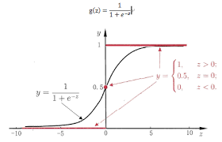
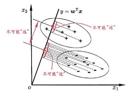
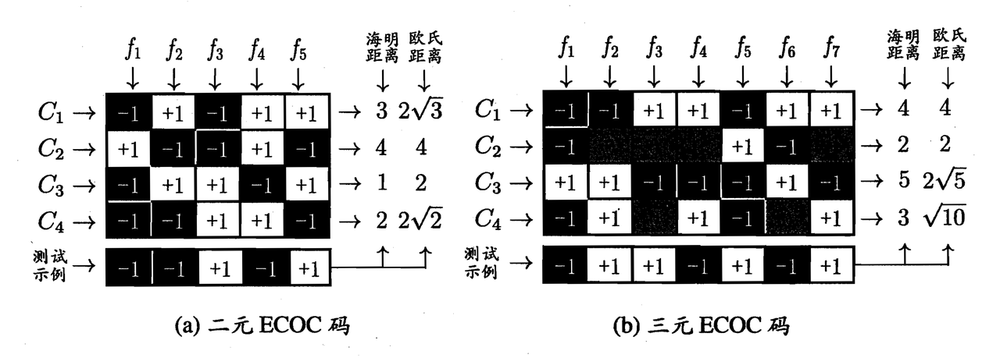

# 线性回归

> $f(x) = \mathbf{\omega}^Tx + b $

> 线性回归模型试图学习出一个线性关系进行预测

## 单元线性回归

> $(w^* b^*)=\underset{(w b)}{\arg{\min}} \sum _ {i=1}^m(y _ i - w x _ i -b)^2$

- 基于均方误差 (MSE) 最小化求得模型的最优解 (最小二乘法)

- $b = \frac{1}{m} \sum _ {i=1}^m (y _ i - w x _ i) $

- $w = \frac{\sum _ {i=1}^m y _ i(x _ i - \bar{x})}{\sum _ {i=1}^m x _ i^2 - \frac{1}{m}(\sum _ {i=1}^m x _ i)^2} $

## 多元线性回归

对于多元的 $x $，此时 $x $ 会形成一个矩阵，而不是一个列向量

令 $X = \begin{pmatrix} x _ 1^T & 1 \\ x _ 2^T & 1\\ ... & ...\\ x _ m^T & 1 \end{pmatrix} $, $\hat{w} = (w; b) $，这样有多元线性回归 $f(X) = X\hat{w} $

有 $\hat{w}^* = \underset{\hat{w}}{\arg\min} (\mathbf{y} - X\hat{w})^T(\mathbf{y} - X\hat{w}) $ (为了矩阵可以相乘，这里需要加上个转置)

对右式进行求导令其等于0： $2X^T(X\hat{w} - y) = 0 $

当 $X^TX $ 为满秩矩阵时，有 $\hat{w}^* = (X^TX)^{-1}X^Ty $

最终得到的模型时 $f(\hat{x} _ i) = \hat{x} _ i^T (X^TX)^{-1}X^Ty $

但实际情况下 , $X^TX $ 基本上不会是满秩，那么 $\hat{w}^* $ 就有多个解，每一个解都可以使均方误差最小化

常见的做法是引入**正则化** (regularization) 项

## 对数线性回归(log-linear regression)

很多情况下数据并不是按照线性进行变化的，如培养皿中细菌的数量变化，这往往是指数型的

可以令模型的预测值去逼近 y 的衍生物，比如指数型变化的 y，那么 $lny $ 就是线性变化的

$lny = w^Tx + b $ 这就是对数线性回归

它实际上拟合的是 $y = e^{w^Tx + b} $ 这种关系

广义上，可以将这种关系推广

形成 $y = g^{-1}(w^Tx + b) $ 这种广义上的线性模型，其中 $g(x) $ 称为**联系函数**，需要是连续可微的

# 对数几率(线性)回归(logistic regression)

有的时候会称其为**逻辑回归(logit regression)**

当希望线性模型可以用于分类任务(主要针对二分类)的话，可以使用对数几率回归

对于 $z = w^Tx + b $ 的输出，可以令 $y = \frac{1}{1+ e^{-z}} $，有 $y = \frac{1}{1+ e^{-(w^Tx + b)}} $

有 $ln \frac{y}{1-y} = w^Tx + b $，其中的对数几率函数( $g^{-1}(x) $) $y = \frac{1}{1+ e^{-z}} $，也可以被称为 **Sigmoid 函数** (形状类似于 S 的函数)

名称由来： $\frac{y}{1-y} $，其中 $y $ 可以认为是被认为是正例的概率，则 $1 - y $ 是被认为是反例的概率，二者的比值叫说 **几率**，对其取对数，叫做 **对数几率**

## 求解模型

将 y 视为概率后，有 $ln \frac{p(y=1 | x)}{p(y=0|x)} = w^Tx + b $

有 $p(y=1|x) = \frac{e^{w^Tx + b}}{1 + e^{w^Tx+b}} $, $p(y=0|x) = \frac{1}{1 + e^{w^Tx+b}} $

通过最大似然估计，对于给定数据集 $\{(\mathbf{x _ i}, y _ i)\} _ {i=1}^{m} $

有模型的**对数似然** $\ell (w, b) = \sum _ {i=1}^{m}\ln{p(y=y _ i|x _ i; w,b)} $

令 $\beta = (w; b), \hat{x} = (x; 1) $，有 $w^Tx + b = \beta ^T\hat{x} $，再令 $p _ 1(\hat{x}; \beta) = p(y=1|\hat{x}; \beta) $

同理 $p _ 0(\hat{x}; \beta) = p(y=0|\hat{x}; \beta) = 1- p _ 1(\hat{x}; \beta) $

那么有 $p(y=y _ i|x _ i; w,b) = \begin{cases} p _ 1(\hat{x} _ i; \beta) & y _ i=1 \newline p _ 0(\hat{x} _ i; \beta) & y _ i=0 \end{cases} = y _ ip _ 1(\hat{x} _ i; \beta) + (1-y _ i)p _ 0(\hat{x} _ i; \beta) $

然后结合上面各式 $\ell(\beta) = \sum _ {i=1}^{m}(-y _ i\beta^T\hat{x} _ i + \ln(1+e^{\beta^T\hat{x} _ i})) $ 最大化该式即可 $\beta^* = \underset{\beta}{\arg\min} \ell(\beta) $

可以用梯度下降(gradient descent)，牛顿法等方法

# 线性判别分析(Linear Discriminant Analysis LDA)

也称 **“Fisher” 判别分析**

和 PCA 很像，对于给定训练集，将数据投影到一条直线上，使同类的投影点在直线上的距离尽可能靠近，不同类的投影点的中心点尽可能远离，进行预测时，将数据投影到拟合的直线上，根据距离来分类

## 推导

给定 $D = \{(\mathbf{x}  _  i. y  _  i)\}  _  {i=1}^m \quad y  _ i  \in \{0, 1\} $ (其中 $\mathbf{x} _ i $是一个随机变量的向量)

有 $\mathbf{X _ i, \mu _ i, \Sigma _ i} $ 分别表示第 $i\in\{0,1\} $类的 **数据矩阵**、**均值向量**、**协方差矩阵**

$y = \mathbf{\omega}^Tx $ 表示所拟合的直线 (这里不需要偏移量 bias )

那么两类样本在直线上的中心点为 $\mathbf{\omega^T\mu _ 0}，\mathbf{\omega^T\mu _ 1} $，投影后，两类样本的(协)方差变成了 $\mathbf{\omega^T\Sigma _ 0\omega}，\mathbf{\omega^T\Sigma _ 1\omega} $，不难得出，上面四个表达式都是标量

要使同类之间的距离尽可能小，即 $\mathbf{\omega^T\Sigma _ 0\omega}，\mathbf{\omega^T\Sigma _ 1\omega} $ 尽可能小，也就是 $\mathbf{\omega^T\Sigma _ 0\omega} + \mathbf{\omega^T\Sigma _ 1\omega} $ 尽可能小，要使异类之间的距离尽可能大，即 $||\mathbf{\omega}^T\mu _ 0 - \omega^T\mu _ 1|| _ 2^2 = \mathbf{(\omega}^T\mu _ 0 - \omega^T\mu _ 1)^2 $ 尽可能大

综合二者，有 $J = \frac{||\mathbf{\omega}^T\mu _ 0 - \omega^T\mu _ 1|| _ 2^2}{\mathbf{\omega^T\Sigma _ 0\omega} + \mathbf{\omega^T\Sigma _ 1\omega}} = \mathbf{\frac{\omega^T(\mu _ 0 - \mu _ 1)(\mu _ 0 - \mu _ 1)^T\omega}{\omega^T(\Sigma _ 0+\Sigma _ 1)\omega}} $最大化

## 求解

令 $\mathbf{S _ \omega = \Sigma _ 0+\Sigma _ 1 \quad S _ b = (\mu _ 0-\mu _ 1)(\mu _ 0-\mu _ 1)^T} $，有 $J = \mathbf{\frac{\omega^T S _ b\omega}{\omega^TS _ \omega\omega}} $，需要从中求解出 $\omega $，观察上式， $\omega = \omega^* $ 和 $\omega = k\omega^* (k \in R , k\not=0) $ 都是 $J $ 最大化时的解，**即** $\omega $ **与大小无关，只取决于它的方向**

不妨令 $\omega^TS _ \omega\omega = 1 $ 作为前提条件，那么求解问题就等价于 $\underset{\omega}{\min} -\omega^TS _ b\omega \quad s.t.  \omega^TS _ \omega\omega = 1 $

由拉格朗日乘子法，当到达最优解 $\omega = \omega^* $ 时，函数 $f(\omega) = -\omega^TS _ b\omega $ 在约束平面 $g(\omega) = \omega^TS _ \omega\omega - 1 $ 上最优解点的梯度 $\nabla{f( \omega^* )} = \lambda\nabla{g(\omega^ * )} $， 其中 $\lambda $ 是拉格朗日乘子，等价于求解 $f(\omega) = \lambda g(\omega) $ 取最值时， $\omega $ 的取值即为 $\omega^* $，又由于 $\omega $ 与大小无关，只与方向有关，可以令 $h(\omega) = g(\omega) + 1 = \omega^TS _ \omega\omega $，于是就等价于求解

$f(\omega) = \lambda h(\omega) \iff \omega^TS _ b\omega = \lambda\omega^TS _ \omega\omega \iff S _ b\omega = \lambda{S} _ \omega\omega $

考虑到 $S _ b\omega = (\mu _ 0-\mu _ 1)(\mu _ 0-\mu _ 1)^T\omega = (\mu _ 0-\mu _ 1)*[(\mu _ 0-\mu _ 1)^T\omega] $， 其中 $[(\mu _ 0-\mu _ 1)^T\omega] $ 是一个标量，于是 $S _ b\omega $ 始终和 $(\mu _ 0-\mu _ 1) $ 一个方向，不妨令 $S _ b\omega = k(\mu _ 0-\mu _ 1) $，于是有

$k(\mu _ 0-\mu _ 1) = \lambda{S} _ \omega\omega $，考虑到 $\omega $ 与方向无关，那么 $k, \lambda $ **都可以省去**，有 $\omega = S _ \omega^{-1}(\mu _ 0 - \mu _ 1) $

实际情况下，求解 $S _ \omega^{-1} $有很多方法，最常见的就是“**奇异(特征)值分解**”，将 $S _ \omega $ 化成 $V\Sigma V^T $，其中 $\Sigma $ 是由 $S _ \omega $ 的奇异值构成的对角矩阵，然后由 $S _ \omega^{-1} = V\Sigma^{-1}V^T $ 求出 $S _ \omega^{-1} $

## 推广

可以将 LDA 推广到多分类问题上，假设有 $N $ 个类别，第 $i $个类别有 $m _ i $ 个类别数，此时 $S _ \omega $ 推广到了每个类别的协方差矩阵之和，即 $S _ \omega = \mathbf{\sum _ {i=1}^{m _ i} S _ {\omega i}=\sum _ {i=1}^{m _ i}\sum _ {x\in X _ i}(x-\mu _ i)(x-\mu _ i)^T} $，用于衡量各个类**内部的**方差(散度)大小， $\mu _ i $ 表示第 $i $ 类的均值向量

此时 $S _ b $ 可以推广为 $S _ b = \mathbf{\sum _ {i=1}^{N} m _ i(\mu _ i-\mu)(\mu _ i-\mu)^T} $，用于衡量各个类**之间的**方差(散度)大小，其中 $\mu $ 表示所有类的平均均值向量

另外再定义一个 $S _ t = S _ b + S _ \omega = \sum _ {i=1}^{m _ i}(x _ i-\mu)(x _ i-\mu)^T $，衡量全局散度

此时求解 LDA 中的 $\omega $ 可以由 $S _ \omega, S _ b, S _ t $ 三者中任意两个都可以

常见优化下面的目标

$\mathbf{W^* = \underset{W}{\arg\max}\frac{tr(W^TS _ bW)}{tr(W^TS _ \omega W)}} $，其中 $\mathbf{W} $可以是一个"**降维矩阵"，**将高维的数据降维分类**；** $tr(*) $ 表示矩阵的迹(trace)

最后转换成对广义特征值求解： $\mathbf{S _ bW = \lambda S _ \omega W} $

# 多分类学习

> 生活中常见的分类任务大多数都是多分类的，虽然有一些方法可以直接推广到多分类，例如 LDA，但是大多数情况下，一般是基于一些规则，利用二分类模型来解决多分类问题

## 拆分策略

将多分类任务进行拆分，训练多个二分类模型来处理

- 一对一 (One vs. One OvO)
  - 将 N 个类别分别两两配对，产生 $C _ N^2 = \frac{N(N-1)}{2} $ 个二分类任务，测试阶段时，将数据给这些分类器分类进行投票，最多的分类结果作为最终分类结果

- 一对多 (One vs. Rest OvR)
  - 每次将一个类的样本作为正例，其余的作为反例，N 个类别就可以训练 N 个分类器，测试时如果只有一个分类器预测为正类，那么就采取这个分类器的正类作为最终分类结果，如果有多个分类器都预测为正类，则需要结合分类器的置信度来判断最终分类结果

- 多对多 (Many vs. Many MvM)
  - 每次将若干个作为正例，若干个作为反例进行训练，MvM 选取正反例时不能随意选取，需要按照一定的规则

## 纠错输出码 (Error Correcting Output Codes. ECOC)

- 编码：对 N 个类别做 M 次划分，每次划分后，一部分作为正类，另一部分作为反类；这样一共可以训练 M 个二分类模型

- 解码：M 个分类器对测试数据进行预测，根据这些预测结果的标记组成一个**编码，**将这个预测的编码与每个类别的编码进行比较，返回其中距离最近的类别作为最终预测结果

其中 $f _ i $ 表示分类器，在三元 ECOC 码中，图中全黑部分表示这个类别不参与该分类器的训练，并且一般标记为 0

ECOC 编码对某个分类器分类错误具有一定修正，容忍能力，当 ECOC 编码越长(分类器越多)，纠错的能力就越强

ECOC 编码设计时，不同类别之间的编码距离越远，纠错能力就越强，在码长较小时可以使用这个原则设计出最优编码

# 类别不平衡问题

> 分类问题在实际情况下经常遇到类别不平衡问题，例如诊断一个人是否患人群中的某种遗传病，其训练样本绝大多数都是不患病，只有少量患病的样本；这时分类器只需要将所有数据都预测为不患病，最后的精度依旧很高

对于线性分类器(逻辑回归)，输出的标号 $y $ 可以作为一个预测为正类的概率，那么 $\frac{y}{1-y} $ 表示预测正类和反类之间的概率比值。对于类别平衡的情况 $\frac{y}{1-y} > 1 $ 时，就将类别判断为正例

对于类别不平衡的情况，若有 $m^+ $ 个正例样本， $m^- $ 个反例样本，那么当 $\frac{y}{1-y} > \frac{m^+}{m^-} $ 时才判断为正例会更好；即分类器预测的概率需要高于**观测概率**

实际情况下，对于每一个任务都去修改分类器的阈值很麻烦，实际上只需要对输出进行缩放(乘上 $\frac{m^-}{m^+} $)即可，这个基本策略称为——**再缩放**

不过实际情况下，训练样本的观测概率往往和现实中的实际概率不相同，那么训练出的模型应用于实际效果却不好，这时候通常有三种做法：**欠采样**，**过采样**，**阈值转移**

- 欠采样
  - 去除多余的类别的样本，来让正反例样本数目相当
    - 利用集成学习，将数目较多的类别分为几个和另一个类别数目相当的数据集，组合它们形成不同的正反例数据集，训练多个模型

- 过采样
  - 增加较少样本的类别，让正反例样本数目相当
  - SMOTE 算法
    - 对数据进行插值来产生额外的数据

- 阈值转移
  - 在原始数据集中训练出模型，实际使用进行决策时动态调整阈值
