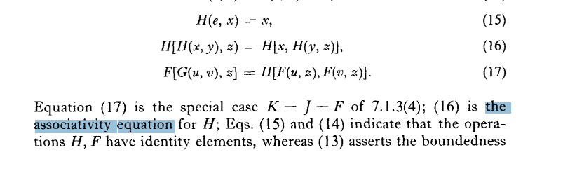
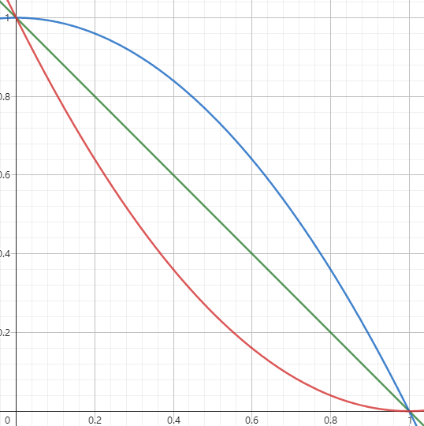
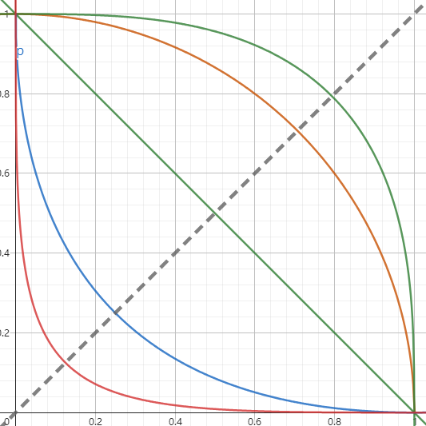

## 常识

丢出一枚硬币，它正面落地的概率是 0.5，这是常识，对吧

对于一个受过良好教育的人来说，这是事实，但如果问没有读过书的人，他们不一定回答得上来，这并不是常识

所谓的常识，是几乎对所有人显而易见的，甚至对于普通动物也是一样的。比如两点之间线段最短：我小时候家里养的小黑狗总是径直地向我跑来

现在很多概率书籍会不加说明地使用以下两个公式作为理论的起点：

$$
P(AB) = P(A)P(B|A) = P(B)P(A|B)
\newline
P(A + B) = P(A) + P(B) - P(AB)
$$

我在脑海里对于这两个公式的理解和记忆是这样的：

"
两个事件同时发生概率是乘积，要考虑一个事件会不会对另一个事件有影响

两个事件有一个发生概率是加法，要考虑两个事件会不会同时发生
"

所以抛出两次硬币，两次都是正面朝上的概率应该是 0.5 * 0.5 而不是 0.5 + 0.5

但正如前文提到，这并非常识，它只是烙印在我的脑子里而已

> In our reasoning we depend very much on prior information to help us in evaluating the degree of plausibility in a new problem. 
> This reasoning process goes on unconsciously, almost instantaneously, and we conceal how complicated it really is by calling it `common sense`.

### 抽丝剥茧

放弃“常识”，这可能会比从空白开始还要困难一点

1. 剥去范围：为什么概率的范围是 [0, 1] ？

稍加思考，我们会发现 [0, 1] 这个范围毫无先验知识支撑，甚至连它为什么用实数表示也没有根据。

但这里我们不剥夺它实数的背景，人类是“喜欢”数字的（从结绳记日开始），在这层面上讨论更抽象的表示只会让理论远离直觉，至少目前看来，实数的表示的概率王国已经很辉煌了。

2. 剥去运算：为什么是乘法和加法？

两次都是正面朝上的概率为什么不是 0.5 + 0.5 ？或者说，它为什么不会是其他的运算规则，而偏偏是乘法？

为此，我们只能用一个未知的映射关系来表示 $P(AB) = F(A, B)$，我们的直觉告诉我们，$F$ 不会有其他的参数了：屋顶会不会漏水和南极有多少企鹅没有关系

3. 剥去概率：为什么是概率？

这毕竟是术语，我们以`合情性`来表示。一件事情越可能发生，其合情性越大。这可能会被误解成偏向于使用不太严谨的普通语言，但它不一定是模糊的，甚至是更细致的：

知识就是力量（✅） vs A = B（✅）

力量就是知识（❎） vs B = A（✅）

> It appears to us that ordinary language, carefully used, need not be less precise than formal logic; but ordinary language is more complicated in its rules and has consequently richer possibilities of expression than we allow ourselves in formal logic.

### 回归本源

(I) 合情性的程度使用实数表示

我们的理论决定构建在实数之上

(II) 常识与性质相符

我们的理论不能背离常识，“概率是常识的数学表示 —— Laplace”

(IIIa) 推理具有一致性

我们的理论不能在正确运用下推理出两个矛盾的结果

(IIIb) 推理无需冗余，不能片面

我们的理论无意识形态，推理时只需要所有相关的知识背景，且不能忽略一些信息

(IIIc) 相同的知识状态有相同的合情性

我们的理论对于未知的知识状态的一种最根本的假设（否则后面我们会发现合情性几乎不能取到一个客观的初始值，所有的运算变成了符号上的游戏）

## 推导

那么，从现在开始，我们一起来构建王国的地基吧！

### 引入记号

1. 命题（事件）的符号表示

使用一个字母来表示命题，比如“A：明天会下雨”。这非常好，可以帮助我们隐藏命题所有的细节，屏蔽掉来自人类不准确的直觉的影响

1. 合情性的符号表示

我们自然可以沿用命题的符号表示，就用单个符号来表示命题为真的合情性。但一个命题为真并不完全取决于自己：“B：天气预报会说明天有雨”会大大影响 A 的合情性

我们给出定义 $A|B$，读作“给定 B 为真，A 为真的合情性”

我们用 $(A|B) > (C|B)$ 来表示在相同的背景 B 下，A 的合情性比 C 大

对于一个给定的命题集合，我们可能会找到一些不依赖任何剩余命题的命题，为其找一个为真的前提会变得无意义。屋顶会不会漏水和南极有多少企鹅没有关系，但确定下南极有多少只企鹅后再去看屋顶，它也不会突然不漏水了，这并不会把我们的理论一拳打碎

作为前提，我们要求它们得是相容的，即要求不会出现互斥的 C，D，在此基础上研究 $A|CD$ 会变得毫无意义：一个假命题可以蕴含所有命题

### 乘法规则

我们需要找到一个函数，可以帮助我们计算 $(AB|C)$ 的合情性

规则 (IIIb) 告诉我们，这个函数的参数不应该和除开 $A, B, C$ 以外的命题的合情性相关，同时也不能漏掉 $A, B, C$ 任何一个

那么在有限的排列组合下：

$$
(A|C), (B|C), (A|BC), (B|AC)
$$

我们排除了类似 $(C|A)$ 这些组合结构，前提的合情性不应该参与讨论，这是不符合 (II) 的。那么这些参数可以组成

$$
\begin{cases}
F[(A|C), (B|C)]
\newline
F[(A|C), (A|BC)]
\newline
F[(A|C), (B|AC)]
\newline
F[(B|C), (A|BC)]
\newline
F[(B|C), (B|AC)]
\newline
F[(A|BC), (B|AC)]
\newline
F[(A|C), (B|C), (A|BC)]
\newline
F[(A|C), (B|C), (B|AC)]
\newline
F[(A|C), (A|BC), (B|AC)]
\newline
F[(B|C), (A|BC), (B|AC)]
\newline
F[(A|C), (B|C), (A|BC), (B|AC)]
\end{cases}
$$

总共 11 个 $F$ 的可能形式

全部研究一遍也未尝不可，有了“不讲道理”的 (II) 之后，我们可以排除掉一些性质不好的 $F$

加上常识的背景，我们定义“C：我们遇到个人”，“A：这个人穿白色的衬衫”，“B：这个人穿棕色的裤子”，“A'：这个人有蓝色左眼”，“B'：这个人有棕色的右眼”，讨论 $(AB|C)$ 和 $(A'B'|C)$

那么 $(AB|C) = F[(A|C), (B|C)]$ 就可以被排除，因为这个函数在处理 $F[(A|C), (B|C)]$ 与 $F[(A'|C), (B'|C)]$ 有着截然不同的方式：同时具有蓝色左眼和棕色右眼不太可能，而同时穿白衬衫和棕裤子却很有可能

我们让 $A = C$，那么 $(AB|C) = F[(A|C), (A|BC)]$，即 $(B|C) = F[True, True]$，也不符合直觉，同样 $F[(B|C), (B|AC)]$ 也被排除

而对于 $F[(A|BC), (B|AC)]$，只需要让 $A = B$ 从而拒绝掉它

应用这些枯燥的规则，我们可以拒绝了除了 $F[(A|C), (B|AC)], F[(B|C), (A|BC)]$ 以外所有的 $F$

事实上，$F[(A|C), (B|AC)], F[(B|C), (A|BC)]$ 也是符合直觉的，我们考虑 $AB$ 是否为真时往往会先考虑其中一个为真，然后在此基础上再考虑剩下的那个是否为真

考虑到 $A,B$ 是可以互换的，只用研究其中一个 $F[(B|C), (A|BC)]$ 即可

---

找到研究对象 $F[(B|C), (A|BC)]$ 之后，我们就可以继续研究它的性质了

1. 连续性

$$
(AB|C) = F[(B|C), (A|BC)]
$$

面对这个等式，我们很容易接受它是连续的这一个事实。人类喜欢连续的映射关系，例如速度与时间。不连续意味着某个细小的自变量的变化会给结果带来突变，这是不符合常识的

2. 单调性

我们给定一个信息的更新 $C \to C'$，使得 $B$ 的合情性变大，但 $A$ 的合情性不变：

$$
B|C' > B|C
\newline
A|BC' = A|BC
$$

常识告诉我们

$$
AB|C' \geq AB|C
$$

等号当且仅当 $A|BC$ 是不可能为真的。

类似，给定另一个信息的更新 $C \to C''$，使得

$$
B|C'' = B|C
\newline
A|BC'' > A|BC
$$

那么同样根据常识

$$
AB|C'' \geq AB|C
$$

等号当且仅当 $B$ 不可能为真

可能你会好奇为什么信息的更新总会让合情性变大，会不会有 $C \to C'$，使得

$$
B|C' < B|C
$$

事实上，正如定义了大于的关系之后，我们不需要再定义小于号，因为所有的小于关系都可以翻转过来成为大于关系。对于上面的例子，只需给定反过来的信息更新即可 $C' \to C$

结合 1. 中的连续性，我们可以看出 $F(x, y)$ 是关于 x, y 均递增（或递减）的，如果进一步 $F(x, y)$ 是可微的（非必须），那么有

$$
F_1(x, y) \equiv \frac{\partial F}{\partial x} \geq 0
$$

$$
F_2(x, y) \equiv \frac{\partial F}{\partial y} \geq 0
$$

等号分别在 y 不可能为真和 x 不可能为真时取到

3. “结合性”

我们尝试分析 $(ABC|D)$，由布尔代数中的结合性 $ABC = (AB)C = A(BC)$，我们的函数也有两种不同的处理方法：

$$
(A(BC)|D) = F[(BC|D), (A|BCD)] = F \lbrace F[(C|D), (B|CD)], (A|BCD) \rbrace
\newline
((AB)C|D) = F[(C|D), (AB|CD)] = F \lbrace (C|D), F[(B|CD), (A|BCD)] \rbrace
$$

根据 (IIIa)，这两种方法的结果应当是相等的，引入字母简化

$$
F[F(x, y), z] = F[x, F(y, z)]
$$

这个公式看起来有点像运算的结合性，这种函数有悠久的历史，[阿贝尔](https://en.wikipedia.org/wiki/Niels_Henrik_Abel)第一次使用了它，在[奥采尔](https://en.wikipedia.org/wiki/J%C3%A1nos_Acz%C3%A9l_(mathematician))的[著作](https://sites.pitt.edu/~jdnorton/teaching/2682_confirmation/2017/pdf/Aczel%20pp%20319-324.pdf)中，很恰当的称其为 “The Associativity Equation”

---

研究完性质之后，就可以尝试求出 $F$ 的一般解了。首先很明显，一个常数解：$F(x, y) = const$ 是符合上面的性质的，但这是无趣的，它不能说明什么，也没有任何作用，我们需要一个非平凡解，并且只需一个简单的即可

在此之前，我们假设 $F(x, y)$ 是可微的，使用微积分工具可以更简单地求出一般解（相比于不作可微假设的证明），并且我们也可以以符合直觉为由来断言它是可微的：合情性不太会受某个因素细微影响导致变化趋势突变（尽管这里直觉带来的确信感有明显减弱，好在这是正确的直觉）

定义两个新的变量

$$
u \equiv F(x, y) \space \space v \equiv F(y, z)
$$

那么“结合性”可以表示成

$$
F(x, v) = F(u, z)
$$

分别对两边对 $x, y$ 求偏导，由链式求导法则，有

$$
F_1(x, v) = F_1(u, z)F_1(x, y)
\newline
F_2(x, v)F_1(y, z) = F_1(u, z)F_2(x, y)
$$

两式相除，消去 $F_1(u, z)$，有

$$
G(x, v)F_1(y, z) = G(x, y)
$$

其中 $G(x, y) \equiv \frac{F_2(x, y)}{F_1(x, y)}$，代入 $F_1(y, z) = \frac{F_2(y, z)}{G(y, z)}$，我们又有

$$
G(x, v)F_2(y, z) = G(x, y)G(y, z)
$$

观察上面两个式子，我们可以验证：

$$
\frac{\partial G(x, v)F_1(y, z)}{\partial z} = G_2(x, v)F_2(y, z)F_1(y, z) + G(x, v)F_{12}(y, z)
$$

$$
\frac{\partial G(x, v)F_2(y, z)}{\partial y} = G_2(x, v)F_1(y, z)F_2(y, z) + G(x, v)F_{21}(y, z)
$$

根据偏导数连续性的直觉要求，我们有：$F_{12}(y, z) = F_{21}(y, z)$

因为 $G(x, v)F_1(y, z) = G(x, y)$ 独立于 z，有

$$
\frac{\partial G(x, v)F_1(y, z)}{\partial z} = \frac{\partial G(x, v)F_2(y, z)}{\partial y} = 0
$$

那么 $G(x, v)F_2(y, z) = G(x, y)G(y, z)$ 就独立于 y 了

一个满足这个要求的 $G$ 可以是：

$$
G(x, y) = r\frac{H(x)}{H(y)}
$$

其中 r 是一个待定的常数，$G(x, y)G(y, z) = r^2\frac{H(x)}{H(z)}$ 独立于 y

代入上面的式子里，我们有

$$
F_1(y, z) = \frac{H(v)}{H(y)}
\newline
F_2(y, z) = r\frac{H(v)}{H(z)}
$$

由 $dv = dF(y, z) = F_1dy + F_2dz$，有

$$
\frac{dv}{H(v)} = \frac{dy}{H(y)} + r\frac{dz}{H(z)}
$$

积分，有

$$
w[F(y, z)] = w(v) = w(y)w^r(z)
$$

其中 

$$
w(x) = \exp \lbrace \int^x\frac{dx}{H(x)} \rbrace
$$

其中缺省的积分下限表示任意的常数乘子

根据性质 $F(x, v) = F(u, z)$，两边加上 $w(\cdot)$，有 $w(x)w^r(v) = w(u)w^r(z)$，再展开：

$$
w(x)w^r(y)w^{r^2}(z) = w(x)w^r(y)w^r(z)
$$

当 $r = 1$ 时，我们就得到了一个满足性质的非平凡解：

$$
w[F(x, y)] = w(x)w(y)
$$

这就被称为“乘法规则”，或者

$$
F(x, y) = w^{-1}[w(x)w(y)]
$$

---

至此，我们已经找到了一个简单的非平凡解 $F(x, y)$，接下来就可以研究研究这个解有没有什么额外的性质，这些性质可以作为拓展供以后使用

回到刚开始的问题，我们使用这个解，有

$$
w(AB|C) = w(A|BC)w(B|C) = w(B|AC)w(A|C)
$$

如果 $C \Rightarrow A$，在 $C$ 背景下，$AB$ 和 $B$ 有相同的值，即它们具有相同的合情性

$$
AB|C = B|C
$$

进一步，当 $B$ 和 $C$ 相容时，我们也可以得到

$$
A|BC = A|C
$$

代入上面，可以化简成

$$
w(B|C) = w(A|C)w(B|C)
$$

这里不妨认为不确定的 $w(B|C) \not = 0$（如果它等于 0，上式始终成立，没有进一步研究的空间了） 那么就有

$$
w(A|C) = 1
$$

这表明在演绎推理 $C \Rightarrow A$ 下，“肯定”的合情性是 $1$，我们找到了“合情性上限”的实数表示

类似，我们现在考虑 $C \Rightarrow \bar{A}$，在 $C$ 背景下，$A$ 和 $AB$ 都不可能为真：

$$
AB|C = A|C
$$

进一步，当 $B$ 和 $C$ 相容时，我们也可以得到

$$
A|BC = A|C
$$

代入上面，可以化简成

$$
w(A|C) = w(A|C)w(B|C)
$$

这里对于不确定的 $w(B|C)$，$w(A|C)$ 可以取三个值：$0, +\infty, -\infty$ 来使等式成立，考虑到之前有定义 $w(x) = \exp \lbrace \dotsb \rbrace$，不可能取负值，这里为了避免违反这个定义的性质，从而和我们推出的乘法规则产生矛盾，我们舍去 $-\infty$

这表明在演绎推理 $C \Rightarrow \bar{A}$ 下，“不可能”的合情性可以是 $0$ 或者 $+\infty$，根据我们之前的单调性要求，它可以是从 $0$ 上升到 $1$，也可以是从 $+\infty$ 下降到 $1$

事实上，值域在 $[0, 1]$ 和 $[1, +\infty]$ 本质上是相同的，给定一个值域在 $[1, +\infty]$ 的函数 $w_1(x)$，始终都可以定义另一个函数 $w_2(x) \equiv \frac{1}{w_1(x)}$，其值域为 $[0, 1]$，它们都可以作为符合要求的 $w(\cdot)$

根据习惯，我们选择 $[0, 1]$ 作为 $w(\cdot)$ 的值域

最后，我们不仅得到了合情性的乘法规则，还找到了在这个规则下，合情性的实数表示的一些特殊值，这将会对我们推理加法规则有很多帮助

### 加法规则

我们现在要找到 $A$ 为假的合情性受 $A$ 为真的合情性的影响，先定义 $u \equiv w(A|B)$，$v \equiv w(\bar{A}|B)$，那就需要找到下面的关系：

$$
v = S(u)
$$

和我们找乘法规则一样，这个函数在直觉上是一个连续单调递减的函数，有两个特殊值 $S(0) = 1$，$S(1) = 0$，那么它可以是什么样子呢？

这三条曲线都可以是，不过我们一眼就相中了那条绿色的直线（$y = 1-x$），不过现在还不能直接拿来用，这条可爱的绿色曲线不一定喜欢我们推出的乘法公式，还需要进一步分析。

根据乘法公式：

$$
w(AB|C) = w(A|C)w(B|AC)
\newline
w(A\bar{B}|C) = w(A|C)w(\bar{B}|AC)
$$

由 $v = S(u)$，有

$$
w(AB|C) = w(A|C)S[w(\bar{B}|AC)] = w(A|C)S[\frac{w(A\bar{B}|C)}{w(A|C)}]
$$

由于 $w(AB|C)$ 是关于 $A, B$ 对称的，类似的，我们有：

$$
w(A|C)S[\frac{w(A\bar{B}|C)}{w(A|C)}] = w(B|C)S[\frac{w(B\bar{A}|C)}{w(B|C)}]
$$

得到了一个怪怪的等式，似乎不能继续下去了，我们得再加上一个限制（或者某种古怪的直觉，我们总能找到一个满足条件的 $D$）：

$$
\bar{B} = AD
$$

其中 $D$ 是任意一个新命题，在这个 $D$ 的帮助下，我们有 $\bar{B} \Rightarrow A$，$\bar{A} \Rightarrow B$，那么

$$
A\bar{B} = \bar{B}, \space B\bar{A} = \bar{A}
$$

这样上面那个怪怪的等式就能进一步化简了，根据：

$$
w(A\bar{B}|C) = w(\bar{B}|C) = S[w(B|C)]
\newline
w(B\bar{A}|C) = w(\bar{A}|C) = S[w(A|C)]
$$

定义

$$
x \equiv = w(A|C), \space y \equiv w(B|C)
$$

全部代入上面的式子，有：

$$
xS[\frac{S(y)}{x}] = yS[\frac{S(x)}{y}] \space (*)
$$

特别的，因为 $S(\cdot)$ 的定义域是 $w(\cdot)$ 的值域： $[0,1]$，那么上面的等式有限制：

$$
0 \le S(y) \le x, \space 0 \le x \le 1
$$

其中 $x$ 和 $y$ 互换也成立。代入一个特殊值 $y = 1$，我们有：

$$
S[S(x)] = x
$$

这说明 $S(\cdot)$ 具有自反性，那么意味着关系 $u = S(v)$ 也成立。这从某种程度上体现了 $A$ 与 $\bar{A}$ 的自反性

交换 $(*)$ 式的 $x, y$，会发现没有发生变化，说明它表示的这片空间是关于 $x, y$ 对称的：

图中的每一条曲线 $y = S(x)$ 都是对称的，它们组成的空间也是对称的

观察上面的那些曲线，它们很不一样，我们或许可以分析 $S(x)$ 在 $x \to 1$ 时的性质（斜率）从而分辨它们。我们定义一个新的变量 $q(x, y)$，有

$$
\frac{S(y)}{x} = 1 - e^{-q}
$$

接下来我们定义 $J(q)$ 满足下面的等式：

$$
S(1 - e^{-q}) = e^{-J(q)}
$$

我们的目标是找到 $q \to \infty$ 时 $J(q)$ 渐进表达式，这样就知道 $S(x \to 1)$ 时的性质了

将 $x,q $ 视为自变量，我们有：

$$
S(y) = x - xe^{-q} = S[S(x)] - S[S(x)]e^{-q}
$$

对后面一个 $S[S(x)]$ 进行一阶导数近似（一阶泰勒展开），有：

$$
S(y) = S[S(x)] + e^{-q}S(x)S'[S(x)] + O(e^{-2q})
$$

对 $S[S(x)] = x$ 两边求导，有 $S'[S(x)]S'(x) = 1$，代入上式，有：

$$
\frac{S(y)}{x} = 1 - e^{-(\alpha + q)} + O(e^{-2q})
$$

其中

$$
\alpha(x) \equiv log[\frac{-xS'(x)}{S(x)}] > 0
$$

代入 $J$ 中，有

$$
J(q + \alpha) - J(q) = log[\frac{x}{S(x)}] + log(1 - e^{-q}) + O(e^{-2q})
$$

最后两项在 $q \to \infty$ 时趋近于 0，此时 $J(q)$ 则是一个渐进线性关系：

$$
J(q) \sim a + bq + O(e^{-q})
$$

其中斜率

$$
b = \alpha^{-1}log[\frac{x}{S(x)}] > 0
$$

代入 $\alpha(x)$ 的定义，最后可以推出

$$
\frac{x}{S(x)} = [\frac{-xS'(x)}{S(x)}]^b
$$

化简一下，等价于

$$
S^{m-1}dS + x^{m-1}dx = 0
$$

其中 $m \equiv \frac{1}{b}$，解这个微分方程，有

$$
S(x) = (1 - x^m)^{1/m}, \space 0 < m < \infty
$$

---

我们得到了 $S(x)$，不过在此过程中，我们引入了一个限制 $\bar{B} = AD$，为了避免这个限制（或者某种古怪的直觉）因不合理导致我们的 $S(x)$ 失效，把它代入引入这个限制之前的那个古怪的式子里检查一下：

$$
w(A|C)S[\frac{w(A\bar{B}|C)}{w(A|C)}] = w(B|C)S[\frac{w(B\bar{A}|C)}{w(B|C)}]
$$

进而

$$
w^m(A|C) - w^m(A\bar{B}|C) = w^m(B|C) - w^m(B\bar{A}|C)
$$

这个等式是成立的（你可以自己检验一下，用乘法规则），最后，我们得到了一个不错的 $S(x)$

---

使用这个 $S(x)$，我们发现满足以下规则：

$$
w^m(A|B) + w^m(\bar{A}|B) = 1
$$

是那条绿线中的线性关系！

同样的，乘法规则可以改写成

$$
w^m(AB|C) = w^m(A|BC)w^m(B|C) = w^m(B|AC)w^m(A|C)
$$

最后我们定义一个新的函数

$$
p(x) \equiv w^m(x)
$$

这个 $p(x)$ 也可以作为当初我们定义的 $w(x)$，而且它们具有相同的值域，类似的性质，我们有了最终的规则：

$$
p(AB|C) = p(A|C)p(B|AC) = p(B|C)p(A|BC)
\newline
p(A|B) + p(\bar{A}|B) = 1
$$

### 这足够了吗？

到目前为止，我们成功打造了两个公式，王国的地基逐渐建立了起来，但这足够了吗？我们是否可以在地基上建立我们的王国了呢？

**足够了！**

你或许会听说过只用一个与非门就能设计所有的电路，这个本质上是一个叫 “完备集” 的概念所阐述的

在布尔代数中，所有的布尔表达式都可以化成规范析取范式或者规范合取范式（恒为假的命题可以用矛盾式 $A\bar{A}$ 表示）

而这规范析取范式中只有三个操作符号：

$$
\lbrace AND, OR, NOT \rbrace
$$

它构成了一个**完备集合**

不过其实还是可以进一步缩减的，其中 $A + B = \overline{\bar{A}\bar{B}}$

那么只需 $\lbrace AND, NOT \rbrace$ 即可（更进一步，与非运算又能表示这两种运算，最后完备集可以只包含一个 $\lbrace NAND \rbrace$）

我们的两种公式则对应着 $\lbrace AND, NOT \rbrace$，它可以将任意复杂的命题组合拆建成最基本的命题组合，来辅助我们进行推导

为了验证这一点，我们计算 $A + B$ 的逻辑公式

$
p(A + B|C) = 1 - p(\overline{AB}|C) = 1 - p(\bar{A}|C)p(\bar{B}|\bar{A}C)
\newline
= 1 - p(\bar{A}|C)[1 - p(B|\bar{A}C)] = p(A|C) + p(\bar{A}B|C)
\newline
= p(A|C) + p(B|C)p(\bar{A}|BC) = p(A|C) + p(B|C)[1 - p(A|BC)]
\newline
= p(A|C) + p(B|C) - p(AB|C)
$

这就是**广义加法规则**

$$
p(A + B|C) = p(A|C) + p(B|C) - p(AB|C)
$$

## 应用

搭好了稳固的地基，是时候开始建筑了，但这却让我们犯了难，我们没有材料：

我们知道如何运用公式，把我们需要的结构化简成最基本的样子，到现在我们还不能给合情性附上**客观**的数值，所有的计算都是空中楼阁，不能让我们得到最终的结果

我们考虑 $(A_1 + A_2 + A_3|B)$ 的合情性，其中 $\lbrace A_1, A_2, A_3 \rbrace$ 至少有一个为真，由我们的规则

$
p(A_1 + A_2 + A_3|B) = p(A_1 + A_2|B) + p(A_3|B) - p(A_1A_3 + A_2A_3|B)
\newline
= p(A_1|B) + p(A_2|B) + p(A_3|B) - p(A_1A_2|B) - p(A_2A_3|B) - p(A_3A_1|B) + p(A_1A_2A_3|B)
$

进一步假设 $\lbrace A_1, A_2, A_3 \rbrace$ 互斥，那么有
$$
p(A_1 + A_2 + A_3|B) = p(A_1|B) + p(A_2|B) + p(A_3|B)
$$

类似的，我们可以拓展到 $n$

$$
p(A_1 + \cdots + A_m|B) = \sum_{i=1}^{m} p(A_i|B), \space 1 \le m \le n
$$

进一步假设 $\lbrace A_1, \cdots, A_n \rbrace$ 不仅互斥，并且是穷尽的，那么上式 $m = n$ 时，有

$$
\sum_{i=1}^{n} p(A_i|B) = 1
$$

到目前为止，我们还不能确定其中的某个 $p(A_i|B)$，这取决于背景 $B$。背景 $B$ 是十分庞大的，我们无法穷尽。这将是我们面临的最重要的问题，每个能从 $B$ 中得到 $p(A_i|B)$ 的方法都是一个十分有用的应用

不过我们可以考虑最简单的情况，这里请压制住你的直觉，我相信你已经知道了这个最简单的情况是什么，并且立即就能得到答案。数学停滞的一些历史告诫我们不要过分依赖直觉，尤其是学科的初始阶段，直觉走得比逻辑分析更快，大量的研究者们因其不一致的直觉而不停争论

现在考虑两个问题：问题 I 是我们刚刚构建的，给定一个穷尽的 $\lbrace A_1, \cdots, A_n \rbrace$，我们要找到每个 $p_I(A_i|B)$，问题 II 和问题 I 很像，只不过它将 $A_1, A_2$ 换了个位置：$\lbrace A'_1, \cdots, A'_n \rbrace$，其中

$$
A'_1 \equiv A_2, \space A'_2 \equiv A_1, \space A'_k \equiv A_k, 3 \le k \le n
$$

由于问题 I 和问题 II 只不过是交换了命题的位置，对应的命题完全一样，在相同的背景下它们具有相同的合情性

$$
p_{I}(A_1|B) = p_{II}(A'_2|B)
$$

$$
p_{I}(A_2|B) = p_{II}(A'_1|B)
$$

现在我们给出最简单的背景 $B$：它对 $A_1$ 和 $A_2$ 具有完全一样的背景。换句话说，即使遮盖住 $A_1$ 和 $A_2$ 的下标，这也不会在 $B$ 背景下产生任何影响。这时候，问题 I 和问题 II 不是仅仅相似的问题，而是完全一样的问题。根据 (IIIc)，它们具有相同的知识状态，那么就有相同的合情性：

$$
p_{I}(A_i|B) = p_{II}(A'_i|B), \space i = 1, 2, ..., n
$$

根据上面的三个等式，我们就有

$$
p_I(A_1|B) = p_I(A_2|B)
$$

更广泛的，让 $\lbrace A''_1, \cdots, A''_n \rbrace$ 成为 $\lbrace A_1, \cdots, A_n \rbrace$ 的任意排列，我们有 $n$ 个对应变换

$$
p_I(A_i|B) = p_{III}(A''_k|B)
$$

现在背景 $B$ 不偏好任意一个 $A_i$，类似的，我们就有

$$
p_{I}(A_k|B) = p_{III}(A''_k|B), \space k = 1, 2, ..., n
$$

最后，我们得到

$$
p_I(A_i|B) = p_I(A_k|B)
$$

结合上面的公式，它们和为 1，我们就有

$$
p_I(A_i|B) = \frac{1}{n}
$$

这个结果叫做**无偏原则**。到这里之前，你可能就已经知道了答案，直觉得到的答案很可能忽略了推理中最核心的原则，这个例子里，(IIIc) 则是那个最核心的原则

---

现在，我们已经有了定量规则以及无偏原则，在这个基础上已经可以得到一些很有用的结果了

但似乎我们没有完成标题“合情性的定量规则”的任务，我们没有得到合情性 $x = A_i|B$ 的推理规则，反而是为其套上了一层单调函数 $p$，得到的是 $p(x)$ 的规则

在推导过程中可以看出，这个 $p$ 是无法穷尽的，为其套上不同 $p$ 则会有不同的数值，不具唯一性的结果会搅乱我们的定量规则，而不是我们真正想要的合情性 $x = A_i|B$ 那个具有实际意义的稳定值，以及合情性的定量规则

不过不用沮丧，无偏原则给了我们一个确定的初始值：$p_I(A_i|B) = \frac{1}{n}$，这是针对任何 $p$ 都成立的。也许我们没有办法得到合情性 $x = A_i|B$ 的推理规则，但我们依旧可以使用 $p$ 的值来进行推理和计算，给定的初始值在一致的计算规则下总会得到相同的结果，这将会帮我们解决唯一性的问题

与其让 $p(x)$ 成为 $x$ 的单调函数，不如反过来看，认为合情性 $x$ 是 $p(x)$ 的单调函数，我们不再关心一开始定义的合情性 $x = A_i|B$，转而使用 $p(x)$ 来推理计算了，~~有了新欢，谁还恋旧爱~~

从现在起，我们定义这个量 $p$ 为**概率**

## 总结

为了找到概率论的基础，我们抛弃了[常识](#chou-si-bo-chong)，定义了[本源](#hui-gui-ben-yuan)，又在推导中重建了我们抛弃的常识，如此下来，我们定会更深刻地认识过去的常识

文章里并没有提出新的理论，几乎所有内容来自于 [Probability Theory: The Logic of Science](http://www.cambridge.org/gb/academic/subjects/physics/theoretical-physics-and-mathematical-physics/probability-theory-logic-science) 第二章，我仅仅只是将其压缩为一篇博客来叙述，填补了一些省去的中间步骤，难免会有些不严谨，甚至有错误，欢迎指出评论
