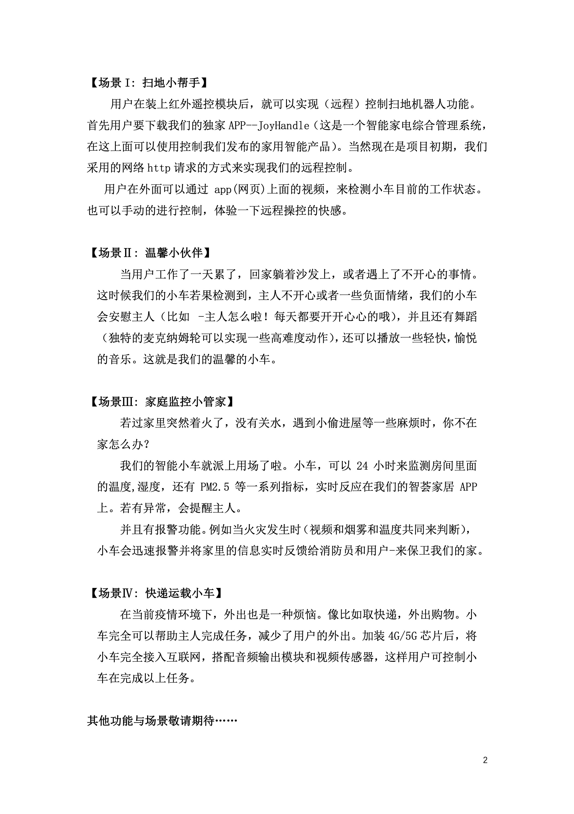

# 缘起

---

一次单片机比赛(鬼知道我一个愣头青为什么会参加

和几个队友组了一个队伍(他们负责资料整理，我负责规划和把小车整出来

idea 首次被小组内的一个人提出来:“做一个避障小车。”然后再加上我的瞎勾八缝合，便形成了这么一个**究极缝合小车怪**

# 项目展示

---

## 脑图

## 实体

## 代码(截取一部分)

> 项目地址: [https://github.com/iGxnon/StitchingCarStrange](https://github.com/iGxnon/StitchingCarStrange) (写的稀烂

APP 的一些源码（烂中烂

# AND 一些功能

- 奇行种

- 偷拍神器

- 情绪识别

# 满是吹水的创意书

---

# 结语

---

从一开始的**硬件什么也不会**，历经一个月，到后来能做出一个新手项目的缝合产物，学到了很多
期间也有几次焊接焊到凌晨两点，排除硬件和软件 bug 排除到凌晨两点......(另外吐槽一下，挖这破带专凌晨 2 点掐电，屏幕一黑，第二天一看，哦吼，代码没了)

焊接焊的稀碎，代码也写的稀碎

网校还有一堆作业，溜了
