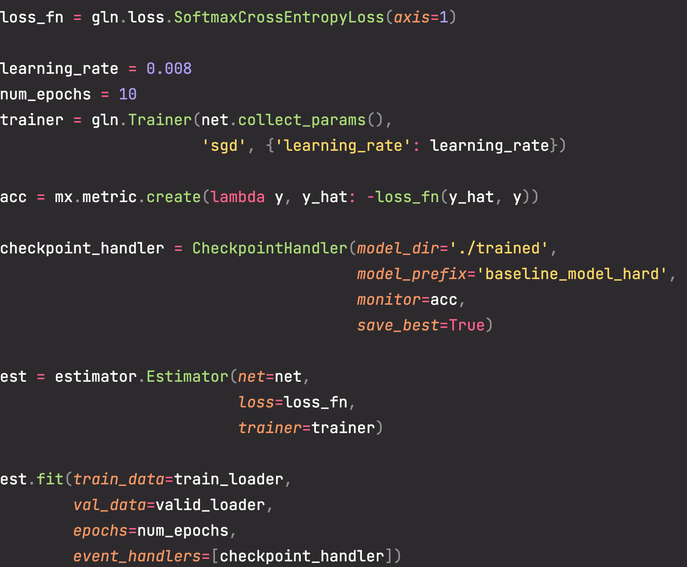

# MXNet 初体验

## 前言

前几天处理教务在线验证码预测的模型时了解到了这个深度学习框架

官方的 60 分钟快速上手的教程里可以看出，这玩意的大部分 api 就像是 `pytorch` 和 `tensorflow` 的杂交体，它支持像 `tensorflow` 一样构建计算图来定义网络(符号式声明)，也可以像 pytorch 一样堆层级模块来构建模型(指令式声明)，它也提供了一个 `Hybridize Block` 来混合这两种计算图构建方法(即编程时是指令式，运行时转换成符号式)

通常来说，符号式声明的方式运行性能要比指令式要快，对内存占用更少


> `译文`：
>
> 缝合怪暴打其他方式(
>
> 大多数深度学习框架选择命令式或符号编程。例如，`Theano` 和 `TensorFlow`（受后者启发）都使用符号编程，而 `Chainer` 及其前身 `PyTorch` 使用命令式编程。在设计 `Gluon` 时，开发人员考虑了是否可以利用命令式和符号编程的好处。开发人员认为，用户应该能够使用纯粹的命令式编程进行开发和调试，同时能够将大多数程序转换为符号编程，以便在需要产品级计算性能和部署时运行。这是 `Gluon` 通过引入混合编程实现的。
>
> 在混合编程中，我们可以使用 `HybridBlock` 或 `HybridSequential` 类构建模型。默认情况下，它们的执行方式与在命令式编程中执行块或序列类的方式相同。当调用混合函数时，`Gluon` 将把程序的执行转换为符号编程中使用的样式。事实上，大多数模型都可以利用混合编程的执行风格。
>
> 通过使用实验，本节将展示混合编程的好处。

## 优势

- 性能很高
- 可定制性很高
- 很多工程化 API 的实现
- 方便部署
- 支持多种风格的 API 实现
- 官方文档很全
- 源码上公开的方法都有详细的注释和代码样例
  - 有 Example 太强了
- 支持多种语言
  - 不同语言 API 只是 `mxnet` 中的前端，真正推理的是 `C/C++` 写的
  

## 不足

- 第三方文档很少
  - 这何尝不是一种优点？这就逼着我看官方文档，而不是看互联网那群🐂🐴的C*ND博客杂文
- Pypi 上的包不能原生支持 `Mac M1`
  - `docker pull mxnet/python:1.9.1_aarch64_cpu_py3` 可以直接拉取一个使用
  - 可以自己编译，这也是我自从用这破 `M1` 芯片后成功编译的 C/C++ 大型项目了(其他项目用了一堆不支持 m1 的库)
    - 不过编译后的指令集是 `x86` 的，需要运行在一个 `Rosetta` 转译的解释器上
      - 这个应该可以改 `CMakeLists.txt` 来配置编译，但是我不会
- 大部分论文，社区(huggingface) 上给的代码都是 pytorch 或者 tensorflow

## 安装

### 心路历程

我有两台设备，一台三年前上新的轻薄本，一台 Mac M1，平时会使用 git 协同编码

所以两台设备都要装，在第一台上(轻薄本)，直接使用 `pip install mxnet` 就完事了

而在第二台设备上(M1)给我装吐了，使用 `pip install mxnet` 装是装上了，运行时报错

```
OSError: dlopen(xxx/envs/mxnet_py39/lib/python3.9/site-packages/mxnet/libmxnet.so, 0x0006): tried: 'xxx/envs/mxnet_py39/lib/python3.9/site-packages/mxnet/libmxnet.so' (not a mach-o file)
```

可以，又是某个链接库不能加载，自从我使用 `arm` 架构的芯片开发后已经见怪不怪了

使用 `brew install libmxnet ` 尝试安装，(当时这位靓仔并没有注意到这个链接库不是外面的，就是这个包自带的)，然后找不到

可以，那我用 `Rosetta` 转译的 Python 运行，导入包花了几十秒，更不用说后续训练要花多长时间了

可以，我熟练的打开浏览器，用中文检索`如何在 Mac m1 上安装 mxnet`，在高强度的信息检索下，我终于在一群深度学习，模型算法教程文章中发现了一个熟悉的社区


于是怀揣着忐忑的心情点开了这个链接

可以，是教我怎么在 Mac 上编译 mxnet 的，那就照做呗，(当时这位靓仔没有注意到这是 2016 年发布的 

一通操作下来，发现文章里给的命令执行不了，哦，官方仓库早就不知道迭代多少个版本了

可以，我又熟练的打开浏览器，切换搜索引擎，用英文检索 `How to install mxnet on Mac`，找到了官方给的构建教程

https://mxnet.apache.org/versions/1.9.0/get_started/osx_setup

构建是构建出来了，当时给我乐坏了，这可是我第一次在 M1 芯片上构建成功一个大型项目，丝毫不觉得构建了 1 个小时的煎熬

一运行，指令集 `x86` 不匹配当前的设备

可以，我又又打开浏览器，打开 `mxnet` 的仓库翻 issue，终于翻了这么一条 issue

https://github.com/apache/incubator-mxnet/issues/20992

有两个回复，一个机器人，一个留下了两个 cmake 构建文件

可以，把这个构建文件换一下，继续构建

可这次并没有那么好运，一直构建失败，我不明白为什么，我也不明白 CMake 怎么配置

可以，在高强度的互联网冲浪🏄🏻下，我检索到了一个 Docker 镜像 `mxnet/python`

打开 docker hub 一搜，找到了一个带有 aarch64  的 tag


芜湖，直接 pull 下来 run 然后 python 最后 import mxnet，一同操作下来，它行了

然后结合之前在 `Pycharm` 里面发现的 `Docker Interpreter (Docker 解释器)`，最后在 `Pycharm` 里面快乐编程，加上 docker 没有 Rosetta 性能损耗严重，还在一个可以接受的范围内

### 不足

- 基本上被锁死了只能用 JB 家的 `Pycharm` 编程，我暂时没发现其他可以将 docker 内的 python 拿出来当解释器用的 IDE
- 装一个包极其麻烦，需要重新构建一个新的镜像
- 不到为啥，我装了给镜像加了 matplotlib 后在 Pycharm 里面就不能用 nn.Conv2D() 了
  - 可命令行开一个容器，容器里面却能用 （奇怪

## 体验

构建一个 CNN 网络

- 非常快乐的就是不需要写入的通道数(CNN)，上一层输出最后维度(Dense)


训练

- 它还会根据传入的 Metric 训练时自动打印性能指标
- Fit 风格的训练
  - 还有其他的风格，比如手动反向传播，更新梯度


