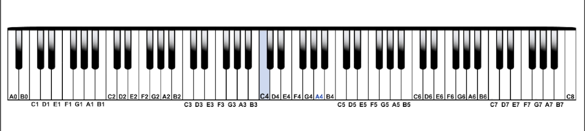

> 笔记基于 [https://www.bilibili.com/cheese/play/ep10106](https://www.bilibili.com/cheese/play/ep10106)

## 音名：CDEFGAB
---
1. 唱名：do re mi fa sol la ti

2. 分组：C1, C2, C3, C4, ...

其中 C4 称其为 `中央C`

> 国内教材分组方法：大小字分组

3. 五线谱中，线和间都可以表示这些音

## 谱号
---

1. 高音谱号 (Treble clef)：吉他，小提琴等高音乐器常用

{{ music_abc(abc="
K: C treble
G
w: G4
") }}

从下往上数第二条线（高音谱号起始点）表示音：G4

从 G4 可以往下找到 C4

{{ music_abc(abc="
K: C treble
C
w: C4
") }}

2. 低音谱号（Bass clef | F clef）：Bass，大提琴等低音乐器常用

{{ music_abc(abc="
K: C bass
F,
w: F3
") }}

从上往下数第二条线（低音谱号起始点）表示音：F3

从 F3 可以往上找到 C4

{{ music_abc(abc="
K: C bass
C
w: C4
") }}

3. 中音谱号 (Alto clef)：高音不高，低音不低，如中提琴（viola）

{{ music_abc(abc="
V: 1 clef=alto
C
w: C4
") }}

中间的箭头指向的就是 C4

4. 奇怪谱号：高音谱号上面或者下面画8，表示升或者降八度，低音谱号同理

## 小节
---
1. 小节符

乐谱会按照旋律划分不同的小节，五线谱上用垂直的竖线分开

{{ music_abc(abc="
|[CEG][EGB][GBd]|[CEG][EGB][GBd]|[CEG][EGB][GBd]
") }}

2. 段落符

乐谱中表示一个段落结束，用两条竖线表示

{{ music_abc(abc="
|[CEG][EGB][GBd]|[CEG][EGB][GBd]|[CEG][EGB][GBd]||
") }}

3. 终止符

乐谱中结尾的表示，用两条竖线，一细一粗

{{ music_abc(abc="
|[CEG][EGB][GBd]|[CEG][EGB][GBd]|[CEG][EGB][GBd]|]
") }}

4. 反复符

{{ music_abc(audio=true, abc="
|[CEG][EGB][GBd][|:[CEG][EGB][GBd]|[CEG][EGB][GBd]:|]
") }}

表示一段需要重复两遍的部分，在终止符前面或后面加两个点表示，括起来的部分会重复演奏一次，如果没有前面的反复符号，则从曲谱开头重复

5. 更多反复符号

{{ music_abc(audio=true, abc="
X: 1
L: 1/4
M: 4/4
K: C
Q: 1/4=80
G | G :: !segno! G | G | G | G | !coda! G| G | G | G :| G | G | G | G !D.S.! || !coda! G | G | G | G |]
") }}

- D.C. / D.C al Fine

> 遇到了就从头再来一遍，到 Fine 乐谱结束

- D.C. al coda

> 遇到了从头再来一遍，到第一个 𝄌(coda) 传送到第二个 𝄌(coda) 处，中间略过

- D.S. / D.S al Fine

> 遇到了跳转到前面的 𝄋(segno) 处，到 Fine 乐谱结束

- D.S. al coda

> 遇到了跳转到前面的 𝄋(segno) 处，到第一个 𝄌(coda) 传送到第二个 𝄌(coda) 处，中间略过

> D.C. D.S 如果后面加个 without repeat 表示第二次遇到不重复

- volta marking

{{ music_abc(audio=true, abc="
K: C
|: edcB AGFE |1 GcGc EGEG :| [2 cc c2 GG G2 |]
") }}

> 当第二次反复时跳过一第一个"房子"，直接演奏第二个"房子"

- 小节内只有一个 𝄎 记号：表示反复上一个小节的内容

## 音高
---
五线谱上由低到高表示音高由低到高

1. 升号(Sharp)：升G，同一个小节内这个音都会升

> 如果放在开头，则整个乐谱这个音都会升

{{ music_abc(abc="
^G
w: G♯
") }}

2. 降号(Flat)：降 G，同一个小节内这个音都会降

> 如果放在开头，则整个乐谱这个音都会降

{{ music_abc(abc="
_G
w: G♭
") }}

3. 半音：相连的音之间的关系叫半音，如 C,C♯、E,F(特殊情况)、B,C(特殊情况)

4. 全音：中间隔了一个音之间的关系叫全音，如 C,D、EG

5. 重升号、重降号：升一个全音、降一个全音

> 虽然听起来 G𝄪 就是 A，但在乐理分析上，G𝄪 和 A 是不同的

{{ music_abc(abc="
^^G __A
w: G𝄪 A𝄫
") }}

6. 还原号：如果之前有升降号，那么还原号会还原下一个音的音高

{{ music_abc(abc="
=A
w: A♮
") }}

## 音量
---
五线谱上表示音的强弱

1. forte(强) / piano(弱)：从标记开始，到下一个音量标记前有效

强度关系：... > fff > ff > f > mf > mp > p > pp > ppp > ...

{{ music_abc(audio=true, abc="
L:1/16
!f! [| GABcdefg !p! | gfedcBAG |]
") }}

临时力度记号，在音上/下画一个 > 号，表示这个音比其他的音声音要大一点

{{ music_abc(audio=true, abc="
L:1/16
!f! [| GABcdefg !p! | gfed!accent!cBAG |]
") }}

## 音符
---

1. 全音符 / 休止符 (第四线上吊着)

{{ music_abc(abc="
L: 1/4
A4 z4
") }}

2. 二分音符 / 休止符 (第三线上躺着)

{{ music_abc(abc="
L: 1/4
A2 c2 z2
") }}

3. 四分音符 / 休止符

{{ music_abc(abc="
L: 1/4
A c z
") }}

4. 八分音符 / 休止符 (一个尾巴)

如果多个八分音符在一起，可以把尾巴连起来，这样方便数拍数，例如 4/4 拍中，两个八分音符就是一拍，把两个连在一起就是一拍

{{ music_abc(abc="
L: 1/8
A Bc GE z
") }}

5. 十六分音符 / 休止符 (两个尾巴)

{{ music_abc(abc="
L: 1/16
A ABcd GABc z
") }}

6. 还能继续分...

## 节拍
---
1. 2/2 拍：Duple Meter

二分音符为一拍，每小节有两拍

{{ music_abc(abc="
M: 2/2
L: 1/8
[| AAAA BBBB | CCCC DDDD |]
w: 1 ___ 2 | 1 ___ 2
") }}

也可以写成这样：C 加一个竖线

{{ music_abc(abc="
M: C|
L: 1/8
[| AAAA BBBB | CCCC DDDD |]
w: 1 ___ 2 | 1 ___ 2
") }}

2. 2/4 拍：Duple Meter

四分音符为一拍，每小节有两拍

{{ music_abc(abc="
M: 2/4
L: 1/8
[| AA BB | CC DD |]
w: 1 _ 2 | 1 _ 2
") }}

3. 3/4 拍：Triple Meter

四分音符为一拍，每小节有三拍

{{ music_abc(abc="
M: 3/4
L: 1/8
[| AA BB c1/2c1/2d1/2d1/2 | CC DD EE |]
w: 1 _ 2 _ 3 | 1 _ 2 _ 3
") }}

4. 4/4 拍：Quadruple Meter

四分音符为一拍，每小节有四拍

{{ music_abc(abc="
M: 4/4
L: 1/4
[| AA BB | CC DD |]
w: 1 2 3 4 | 1 2 3 4
") }}

也可以写成 C

{{ music_abc(abc="
M:C
L: 1/4
[| AA BB | CC DD |]
w: 1 2 3 4 | 1 2 3 4
") }}

5. 6/8 拍：Compound Duple Meter

复合两拍，三个小拍合成一拍，六个小拍合成一个大拍

{{ music_abc(abc="
M: 6/8
L: 1/8
[| AAA BBB | GGG EEE |]
w: 1 2 3 4 5 6 | 1 2 3 4 5 6
") }}

6. 9/8 拍：Compound Triple Meter

复合三拍，三个小拍合成一拍，九个小拍合成一个大拍

八分音符为一拍，每小节九拍

{{ music_abc(abc="
M: 9/8
L: 1/8
[| AAA AAA AAA | BBB BBB BBB |]
w: 1 2 3 4 5 6 7 8 9 | 1 2 3 4 5 6 7 8 9
") }}

> 6/8 拍和 3/4 拍不一样，前面是 Duple Meter，后面是 Triple Meter，律动不同

7. 5/8 拍：Odd Meter

奇数拍

{{ music_abc(abc="
M: 5/8
L: 1/8
[| GG AAA | BBB cc |]
w: 1 2 1 2 3 | 1 2 3 1 2
") }}

8. 7/8 拍：Odd Meter

奇数拍

{{ music_abc(abc="
M: 7/8
L: 1/8
[| GG AA BBB | cc ddd ee | fff gg aa |]
w: 1 2 1 2 1 2 3 | 1 2 1 2 3 1 2 | 1 2 3 1 2 1 2
") }}

9. 浮点音符

第一个点表示前面音符的二分之一拍，第二个表示四分之一拍，最后音符的拍数是自己的拍数加每个点的拍数

{{ music_abc(abc="
M: C
L: 1/8
[| A3 A7 |]
w: 1 2
") }}

10. 三连音

如下把两个八分音符分为三份，实际的拍数和两个八分音符一样

{{ music_abc(abc="
M: 2/4
L: 1/8
[| C!3!CC C!3!CC | C!3!CC C!3!CC |]
w: 1 __ 2 | 1 __ 2
") }}

听感上和下面的很像，只不过下面的节奏会慢一点

{{ music_abc(abc="
M: 6/8
L: 1/8
[| CCC CCC | CCC CCC |]
w: 1 2 3 4 5 6 | 1 2 3 4 5 6
") }}

11. 连线

- 同一个音高的连线：表示这个音不间断地持续到连线最后的音结束，可以跨小节

> 和使用浮点音符相比，这种连线来拓展音符长度可以随意搭配，例如一个四分音符配一个十六分音符，这用浮点音符是表示不出来的

{{ music_abc(audio=true, abc="
M: 4/4
L: 1/4
GG- GG- | GG
w: 1 2 x 2 x 2
") }}

- 不同音高的连线：弦类乐器可以通过滑弦音来连贯地弹过去

{{ music_abc(audio=true, abc="
G-B A-F
") }}

12. 速度

曲谱开头会标注速度，使用 `音符=数字` 来表示，前面音符可以是浮点音符，后面的数字表示一分钟有多少拍这个音符

- allegro: 快速的
- slowly: 慢速的

{{ music_abc(abc="
Q: 3/8=50
M: 6/8
L: 1/8
AAA BBB
Q: 1/4=120
M: 4/4
L: 1/8
AA BB CC DD
") }}

## 总结
---
这就是五线谱最基本的一些符号了，学到这应该可以看大部分谱子了

乐谱部分使用了一个叫 [abc notation](http://abcnotation.com/wiki/abc:standard:v2.1) 的标记方法，前端有一个插件 [abc-js](https://www.abcjs.net/) 可以渲染这种标记([文档](https://paulrosen.github.io/abcjs/))

## 最后
---

> 照着现有谱子编的：Undertale: His Theme

{{ music_abc(audio=true, midi=true, abc="
X: 1
T: Undertale: His Theme
V: T clef=treble
V: B clef=bass
L: 1/8
M: 4/4
K: B
Q: 1/4=90
[V: T] !mp! [|: fc'bf a3/2a3/2b- | bfbf a3/2a3/2b | fc'bf a3/2a3/2b- | bfbd' c'3/2b3/2c' :|]
[V: B] [|: E8 | F8 | G8 | B8 :|]
[V: T] !mf! [|: fc'bf a3/2a3/2b- | bfbf a3/2a3/2b | fc'bf a3/2a3/2b- | bfbd' c'3/2b3/2c' :|]
[V: B] [|: E,2 B,2 F2 B,2 | F,2 B,2 A2 F2 | G,2 D2 A2 D2 | B,2 F2 c2 B2:|]
[V: T] [|: fc'bf a3/2a3/2b- | bfbf a3/2a3/2b | fc'bf a3/2a3/2b- | bfbd' c'3/2b3/2c' :|]
[V: B] [|: E,2 B,2 F2 B,2 | F,2 B,2 A2 F2 | G,2 D2 A2 D2 | B,2 F2 c2 B2:|]
[V: T] !f! [|: fc'bf [a3/2f3/2][a3/2f3/2]b- | bfbf [a3/2f3/2][a3/2f3/2]b | fc'bf [a3/2f3/2][a3/2f3/2]b- | bfbd' [c'3/2f3/2][b3/2f3/2][c'f] :|]
[V: B] [|: [E,2E8] B,2 F2 B,2 | [F,2F8] B,2 A2 F2 | [G,2G8] D2 A2 D2 | [B,2B8] F2 c2 B2 :|]
[V: T] [|: fc'bf [a3/2f3/2][a3/2f3/2]b- | bfbf [a3/2f3/2][a3/2f3/2]b | fc'bf [a3/2f3/2][a3/2f3/2]b- | bfbd' [c'3/2f3/2][b3/2f3/2][c'f] :|]
[V: B] [|: [E,E]2 B,2 F2 B,2 | [F,F]2 B,2 A2 F2 | [G,G]2 D2 A2 D2 | [B,B]2 F2 c2 B2 :|]
[V: T] !mf! fc'bf a3/2a3/2[bf]- | [f6b6]-[f2b2] |]
[V: B] [E4B,4] [E4F,4] | z8 |]
") }}
