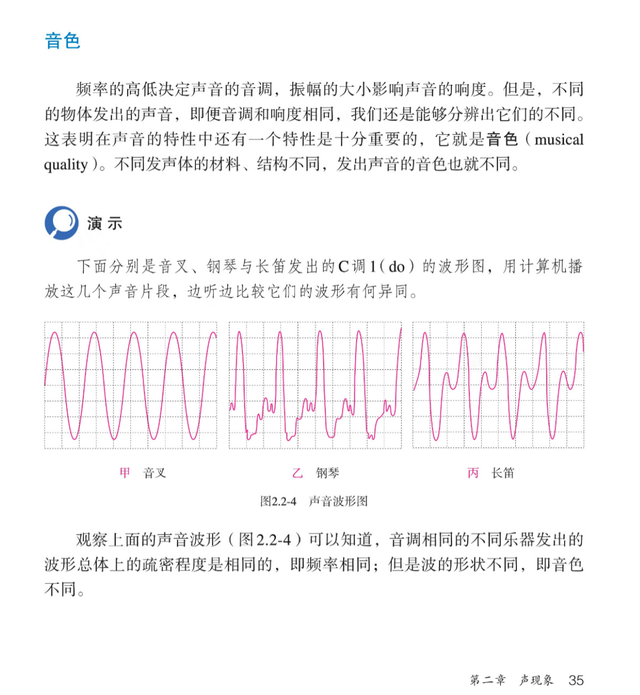

最近我的电吉他到了，一把日芬 tele

连上之前买的 Spark Mini 音箱，就可以快乐弹琴了

不过作为一款数字音箱，Spark 有一套软件建模体系，同时需要在手机上安装他们的 App 才可以调节 Spark Mini 那款音箱

界面非常好看！但是我对这些花花绿绿的东西是什么却没有一个概念，电信号从吉他那输出经过哪些步骤才成为了一个制品音色呢？

## 理论

第一次接触 “音色” 这个概念应该在初中物理课上

当时应该还不知道为什么这些乐器可以产生这样的图谱，现在看来，这些奇怪的波形图是由很多正弦波叠加而成，除了最突出的那个基音以外，剩下的是一些泛音。

我们可以使用傅立叶变换从一个乐器的波形图谱中分离出各个泛音，从数学的角度来分析音色（但这显得有些枯燥了

### 泛音怎么来的？

基音很好理解，振幅最大，响度最大，可以很清楚的听到和辨识。即使是不同的乐器，人类也很容易分辨这些乐器是否弹奏的是同一个音。

泛音却需要仔细才能听到了，通常一个泛音列中包含的泛音非常多，并且泛音的音量都比较小，很容易融合在一起很难听清楚某个具体的音。
