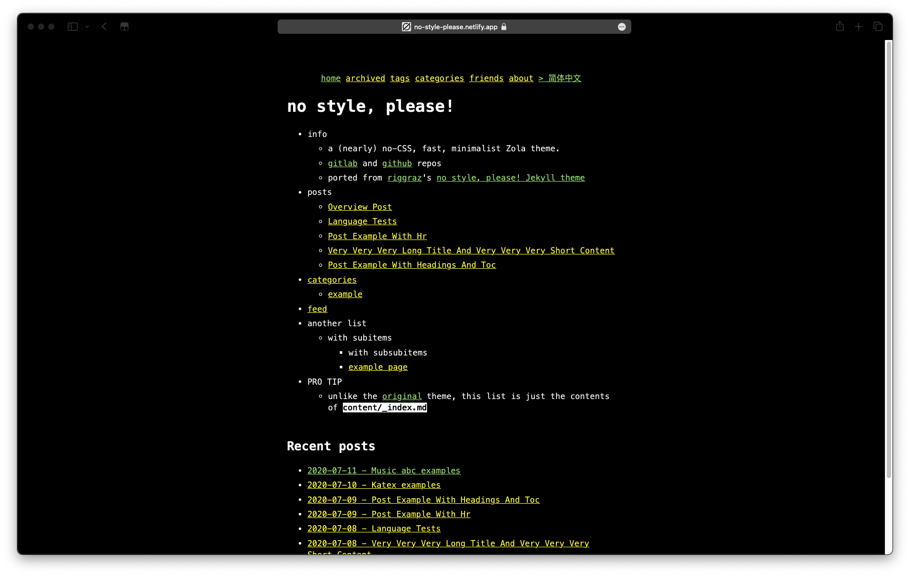

 

> 博客主题已经开源：[no-style-please](https://github.com/iGxnon/no-style-please)
>
> 基于 [no-style-please](https://github.com/4bcx/no-style-please) 二次开发
>
> [zola](http://getzola.org/) 主题，支持：
> - `五线谱`
> - `数学公式`
> - `多语言`

 

作为一个简约控，我的博客迁移了一遍又一遍，主题也越来越简约

{{ hr(data_content=" 由这样 ") }}

<s>(已经找不到了，盗用一下 ColdRain 的博客)</s>

 

{{ hr(data_content=" 到这样 ") }}

 

{{ hr(data_content=" 最后就是看到的这样 ") }}

 

{{ hr(data_content=" 下个周目就是 txt 了（ ") }}

(MIT6.824 Lecture raft-structure.txt)

 

> 简约并不是简陋，简约的目的是抽出设计中最核心的部分。这和编程一样，抽象出主要部分的程序总是很好理解且很好维护的，而不是追究任何一个细小的结构，为其套上各种设计模式，最终的结果只会是难以维护，和当初运用各种设计模式的初衷背离了。
