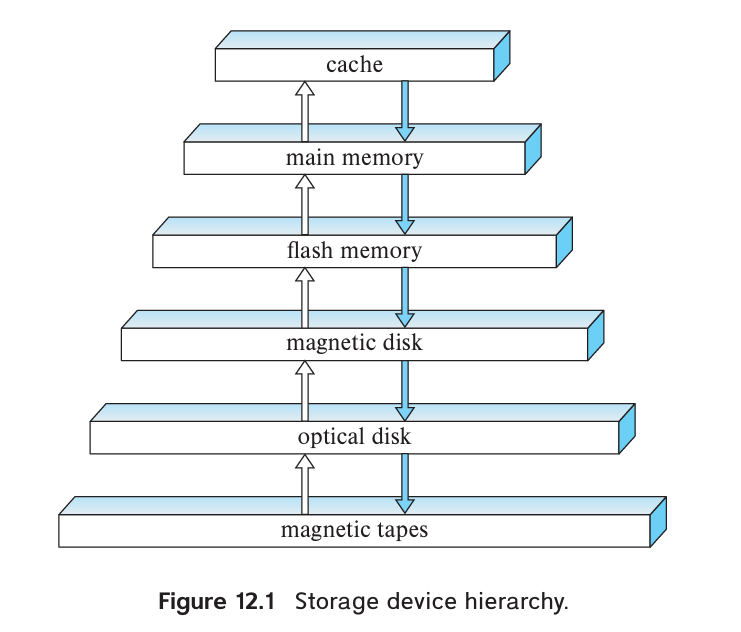
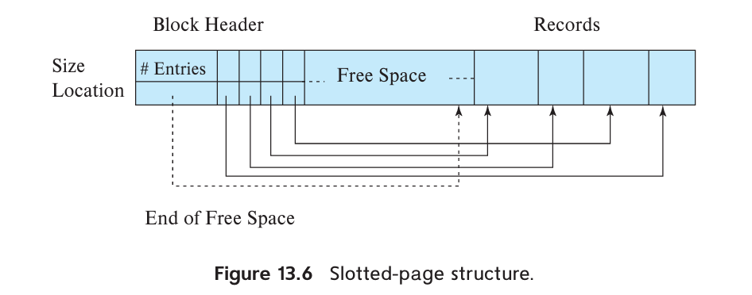

# Database System Concepts (Seventh Edition)

## #12 Physical Storage Systems

### Media

- Cache
- Main memory
- Flash memory
- Magnetic-disk storage
- Optical storage
- Tape storage

### Storage Interfaces

- **Serial ATA (SATA)**
  - SATA-3: nominally supports 6 GB/s, allowing data transfer speeds of up to 600 MB/s.
- **Serial Attached SCSI (SAS)**: typically used only in servers.
  - SAS-3: nominally supports data transfer rates of 12 GB/s.
-  **Non Volatile Memory Express (NVMe)**: logical interface standard developed to better support SSDs and is typically used with the PCIe interface.

- **Storage Area Network (SAN)**: large numbers of disks are connected by a high-speed network to a number of server computers. e.g. RAID.
  - **iSCSI**: An interconnection technology allows SCSI commands to be sent over an IP network.
  - **Fiber Channel FC**: supports transfer rates of 1.6 to 12 GB/s, depending on the version.
  - **InfiniBand**: provides very low latency high-bandwidth network communication.
- **Network attached storage (NAS)**: provides a file system interface using networked file system protocols such as NFS or CIFS. e.g. cloud storage.

### Magnetic Disks

Performance Measurement

- **Access time**: The time from when a read or write request is issued to when data transfer begins, mainly include seek time and rotational latency time.
  - **Seek time**: The time for repositioning the arm. Typical seek times range from 2 to 20 milliseconds depending on how far the track is from the initial arm position. Average seek times currently range between 4 and 10 milliseconds, depending on the disk model.
  - **Rotational latency time**:  The time spent waiting for the sector to be accessed to appear under the head. Typically range from 2 to 5.5 milliseconds.
- **Data-transfer rate**: The rate at which data can be retrieved from or stored to the disk. Current disk systems support maximum transfer rates of 50 to 200 MB/s.
- **IOPS**: With a 4KB block size, current generation disks support between 50 and 200IOPS, depending on the model.
- **Mean time to failure (MTTF)**: According to vendors’ claims, the mean time to failure of disks today ranges from 500,000 to 1,200,000 hours—about 57 to 136 years.

### Flash Memory

- **Erase block**: Once written, a page of flash memory cannot be directly overwritten. It has to be erased and rewritten subsequently. The erase operation must be performed on a group of pages, called an erase block.
- **Translation table**: Flash memory systems limit the impact of both the slow erase speed and the update limits by mapping logical page numbers to physical page numbers. The page mapping is replicated in an in-memory translation table for quick access.
- **Wear leveling**: Distributing erase operations across physical blocks, usually performed transparently by flash-memory controllers.
- **Flash translation layer**:  All the above actions are carried out by a layer of software called the flash translation layer; above this layer, flash storage looks identical to magnetic disk storage, pro viding the same page/sector-oriented interface.

Performance Measurement

- **IOPS**: Typical values in 2018 are about 10,000 random reads per second with4KB blocks, although some models support higher rates.
- **QD-n**: SSDs can support multiple random requests in parallel, with 32 parallel requests being commonly supported (QD-32); a flash disk with SATA interface supports nearly 100,000 random 4KB block reads in a second with 32 requests sent in parallel, while SSDs connected using NVMe PCIe can support over 350,000 random 4KB block reads per second.
- **Data transfer rate**: Typical rates for both sequential reads and sequential writes are 400 to 500 megabytes per second for SSDs with a SATA 3 interface, and 2 to 3 GB/s for SSDs using NVMe over the PCIe3.0x4 interface.
- **Random block writes per second**: Typical values in 2018 are about 40,000 random 4KB writes per second for QD-1 (without parallelism), and around 100,000 IOPS for QD-32.

### RAID

// 

## #13 Data Storage Structures

### File Organization

**File** -> **Block** (fixed size, 4 to 8KB) -> **Record** (fixed or variable size)

#### Fixed-Length Records

File header stores there is the address of the first record whose contents are deleted. The first record to store the address of the second available record, and so on. The deleted records thus form a linked list, which is often referred to as a **free list**.

Insertion and deletion can be easily done according to free list.

#### Variable-Length Records

For the presence of variable length fields, we use **variable-length records**.

A variable-length record looks like:

Variable-length attributes are represented in the initial part of the record by a pair *(offset, length)*. The values for the variable-length attributes are stored consecutively, after the initial fixed-length part of the record.

 **Null bitmap** indicates which attributes of the record have a null value.

The **slotted-page structure** is commonly used for organizing records within a block:

There is a header at the beginning of each block, containing the following information:

- The number of record entries in the header
- The end of free space in the block
- An array whose entries contain the location and size of each record

When a record is deleted, the space it occupied is freed up and its entry is marked as deleted (e.g. size set to -1). Additionally, the records in the block before the deleted record are shifted to fill the empty space created by the deletion. The cost of moving records is not too high because the block size is limited, typically around 4 to 8KB.

#### Storing Large Objects

**Large objects** may be stored either as files in a file system area managed by the database, or as file structures (e.g. B+ tree) stored in and managed by the database. A (logical) pointer to the object is then stored in the record containing the large object.

### Organization of Records in Files

#### Heap file organization

In a heap file organization, a record can be stored anywhere in the file that corresponds to a relation. Once placed in a specific location, the record is typically not moved.

To implementing efficient insertion, most database use a space-efficient data structure called a **free-space map** to track which blocks have free space to store records.

The free-space map is commonly represented by an array containing 1 entry for each block in the relation. Each entry represents a fraction *f* such that at least a fraction *f* of the space in the block is free. Assume that 3 bits are used to store the occupancy fraction; the value at position *i* should be divide by 8 to get the free-space fraction for block *i*.

To find a block to store a new record of a given size, the database can scan the free-space map to find a block that has enough free space to store that record. If there is no such block, a new block is allocated for the relation.

For large files, it can still be slow to scan free-space map. To further speed up the task of locating a block with sufficient free space, we can create a second-level free-space map, which has, say 1 entry for every 100 entries for the main free-space map. That 1 entry stores the maximum value amongst the 100 entries in the main free-space map that it corresponds to. (Seems like a skip list :D) We can create more levels beyond the second level, using the same idea.

#### Sequential file organization

A **sequential file** is designed for efficient processing of records in sorted order based on some search key. A **search key** is any attribute or set of attributes.  To permit fast retrieval of records in search-key order, we chain together records by pointers. The pointer in each record points to the next record in search-key order. Furthermore, to minimize the number of block accesses in sequential file processing, we store records physically in search-key order, or as close to search-key order as possible.

Maintaining physical sequential order is difficult when inserting or deleting records, as moving many records due to a single change is costly.

For insertion, we apply two rules:

1. Locate the record in the file that precedes the record to be inserted in search key order.
2. If there is available space in the same block, insert the new record there. Otherwise, insert the new record in an *overflow block*. In either case, adjust the pointers so as to chain together the records in search-key order.

**Reorganizing** is still necessary if the overflow blocks become too large. To keep the correspondence between search-key order and physical order. (B+-tree file organization provides efficient ordered access even if there are many inserts, deletes, without requiring expensive reorganizations).

#### Multitable clustering file organization

**Multitable clustering file organization** stores related records of two or more relations in each block. The **cluster key** is the attribute that defines which records are stored together.

A multitable clustering file organization can speed up certain join queries but may slow down other types of queries.

The Oracle database system supports multitable clustering. Clusters are created using a **create cluster** command with a specified cluster key. The **create table** command extension can specify that a relation is stored in a specific cluster, using a particular attribute as the cluster key, allowing multiple relations to be allocated to one cluster.

#### B+-tree file organization

**B+-tree file organization** allows efficient ordered access even with numerous insertions, deletions, or updates while also enabling very efficient access to specific records based on the search key.

Detailed information will be discussed in #14.

#### Hasing file organization

A hash function is calculated based on a specific attribute of each record, determining the block in which the record should be stored in the file.

Detailed information will be discussed in #14.

#### Partitioning

Many databases allow records in a relation to be partitioned into smaller relations stored separately. **Table partitioning** is usually based on an attribute value, such as partitioning transaction records by year into separate relations for each year (e.g., transaction 2018, transaction 2019).

Table partitioning can avoid querying records with mismatched attributes. For example, a query **select * from transaction where year=2019** would only access the relation *transaction_2019*.

Partitioning can help reduce costs for operations like finding free space for a record, as the size of relations increases. It can also be used to store different parts of a relation on separate storage devices. For example, in 2019, older transactions could be stored on magnetic disk while newer ones are stored on SSD for faster access.

### Data-Dictionary Storage

//

## #14 Indexing

### Basic Concepts

//

###  Ordered Indices

//

### B+-Tree Index Files

//

### B+-Tree Extensions

//

### Hash Indices

//

### Multiple-Key Access

//

###  Creation of Indices

//

### Write-Optimized Index Structures

