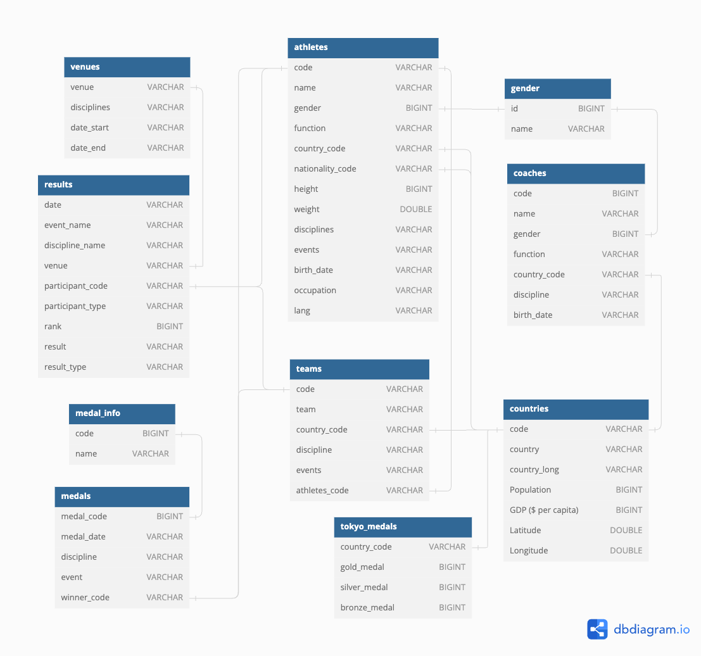

# CMU 15445 Intro to Database Systems

## #01 Relation Model & Algebra

1. Concepts

- A **database** is an organized collection of inter-related data that models some aspect of the real-world.
- A **data model** is a collection of concepts for describing the data in database.
  - **Relation** (most common)
  - **NoSQL** (kv, doc, graph)
  - **Array / Matrix / Vector** (for ML)
- A **schema** is a description of a particular collection of data, using a given data model.
  - This defines the structure of data for a data model
  - Otherwise, you have random bits with no meaning

2. Relation Algebra


## #02 Modern SQL

1. Relation Languages

- Data Manipulation Language (DML)
  - SELECT, UPDATE, DELETE, ...
- Data Define Language (DDL)
  - CREATE ...
- Data Control Language (DCL)
  - GRANT ...

2. Aggregates

- AVG(COL): The average of the values in COL
- MIN(COL): The minimum value in COL
- MAX(COL): The maximum value in COL
- SUM(COL): The sum of the values in COL
- COUNT(COL): The number of tuples in the relation


3. String Operations

The SQL standard says that strings are **case sensitive** and **single-quotes** only. There are functions to
manipulate strings that can be used in any part of a query.

Pattern Matching: The LIKE keyword is used for string matching in predicates.

- “%” matches any substrings (including empty).
- “_” matches any one character.

Examples of standard string functions include SUBSTRING(S, B, E) and
UPPER(S).

Concatenation: Two vertical bars (“||”) will concatenate two or more strings together into a single string.

4. Date and Time

Databases generally want to keep track of dates and time, so SQL supports operations to manipulate DATE
and TIME attributes. These can be used as either outputs or predicates.

Specific syntax for date and time operations can vary wildly across systems.

5. Output Control

- **ORDER BY \<column\> [ASC|DESC]**
- **FETCH [FIRST|{NEXT}] \<count\> ROWS ONLY {OFFSET \<count\>} {WITH TIES}** (ANSI SQL)
  - **LIMIT \<count\> OFFSET \<count\>** (MySQL/SQLite)

```sql
> SELECT * FROM employee;

|name|salary|
-------------
| A  | 1000 |
| B  | 1300 |
| C  | 1100 |
| D  | 1100 |
| E  | 1400 |

> SELECT salary FROM employee FETCH FIRST 3 ROWS WITH TIES;

|salary|
--------
| 1000 |
| 1300 |
| 1100 |
| 1100 | <- TIES
```

6. Window Functions

A window function performs “sliding” calculation across a set of tuples that are related. Window functions
are similar to aggregations, but tuples are not collapsed into a singular output tuple.

Aggregations: 

```txt
|name|salary|age|
-----------------
| A  | 1000 |23 |
| B  | 1300 |22 |
| C  | 1100 |23 |
| D  | 1100 |45 |
| E  | 1400 |22 |

--- Aggregate by age ---

|name |salary     |age|
-----------------------
| A,C | 1000,1100 |23 |
| B,E | 1300,1400 |22 |
| D   | 1100      |45 |

--- Mean on salary ---

|salary|age|
------------
| 1050 |23 |
| 1350 |22 |
| 1100 |45 |
```

Window:

```txt
|name|salary|age|
-----------------
| A  | 1000 |23 |
| B  | 1300 |22 |
| C  | 1100 |23 |
| D  | 1100 |45 |
| E  | 1400 |22 |

--- Window over age ---

|name|salary|age|
-----------------
| A  | 1000 |23 |
| C  | 1100 |23 |
-----------------
| B  | 1300 |22 |
| E  | 1400 |22 |
-----------------
| D  | 1100 |45 |

--- ROW_NUMBER()/RANK(salary) ---

|name|salary|age|row_number
---------------------------
| A  | 1000 |23 |1
| C  | 1100 |23 |2
---------------------------
| B  | 1300 |22 |1
| E  | 1400 |22 |2
---------------------------
| D  | 1100 |45 |1
```


7. Nested Queries


**Nested Query Results Expressions:**

- ALL: Must satisfy expression for all rows in sub-query.
- ANY: Must satisfy expression for at least one row in sub-query.
- IN: Equivalent to =ANY().
- EXISTS: At least one row is returned


8. Lateral Joins

The LATERAL operator allows a nested query to reference attributes in other nested queries that precede it.
You can think of lateral joins like a for loop that allows you to invoke another query for each tuple in a
table.


```sql
SELECT * FROM course AS c,

|cid   |name    
-------------       
|15-445|Database System
|15-721|Advanced Database System
|15-826|Data Mining

LATERAL (SELECT COUNT(*) AS cnt FROM enrolled
          WHERE enrolled.cid = c.cid) AS t1,

-- For each cid in c, execute
-- `SELECT COUNT(*) AS cnt FROM enrolled WHERE enrolled.cid = c.cid`

|cid   |name                    |cnt
------------------------------------
|15-445|Database System         |2
|15-721|Advanced Database System|3
|15-826|Data Mining             |2

-- 

LATERAL (SELECT AVG(gpa) AS avg FROM student AS s
           JOIN enrolled AS e ON s.sid = e.sid
          WHERE e.cid = c.cid) AS t2;

-- For each cid in c, execute
-- `SELECT AVG(gpa) AS avg FROM student AS s JOIN enrolled AS e ON s.sid = e.sid WHERE e.cid = c.cid`

|cid   |name                    |cnt|avg
----------------------------------------
|15-445|Database System         |2  |3.2
|15-721|Advanced Database System|3  |3.4
|15-826|Data Mining             |2  |3.6
```

9. Common Table Expressions

Common Table Expressions (CTEs) are an alternative to windows or nested queries when writing more
complex queries. They provide a way to write auxiliary statements for use in a larger query. A CTE can
be thought of as a temporary table that is scoped to a single query.

```sql
WITH cteName AS (
    SELECT 1
)
SELECT * FROM cteName;

|*|
---
|1|
```

Bind output columns to names before the AS:

```sql
WITH cteName (col1, col2) AS (
    SELECT 1, 2
)
SELECT col1 + col2 FROM cteName;
```

Multiple CTE declarations in single query:

```sql
WITH cte1 (col1) AS (SELECT 1), cte2 (col2) AS (SELECT 2)
SELECT * FROM cte1, cte2;
```

Adding the **RECURSIVE** keyword after **WITH** allows a CTE to reference itself. This enables the implementation of recursion in SQL queries. With recursive CTEs, SQL is provably Turing-complete, implying that it
is as computationally expressive as more general purpose programming languages (ignoring the fact that
it is a bit more cumbersome).

Print the sequence of numbers from 1 to 10:

```sql
WITH RECURSIVE cteSource (counter) AS (
    ( SELECT 1 )
    UNION
    ( SELECT counter + 1 FROM cteSource
        WHERE counter < 10 )
)
SELECT * FROM cteSource;
```

<details>
<summary>Homework 1</summary>

### HW1



Q2: Find all successful coaches who have won at least one medal. List them in descending order by medal number, then by name alphabetically:

> Details: A medal is credited to a coach if it shares the same country and discipline with the coach, regardless of the gender or event. Consider to use winner_code of one medal to decide its country.

```sql
select c.name as COACH_NAME, count(*) as MEDAL_NUMBER 
  from coaches as c
    join (
      select m.discipline, t.country_code from medals as m join 
        (
          select code, country_code from teams 
          union all
          select code, country_code from athletes
        ) as t on m.winner_code = t.code
    ) as o on c.country_code = o.country_code
    and c.discipline = o.discipline
    group by c.name 
    order by MEDAL_NUMBER desc, COACH_NAME;
```

Q3: Find all athletes in Judo discipline, and also list the number of medals they have won. Sort output in descending order by medal number first, then by name alphabetically:

> Details: The medals counted do not have to be from the Judo discipline, and also be sure to include any medals won as part of a team. If an athlete doesn't appear in the athletes table, please ignore him/her. Assume that if a team participates in a competition, all team members are competing.

```sql
with medals_cnt as ( -- athlete_code, cnt
  select athlete_code, sum(cnt) as cnt from
    (select athletes.code as athlete_code, count(*) as cnt
      from athletes, medals 
        where athletes.code = medals.winner_code
      group by athletes.code
    union all -- row duplicated is allowed
    select athletes_code as athlete_code, count(*) as cnt
      from teams, medals
        where teams.code = medals.winner_code
      group by athletes_code)
  group by athlete_code
)
select name as ATHLETE_NAME, 
  (case when cnt is not null then cnt else 0 end) as MEDAL_NUMBER 
  from athletes left join medals_cnt -- use left join to keep all records in athletes
    on athletes.code = medals_cnt.athlete_code 
  where athletes.disciplines like '%Judo%' 
  order by MEDAL_NUMBER desc, ATHLETE_NAME;
```

Q4: For all venues that have hosted Athletics discipline competitions, list all athletes who have competed at these venues, and sort them by the distance from their nationality country to the country they represented in descending order, then by name alphabetically.

> Details: The athletes can have any discipline and can compete as a team member or an individual in these venues. The distance between two countries is calculated as the sum square of the difference between their latitudes and longitudes. Only output athletes who have valid information. (i.e., the athletes appear in the athletes table and have non-null latitudes and longitudes for both countries.) Assume that if a team participates in a competition, all team members are competing.

```sql
with comp as (
  select participant_code, participant_type
      from results, venues
      where results.venue = venues.venue 
        and venues.disciplines like '%Athletics%'
), a as (
  select *
  from athletes
  where code in 
      (select distinct participant_code
      from 
          (select participant_code 
          from comp 
          where participant_type = 'Person'
          union
          select athletes_code as participant_code 
          from teams, comp
          where comp.participant_type = 'Team' 
            and comp.participant_code = teams.code))
)
select 
    name as ATHLETE_NAME, 
    country_code as REPRESENTED_COUNTRY_CODE, 
    nationality_code as NATIONALITY_COUNTRY_CODE
from 
    (select t.*, countries.Latitude as nationality_latitude, countries.Longitude as nationality_longitude
    from 
        (select a.*, countries.Latitude as country_latitude, countries.Longitude as country_longitude 
        from a left join countries on a.country_code = countries.code) as t 
        left join countries on t.nationality_code = countries.code
    where nationality_latitude is not null 
          and nationality_longitude is not null 
          and country_latitude is not null 
          and country_longitude is not null)
order by 
    (country_latitude - nationality_latitude)^2 + (country_longitude - nationality_longitude)^2 desc, athlete_name;
```

Q5: For each day, find the country with the highest number of appearances in the top 5 ranks (inclusive) of that day. For these countries, also list their population rank and GDP rank. Sort the output by date in ascending order:

> Hints: Use the result table, and use the participant_code to get the corresponding country. If you cannot get the country information for a record in the result table, ignore that record.

> Details: When counting appearances, only consider records from the results table where rank is not null. Exclude days where all rank values are null from the output. In case of a tie in the number of appearances, select the country that comes first alphabetically. Keep the original format of the date. Also, DON'T remove duplications from results table when counting appearances. (see Important Clarifications section).

```sql
with country_rank as (
select
    code,
    rank() over (order by "GDP ($ per capita)" desc) as gdp_rank,
    rank() over (order by "Population" desc) as population_rank
from
    countries
)
select 
  t1.date as DATE,
  t1.country_code as COUNTRY_CODE,
  t1.cnt as TOP5_APPEARANCES,
  country_rank.gdp_rank as GDP_RANK,
  country_rank.population_rank as POPULATION_RANK
from 
  (select *,
    row_number() over (partition by date order by date, cnt desc) as row_number 
    from (
      select date,
       country_code,
       count(*) as cnt
      from (
        select date, rank, country_code 
        from results, athletes 
        where results.participant_type = 'Person' 
          and results.participant_code = athletes.code
        union all
        select date, rank, country_code
        from results, teams 
        where results.participant_type = 'Team'
          and results.participant_code = teams.code)
    where rank <= 5 group by date, country_code)) as t1, country_rank
where t1.row_number = 1 and country_rank.code = t1.country_code
order by date;
```

Q6: List the five countries with the greatest improvement in the number of gold medals compared to the Tokyo Olympics. For each of these five countries, list all their all-female teams. Sort the output first by the increased number of gold medals in descending order, then by country code alphabetically, and last by team code alphabetically.

> Details: When calculating all-female teams, if the athletes_code in a record from the teams table is not found in the athletes table, please ignore this record as if it doesn't exist.

```sql
with t as (
	select code, country_code from teams group by code, country_code
) -- team may duplicate
select * from (
  select
    t1.country_code as COUNTRY_CODE,
    t1.paris_gold - t2.gold_medal as INCREASED_GOLD_MEDAL_NUMBER,
  from (
    select
      country_code,
      count(*) as paris_gold
    from (
      select country_code
      from medals, athletes 
      where medals.winner_code = athletes.code and medal_code = 1
      union all
      select country_code
      from medals, t
      where medals.winner_code = t.code and medal_code = 1
    )
    group by country_code
  ) as t1, tokyo_medals as t2
  where t1.country_code = t2.country_code
  order by INCREASED_GOLD_MEDAL_NUMBER desc
  limit 5
) as i1,
lateral (
  select teams.code as TEAM_CODE
  from teams, athletes
  where teams.athletes_code = athletes.code and teams.country_code = i1.country_code
  group by teams.code
  having SUM(1- gender) = 0 -- mem: 0, women: 1 [all female = 'sum(1 - gender) = 0']
)
order by INCREASED_GOLD_MEDAL_NUMBER desc, COUNTRY_CODE, TEAM_CODE;
```

</details>

## #03 Database Storage: Files & Pages

