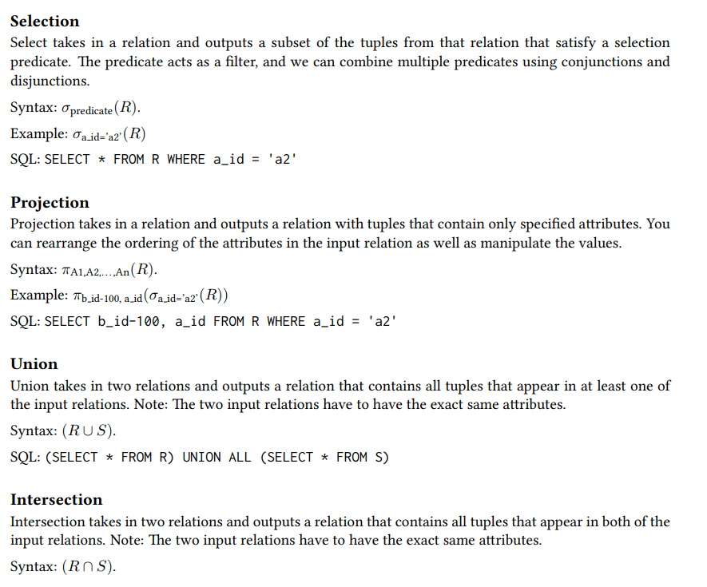
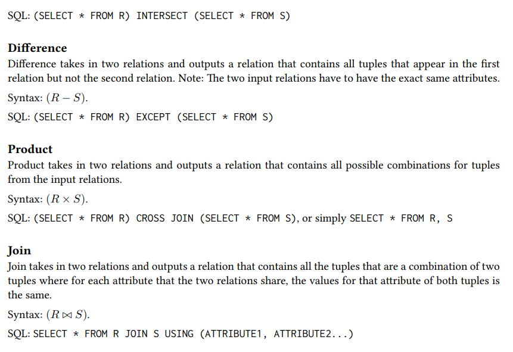
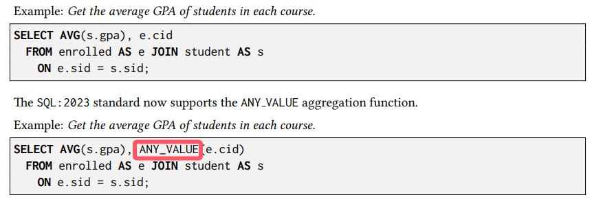
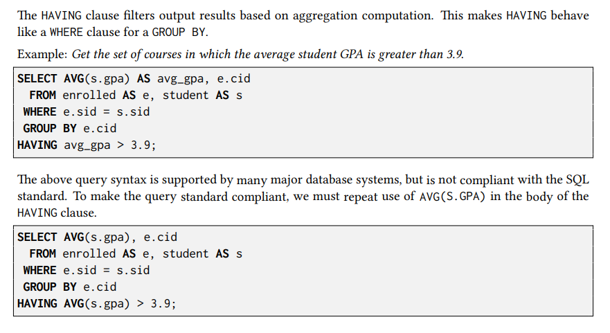
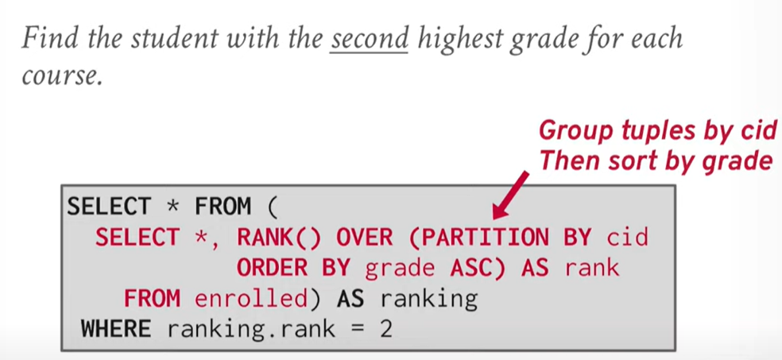
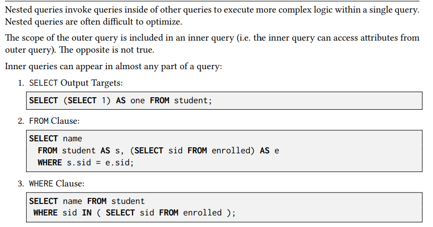
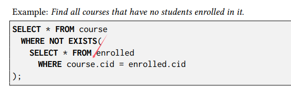
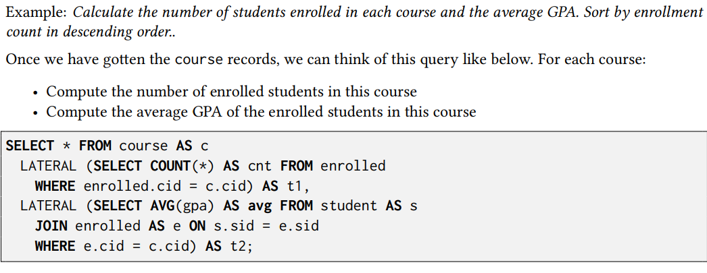

# CMU 15445 Intro to Database Systems

## #01 Relation Model & Algebra

1. Concepts

- A **database** is an organized collection of inter-related data that models some aspect of the real-world.
- A **data model** is a collection of concepts for describing the data in database.
  - **Relation** (most common)
  - **NoSQL** (kv, doc, graph)
  - **Array / Matrix / Vector** (for ML)
- A **schema** is a description of a particular collection of data, using a given data model.
  - This defines the structure of data for a data model
  - Otherwise, you have random bits with no meaning

2. Relation Algebra





## #02 Modern SQL

1. Relation Languages

- Data Manipulation Language (DML)
  - SELECT, UPDATE, DELETE, ...
- Data Define Language (DDL)
  - CREATE ...
- Data Control Language (DCL)
  - GRANT ...

2. Aggregates

- AVG(COL): The average of the values in COL
- MIN(COL): The minimum value in COL
- MAX(COL): The maximum value in COL
- SUM(COL): The sum of the values in COL
- COUNT(COL): The number of tuples in the relation





3. String Operations

The SQL standard says that strings are **case sensitive** and **single-quotes** only. There are functions to
manipulate strings that can be used in any part of a query.

Pattern Matching: The LIKE keyword is used for string matching in predicates.

- “%” matches any substrings (including empty).
- “_” matches any one character.

Examples of standard string functions include SUBSTRING(S, B, E) and
UPPER(S).

Concatenation: Two vertical bars (“||”) will concatenate two or more strings together into a single string.

4. Date and Time

Databases generally want to keep track of dates and time, so SQL supports operations to manipulate DATE
and TIME attributes. These can be used as either outputs or predicates.

Specific syntax for date and time operations can vary wildly across systems.

5. Output Control

- **ORDER BY \<column\> [ASC|DESC]**
- **FETCH [FIRST|{NEXT}] \<count\> ROWS ONLY {OFFSET \<count\>} {WITH TIES}** (ANSI SQL)
  - **LIMIT \<count\> OFFSET \<count\>** (MySQL/SQLite)

```sql
> SELECT * FROM employee;

|name|salary|
-------------
| A  | 1000 |
| B  | 1300 |
| C  | 1100 |
| D  | 1100 |
| E  | 1400 |

> SELECT salary FROM employee FETCH FIRST 3 ROWS WITH TIES;

|salary|
--------
| 1000 |
| 1300 |
| 1100 |
| 1100 | <- TIES
```

6. Window Functions

A window function performs “sliding” calculation across a set of tuples that are related. Window functions
are similar to aggregations, but tuples are not collapsed into a singular output tuple.

Aggregations: 

```txt
|name|salary|age|
-----------------
| A  | 1000 |23 |
| B  | 1300 |22 |
| C  | 1100 |23 |
| D  | 1100 |45 |
| E  | 1400 |22 |

--- Aggregate by age ---

|name |salary     |age|
-----------------------
| A,C | 1000,1100 |23 |
| B,E | 1300,1400 |22 |
| D   | 1100      |45 |

--- Mean on salary ---

|salary|age|
------------
| 1050 |23 |
| 1350 |22 |
| 1100 |45 |
```

Window:

```txt
|name|salary|age|
-----------------
| A  | 1000 |23 |
| B  | 1300 |22 |
| C  | 1100 |23 |
| D  | 1100 |45 |
| E  | 1400 |22 |

--- Window over age ---

|name|salary|age|
-----------------
| A  | 1000 |23 |
| C  | 1100 |23 |
-----------------
| B  | 1300 |22 |
| E  | 1400 |22 |
-----------------
| D  | 1100 |45 |

--- ROW_NUMBER()/RANK(salary) ---

|name|salary|age|row_number
---------------------------
| A  | 1000 |23 |1
| C  | 1100 |23 |2
---------------------------
| B  | 1300 |22 |1
| E  | 1400 |22 |2
---------------------------
| D  | 1100 |45 |1
```



7. Nested Queries



**Nested Query Results Expressions:**

- ALL: Must satisfy expression for all rows in sub-query.
- ANY: Must satisfy expression for at least one row in sub-query.
- IN: Equivalent to =ANY().
- EXISTS: At least one row is returned



8. Lateral Joins

The LATERAL operator allows a nested query to reference attributes in other nested queries that precede it.
You can think of lateral joins like a for loop that allows you to invoke another query for each tuple in a
table.



```sql
SELECT * FROM course AS c,

|cid   |name    
-------------       
|15-445|Database System
|15-721|Advanced Database System
|15-826|Data Mining

LATERAL (SELECT COUNT(*) AS cnt FROM enrolled
          WHERE enrolled.cid = c.cid) AS t1,

-- For each cid in c, execute
-- `SELECT COUNT(*) AS cnt FROM enrolled WHERE enrolled.cid = c.cid`

|cid   |name                    |cnt
------------------------------------
|15-445|Database System         |2
|15-721|Advanced Database System|3
|15-826|Data Mining             |2

-- 

LATERAL (SELECT AVG(gpa) AS avg FROM student AS s
           JOIN enrolled AS e ON s.sid = e.sid
          WHERE e.cid = c.cid) AS t2;

-- For each cid in c, execute
-- `SELECT AVG(gpa) AS avg FROM student AS s JOIN enrolled AS e ON s.sid = e.sid WHERE e.cid = c.cid`

|cid   |name                    |cnt|avg
----------------------------------------
|15-445|Database System         |2  |3.2
|15-721|Advanced Database System|3  |3.4
|15-826|Data Mining             |2  |3.6
```

9. Common Table Expressions

Common Table Expressions (CTEs) are an alternative to windows or nested queries when writing more
complex queries. They provide a way to write auxiliary statements for use in a larger query. A CTE can
be thought of as a temporary table that is scoped to a single query.

```sql
WITH cteName AS (
    SELECT 1
)
SELECT * FROM cteName;

|*|
---
|1|
```

Bind output columns to names before the AS:

```sql
WITH cteName (col1, col2) AS (
    SELECT 1, 2
)
SELECT col1 + col2 FROM cteName;
```

Multiple CTE declarations in single query:

```sql
WITH cte1 (col1) AS (SELECT 1), cte2 (col2) AS (SELECT 2)
SELECT * FROM cte1, cte2;
```

Adding the **RECURSIVE** keyword after **WITH** allows a CTE to reference itself. This enables the implementation of recursion in SQL queries. With recursive CTEs, SQL is provably Turing-complete, implying that it
is as computationally expressive as more general purpose programming languages (ignoring the fact that
it is a bit more cumbersome).

Print the sequence of numbers from 1 to 10:

```sql
WITH RECURSIVE cteSource (counter) AS (
    ( SELECT 1 )
    UNION
    ( SELECT counter + 1 FROM cteSource
        WHERE counter < 10 )
)
SELECT * FROM cteSource;
```

### HW1


## #03 Database Storage: Files & Pages